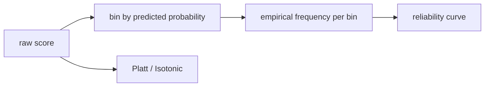

# Calibration

> Model Evaluation 101 시리즈 (7/10)

<!-- a-grade-intro:begin -->

**핵심 질문**: 모델이 *“80% 확신”* 이라고 말할 때, *정말로* *80%* 가 맞을까요?

> *Calibration 은 *예측 확률* 과 *실제 빈도* 의 *일치* 를 본다. *임계값* 과는 *다른 차원* 입니다.*

<!-- a-grade-intro:end -->

## 이 글에서 배울 것

- *보정* 의 *정의* 와 *왜 필요* 한가
- *신뢰도 곡선* 읽는 법
- *Brier Score* 의 의미
- *Platt* 와 *Isotonic* 보정
- 흔한 함정 5가지

## 왜 중요한가

*확률* 을 *비용* 에 곱해 *결정* 을 내리는 시스템에서는 *보정* 이 *AUC 보다* 중요합니다.

## 개념 한눈에 보기



## 핵심 용어 정리

- **Calibration**: *예측 확률 = 실제 빈도*.
- **Reliability diagram**: *bin* 별 *예측 vs 실제* 그래프.
- **Brier Score**: *(p - y)^2* 평균. 낮을수록 좋음.
- **Platt scaling**: *시그모이드* 후처리.
- **Isotonic regression**: *비모수* 단조 보정.

## Before/After

**Before**: *“proba = 0.9 → 매우 확신”*.

**After**: *보정 곡선 확인 → Brier 비교 → 필요시 isotonic*.

## 실습: 5단계 보정

### 1단계 — 데이터와 모델

```python
from sklearn.datasets import make_classification
from sklearn.model_selection import train_test_split
from sklearn.ensemble import RandomForestClassifier
X, y = make_classification(n_samples=3000, weights=[0.7, 0.3], random_state=0)
Xtr, Xte, ytr, yte = train_test_split(X, y, stratify=y, random_state=42)
rf = RandomForestClassifier(n_estimators=100, random_state=0).fit(Xtr, ytr)
proba = rf.predict_proba(Xte)[:, 1]
```

### 2단계 — 신뢰도 곡선

```python
from sklearn.calibration import calibration_curve
frac_pos, mean_pred = calibration_curve(yte, proba, n_bins=10)
for mp, fp in zip(mean_pred, frac_pos):
    print(round(mp, 2), round(fp, 2))
```

### 3단계 — Brier Score

```python
from sklearn.metrics import brier_score_loss
print("brier:", brier_score_loss(yte, proba))
```

### 4단계 — Platt 보정

```python
from sklearn.calibration import CalibratedClassifierCV
platt = CalibratedClassifierCV(rf, method="sigmoid", cv=5).fit(Xtr, ytr)
print("brier (platt):", brier_score_loss(yte, platt.predict_proba(Xte)[:, 1]))
```

### 5단계 — Isotonic 보정

```python
iso = CalibratedClassifierCV(rf, method="isotonic", cv=5).fit(Xtr, ytr)
print("brier (isotonic):", brier_score_loss(yte, iso.predict_proba(Xte)[:, 1]))
```

## 이 코드에서 주목할 점

- *RF 원본* 은 *과신* 또는 *과소신* 경향.
- *Platt* 는 *적은 데이터* 에 안정적.
- *Isotonic* 은 *충분한 데이터* 에서 *유연*.

## 자주 하는 실수 5가지

1. ***AUC* 만 좋다고 *확률* 도 정확하다고 단정.**
2. ***훈련 데이터* 로 *보정* 학습.**
3. ***bin 수* 를 *너무 적게* 또는 *너무 많이*.**
4. ***Isotonic* 을 *작은 데이터* 에 사용해 *과적합*.**
5. ***보정 후 임계값* 을 *그대로* 사용.**

## 실무에서는 이렇게 쓰입니다

*기댓값 기반 입찰* (광고/보험) — *보정된 확률* 이 *돈* 과 *직결*.

## 시니어 엔지니어는 이렇게 생각합니다

- *AUC* 가 좋아도 *보정* 은 *별개*.
- *보정용 데이터* 는 *분리*.
- *Brier* 는 *AUC + 보정* 을 합친 단일 지표.
- *보정 후* *재 임계값 튜닝*.
- *드리프트* 시 *재보정* 필요.

## 체크리스트

- [ ] *신뢰도 곡선* 을 본다.
- [ ] *Brier Score* 를 비교한다.
- [ ] *보정 데이터* 가 *분리* 되어 있다.
- [ ] *재보정* 주기를 정한다.

## 연습 문제

1. *Logistic* 과 *Random Forest* 의 *보정 곡선* 을 비교하세요.
2. *isotonic* vs *sigmoid* 의 *Brier* 를 비교하세요.
3. *보정 전후* 의 *AUC* 가 어떻게 변하는지 확인하세요.

## 정리 및 다음 단계

보정은 *확률 자체* 의 *진실성* 입니다. 다음 글은 *Cross Validation* 으로 *추정의 분산* 을 다룹니다.

<!-- toc:begin -->
- [모델 평가는 왜 어려운가?](./01-why-evaluation-is-hard.md)
- [train/validation/test](./02-train-val-test.md)
- [Accuracy의 한계](./03-limits-of-accuracy.md)
- [Precision과 Recall](./04-precision-and-recall.md)
- [F1 Score](./05-f1-score.md)
- [ROC와 AUC](./06-roc-and-auc.md)
- **Calibration (현재 글)**
- Cross Validation (예정)
- Error Analysis (예정)
- 평가 리포트 만들기 (예정)
<!-- toc:end -->

## 참고 자료

- [scikit-learn — Calibration](https://scikit-learn.org/stable/modules/calibration.html)
- [scikit-learn — calibration_curve](https://scikit-learn.org/stable/modules/generated/sklearn.calibration.calibration_curve.html)
- [Wikipedia — Brier score](https://en.wikipedia.org/wiki/Brier_score)
- [Niculescu-Mizil & Caruana 2005](https://www.cs.cornell.edu/~alexn/papers/calibration.icml05.crc.rev3.pdf)
