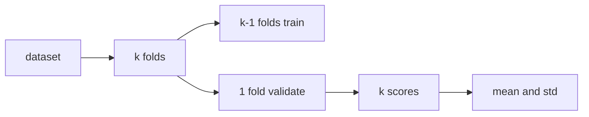

# Cross Validation

> Model Evaluation 101 시리즈 (8/10)

<!-- a-grade-intro:begin -->

**핵심 질문**: *test set 점수 한 줄* 만으로 *모델 비교* 를 끝내도 될까요?

> *Cross Validation 은 *여러 분할* 의 *평균과 분산* 으로 *추정 신뢰도* 를 정량화합니다.*

<!-- a-grade-intro:end -->

## 이 글에서 배울 것

- *K-Fold* 의 의미와 *trade-off*
- *Stratified* 가 *왜 기본* 인가
- *GroupKFold* 와 *시계열 분할*
- *분산* 을 보는 법
- 흔한 함정 5가지

## 왜 중요한가

*하나의 분할* 점수는 *우연* 의 영향을 받습니다. *분산* 을 *평균* 과 함께 보고해야 *비교* 가 의미 있습니다.

## 개념 한눈에 보기



## 핵심 용어 정리

- **K-Fold**: *k 등분* 후 *k 회 학습/검증*.
- **Stratified**: *클래스 비율* 보존.
- **GroupKFold**: *동일 그룹* 이 *분할 경계* 를 넘지 않음.
- **TimeSeriesSplit**: *과거→미래* 순서 보존.
- **Repeated K-Fold**: *여러 시드* 로 *k-fold 반복*.

## Before/After

**Before**: *단일 train/test → 점수 하나*.

**After**: *5-fold 평균 ± 표준편차*, *집단 누수* 점검.

## 실습: 5단계 CV

### 1단계 — 데이터와 모델

```python
from sklearn.datasets import make_classification
from sklearn.linear_model import LogisticRegression
X, y = make_classification(n_samples=2000, weights=[0.7, 0.3], random_state=0)
m = LogisticRegression(max_iter=1000)
```

### 2단계 — Stratified K-Fold

```python
from sklearn.model_selection import cross_val_score, StratifiedKFold
cv = StratifiedKFold(n_splits=5, shuffle=True, random_state=0)
scores = cross_val_score(m, X, y, cv=cv, scoring="f1_macro")
print("mean:", scores.mean(), "std:", scores.std())
```

### 3단계 — GroupKFold (가짜 그룹)

```python
import numpy as np
from sklearn.model_selection import GroupKFold
groups = np.repeat(np.arange(100), 20)
gkf = GroupKFold(n_splits=5)
scores = cross_val_score(m, X, y, cv=gkf, groups=groups, scoring="f1_macro")
print("group cv:", scores.mean(), scores.std())
```

### 4단계 — TimeSeriesSplit

```python
from sklearn.model_selection import TimeSeriesSplit
tscv = TimeSeriesSplit(n_splits=5)
scores = cross_val_score(m, X, y, cv=tscv, scoring="f1_macro")
print("time cv:", scores.mean(), scores.std())
```

### 5단계 — 다중 지표

```python
from sklearn.model_selection import cross_validate
out = cross_validate(m, X, y, cv=cv, scoring=["f1_macro", "roc_auc"])
print({k: v.mean() for k, v in out.items() if k.startswith("test_")})
```

## 이 코드에서 주목할 점

- *Stratified* 가 *분류 기본*.
- *Group* 누수가 *가장 흔한 함정*.
- *TimeSeriesSplit* 은 *훈련 크기 증가* 형태.

## 자주 하는 실수 5가지

1. ***시계열* 에 *일반 K-Fold* 사용.**
2. ***동일 사용자/문서* 가 *여러 fold* 에 등장.**
3. ***평균* 만 보고 *분산* 무시.**
4. ***k* 를 *너무 작게* (k=2) 또는 *너무 크게*.**
5. ***test set* 으로 *CV* 한 뒤 *동일 set* 으로 *보고*.**

## 실무에서는 이렇게 쓰입니다

*하이퍼파라미터 튜닝* — *CV* 가 *내부 평가*. *최종 보고* 는 *별도 holdout*.

## 시니어 엔지니어는 이렇게 생각합니다

- *분산이 큰 점수* 는 *비교 불가* 일 수 있다.
- *그룹/시간 누수* 를 *가장 먼저* 점검.
- *Repeated CV* 로 *시드 의존* 을 줄인다.
- *Nested CV* 로 *튜닝 + 평가* 를 분리.
- *느린 모델* 은 *3-fold* 로 시작.

## 체크리스트

- [ ] *Stratified* 또는 *Group/Time* 을 적용.
- [ ] *평균 ± 표준편차* 를 보고.
- [ ] *튜닝* 과 *평가* 가 분리됨.
- [ ] *최종 holdout* 이 별도.

## 연습 문제

1. *K=2 vs K=10* 의 *분산* 을 비교하세요.
2. *GroupKFold* 와 *KFold* 점수가 *얼마나 다른지* 측정하세요.
3. *시계열* 데이터에 *KFold* 를 적용했을 때의 *낙관적 편향* 을 보이세요.

## 정리 및 다음 단계

CV 는 *추정의 신뢰도* 입니다. 다음 글은 *Error Analysis* 로 *틀린 예측을 뜯어보는 법* 을 다룹니다.

<!-- toc:begin -->
- [모델 평가는 왜 어려운가?](./01-why-evaluation-is-hard.md)
- [train/validation/test](./02-train-val-test.md)
- [Accuracy의 한계](./03-limits-of-accuracy.md)
- [Precision과 Recall](./04-precision-and-recall.md)
- [F1 Score](./05-f1-score.md)
- [ROC와 AUC](./06-roc-and-auc.md)
- [Calibration](./07-calibration.md)
- **Cross Validation (현재 글)**
- Error Analysis (예정)
- 평가 리포트 만들기 (예정)
<!-- toc:end -->

## 참고 자료

- [scikit-learn — Cross-validation](https://scikit-learn.org/stable/modules/cross_validation.html)
- [scikit-learn — StratifiedKFold](https://scikit-learn.org/stable/modules/generated/sklearn.model_selection.StratifiedKFold.html)
- [scikit-learn — TimeSeriesSplit](https://scikit-learn.org/stable/modules/generated/sklearn.model_selection.TimeSeriesSplit.html)
- [Wikipedia — Cross-validation](https://en.wikipedia.org/wiki/Cross-validation_(statistics))
