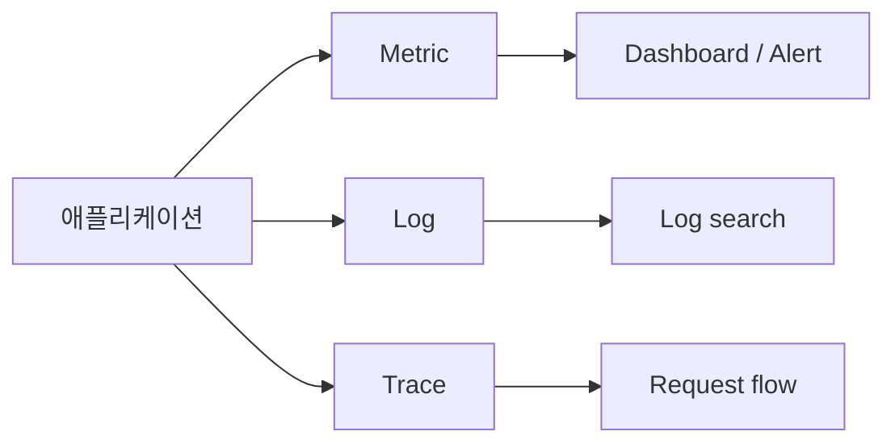

# Observability란 무엇인가?

> Observability 101 시리즈 (1/10)

<!-- a-grade-intro:begin -->

**핵심 질문**: 시스템이 *조용히 망가질 때*, 우리는 어떻게 *밖에서 안을 들여다볼 수 있을까요*?

> *Observability 는 *외부 신호만으로 시스템 내부 상태를 이해하는 능력* 입니다. Monitoring 은 *알려진 문제를 본다*, Observability 는 *모르는 문제를 묻는다*.*

<!-- a-grade-intro:end -->

## 이 글에서 배울 것

- *Monitoring* 과 *Observability* 의 차이
- *Metric, Log, Trace* 세 기둥
- *Known unknowns* 대 *unknown unknowns*
- 첫 신호 수집 5단계
- 흔한 함정 5가지

## 왜 중요한가

운영 시스템은 *예측 불가능한 방식으로* 무너집니다. 미리 만든 dashboard 만으로는 *처음 보는 장애* 를 설명할 수 없습니다. *Observability* 는 *질문할 수 있는 시스템* 을 만듭니다.

> *대시보드는 *답*, observability 는 *질문* 이다.*

## 개념 한눈에 보기



## 핵심 용어 정리

- **Metric**: 시간에 따라 변하는 *숫자*. 예: 초당 요청 수.
- **Log**: 사건을 기록한 *텍스트* 라인.
- **Trace**: 한 요청이 여러 서비스를 거친 *경로*.
- **Cardinality**: label 조합의 *고유 개수*.
- **SLO**: 서비스가 지켜야 할 *수치 약속*.

## Before/After

**Before**: 장애 알림이 와도 *어디서 시작했는지* 모른다. log 를 *grep* 하며 헤맨다.

**After**: dashboard 에서 *증상* 을 보고, trace 로 *원인 서비스* 를 찾고, log 로 *맥락* 을 확인한다.

## 실습: 첫 신호 5단계

### 1단계 — 가장 단순한 metric

```python
import time
counter = 0

def handle_request():
    global counter
    counter += 1
    return f"requests_total {counter}"
```

### 2단계 — 구조화된 log

```python
import json, time

def log_event(event, **fields):
    print(json.dumps({"ts": time.time(), "event": event, **fields}))

log_event("request_received", path="/health", status=200)
```

### 3단계 — 단순 trace 흉내

```python
import uuid

def handle(req):
    trace_id = req.get("trace_id") or str(uuid.uuid4())
    log_event("auth_start", trace_id=trace_id)
    log_event("db_query", trace_id=trace_id)
    log_event("response_sent", trace_id=trace_id)
```

### 4단계 — 세 신호 함께 보기

```bash
# metric: 1분간 요청 수
# log: trace_id 기준 검색
grep '"trace_id": "abc-123"' app.log
```

### 5단계 — 한 가지 질문에 답하기

```text
"왜 결제가 느려졌는가?"
1. metric: latency 그래프 상승
2. trace: payment 서비스 구간이 길다
3. log: db connection timeout
```

## 이 코드에서 주목할 점

- 세 신호는 *서로 보완* 한다. 하나만으로는 *부족*.
- *trace_id* 가 metric, log, trace 를 *연결* 한다.
- 구조화된 log 는 *기계가 읽는 데이터* 다.

## 자주 하는 실수 5가지

1. **Monitoring 과 Observability 를 *동의어* 로 본다.** 전자는 *답*, 후자는 *질문 능력*.
2. **Metric 만 모은다.** *왜* 를 답하지 못한다.
3. **Log 에 *비구조 텍스트* 만 쓴다.** 검색이 *지옥*.
4. **trace_id 를 *서비스 간에 전달하지 않는다*.** trace 가 *끊긴다*.
5. **모든 신호를 *영원히 보관*.** 비용이 *폭발*.

## 실무에서는 이렇게 쓰입니다

대부분의 SRE 팀은 *세 기둥* 을 *최소 신호* 로 본 뒤, *SLO* 를 기준으로 *경보* 를 설계합니다.

## 시니어 엔지니어는 이렇게 생각합니다

- *시스템은 *블랙박스* 가 아니라 *유리상자* 여야 한다.*
- *Dashboard 는 *질문에 답하는 도구*, 장식이 아니다.*
- *Cardinality 는 *비용* 이다.*
- *모든 신호에 *trace_id* 를 흘려보낸다.*
- *모르는 장애를 *물을 수 있는가* 가 진짜 척도.*

## 체크리스트

- [ ] *Monitoring* 과 *Observability* 의 차이를 설명할 수 있다.
- [ ] *세 기둥* 을 나열할 수 있다.
- [ ] 구조화된 log 한 줄을 작성할 수 있다.
- [ ] *trace_id* 의 역할을 안다.

## 연습 문제

1. 최근 장애 하나를 골라 *세 기둥* 으로 분해해 보세요.
2. 비구조 log 한 줄을 *JSON* 으로 다시 써 보세요.
3. *Known unknown* 과 *unknown unknown* 의 예시를 각각 두 개씩.

## 정리 및 다음 단계

Observability 는 *외부에서 내부를 묻는* 기술입니다. 다음 글에서는 *세 기둥* 을 더 깊이 봅니다.

<!-- toc:begin -->
- **Observability란 무엇인가? (현재 글)**
- Metric, Log, Trace (예정)
- Metric 수집과 시각화 (예정)
- 구조화된 로깅 (예정)
- 분산 트레이싱 기초 (예정)
- Dashboard 설계 (예정)
- Alert와 On-Call (예정)
- SLI와 SLO 기초 (예정)
- Cost와 Cardinality (예정)
- 운영 가능한 Observability 스택 (예정)
<!-- toc:end -->

## 참고 자료

- [OpenTelemetry overview](https://opentelemetry.io/docs/concepts/)
- [Google SRE Book — Monitoring](https://sre.google/sre-book/monitoring-distributed-systems/)
- [Three Pillars of Observability](https://www.cncf.io/blog/2022/05/24/observability-cloud-native/)
- [Observability vs Monitoring](https://www.honeycomb.io/blog/observability-101)
