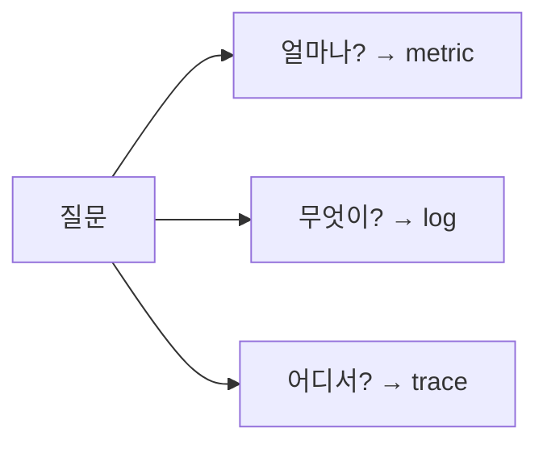

# Metric, Log, Trace

> Observability 101 시리즈 (2/10)


## 이 글에서 다룰 문제

신호를 *잘못 고르면* 비용은 *폭발* 하고 답은 *나오지 않습니다*. 세 신호의 *경계* 를 알면 *적은 비용으로 더 많은 답* 을 얻습니다.

> *옳은 신호 한 개가 *잘못된 dashboard 열 개* 보다 낫다.*

## 전체 흐름


## Before/After

**Before**: 모든 것을 log 에 남긴다. 검색이 *느리고* 비용이 *비싸다*.

**After**: *추세* 는 metric, *원인 맥락* 은 log, *흐름* 은 trace 로 *나눈다*.

## 세 신호 비교 5단계

### 1단계 — Counter

```python
http_requests_total = 0

def on_request():
    global http_requests_total
    http_requests_total += 1
```

### 2단계 — Histogram

```python
import time
buckets = {0.1: 0, 0.5: 0, 1.0: 0, "inf": 0}

def observe(d):
    for b in [0.1, 0.5, 1.0]:
        if d <= b: buckets[b] += 1; return
    buckets["inf"] += 1
```

### 3단계 — 구조화된 log

```python
import json
def log(event, **f):
    print(json.dumps({"event": event, **f}))

log("payment_failed", order_id=42, reason="card_declined")
```

### 4단계 — 단순 trace

```python
import uuid, time

def span(name, trace_id):
    s = time.time()
    log("span_start", trace_id=trace_id, name=name)
    yield
    log("span_end", trace_id=trace_id, name=name, dur=time.time()-s)
```

### 5단계 — 신호 선택 기준

```text
"전체 처리량" → metric
"이 주문의 실패 이유" → log
"이 요청의 어느 서비스가 느렸는가" → trace
```

## 이 코드에서 주목할 점

- *Counter* 는 *증가만* 한다. *Gauge* 는 *오르내린다*.
- *Histogram* 은 *분포* 를 본다. p50/p95/p99.
- *trace_id* 가 세 신호를 *묶는다*.

## 자주 하는 실수 5가지

1. **모든 것을 log 에 남긴다.** 비용 *폭발*, 검색 *지옥*.
2. **Counter 와 Gauge 를 *혼동*.** 그래프가 *말이 안 된다*.
3. **Histogram 없이 *평균* 만 본다.** *long tail* 을 놓친다.
4. **Label 에 *user_id* 를 넣는다.** *cardinality* 폭발.
5. **trace 만 보고 metric 을 무시.** *전체 추세* 를 놓친다.

## 실무에서는 이렇게 쓰입니다

대부분의 팀은 *metric 으로 알람*, *log 로 디버깅*, *trace 로 원인 서비스 추적* 의 3단 구도를 씁니다.

## 체크리스트

- [ ] *Counter, Gauge, Histogram* 을 구분한다.
- [ ] *cardinality* 의 의미를 안다.
- [ ] *trace_id* 의 역할을 안다.
- [ ] 어떤 질문에 어떤 신호를 쓸지 *결정* 할 수 있다.

## 정리 및 다음 단계

세 신호는 *경계가 다른* 도구들입니다. 다음 글에서는 *metric 수집과 시각화* 를 봅니다.

<!-- toc:begin -->
- [Observability란 무엇인가?](./01-what-is-observability.md)
- **Metric, Log, Trace (현재 글)**
- Metric 수집과 시각화 (예정)
- 구조화된 로깅 (예정)
- 분산 트레이싱 기초 (예정)
- Dashboard 설계 (예정)
- Alert와 On-Call (예정)
- SLI와 SLO 기초 (예정)
- Cost와 Cardinality (예정)
- 운영 가능한 Observability 스택 (예정)
<!-- toc:end -->

## 참고 자료

- [Prometheus metric types](https://prometheus.io/docs/concepts/metric_types/)
- [Structured logging](https://www.datadoghq.com/blog/structured-logging/)
- [OpenTelemetry traces](https://opentelemetry.io/docs/concepts/signals/traces/)
- [Histograms vs averages](https://prometheus.io/docs/practices/histograms/)
