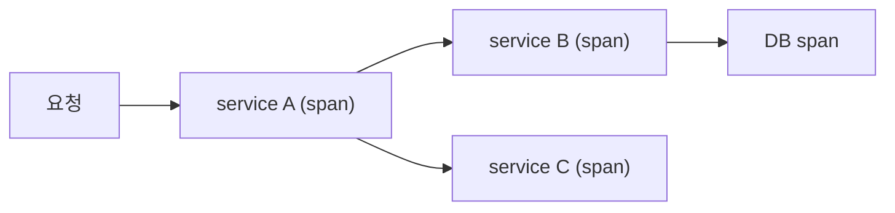

# 분산 트레이싱 기초

> Observability 101 시리즈 (5/10)


## 이 글에서 다룰 문제

Microservice 환경에서 *느린 요청* 의 원인을 찾으려면, log 와 metric 만으로는 *불가능* 합니다. trace 가 *유일한 답* 입니다.

> *Trace 없이 *분산 시스템* 을 디버깅하는 것은 *눈을 감고 미로 걷기*.*

## 전체 흐름


## Before/After

**Before**: log 를 *grep* 하며 어느 서비스가 느렸는지 *추측*.

**After**: trace UI 에서 *느린 span* 이 *바로* 보인다.

## 첫 Trace 5단계

### 1단계 — OpenTelemetry 설치

```bash
pip install opentelemetry-api opentelemetry-sdk \
            opentelemetry-exporter-otlp
```

### 2단계 — Tracer 설정

```python
from opentelemetry import trace
from opentelemetry.sdk.trace import TracerProvider
from opentelemetry.sdk.trace.export import (
    BatchSpanProcessor, ConsoleSpanExporter)

trace.set_tracer_provider(TracerProvider())
trace.get_tracer_provider().add_span_processor(
    BatchSpanProcessor(ConsoleSpanExporter()))
tracer = trace.get_tracer("app")
```

### 3단계 — 첫 span

```python
with tracer.start_as_current_span("handle_request") as s:
    s.set_attribute("user_id", 42)
    with tracer.start_as_current_span("db_query"):
        pass
```

### 4단계 — Context propagation (HTTP 헤더)

```python
from opentelemetry.propagate import inject, extract

headers = {}
inject(headers)              # 호출 전: trace_id 를 헤더에 주입
ctx = extract(incoming_headers)  # 수신 측: 헤더에서 복원
```

### 5단계 — Sampling

```python
from opentelemetry.sdk.trace.sampling import TraceIdRatioBased
TracerProvider(sampler=TraceIdRatioBased(0.1))   # 10% 만
```

## 이 코드에서 주목할 점

- *한 trace = 여러 span* 의 트리.
- 헤더 *traceparent* 가 표준 (W3C Trace Context).
- *Sampling* 은 *비용 통제* 의 핵심.

## 자주 하는 실수 5가지

1. **모든 trace 를 100% 저장.** 비용 *폭발*.
2. **Context 를 *전달하지 않음*.** trace 가 *끊긴다*.
3. **Span 에 *너무 많은 attribute*.** cardinality 폭발.
4. **Async 코드에서 *context 를 잃음*.** 부모 추적 실패.
5. **Trace 만 보고 *metric 무시*.** 추세를 놓친다.

## 실무에서는 이렇게 쓰입니다

OpenTelemetry → *Tempo / Jaeger / Honeycomb* 으로 흘려보내고, Grafana 에서 *trace ↔ log ↔ metric* 을 *한 화면* 에서 봅니다.

## 체크리스트

- [ ] 첫 span 을 *콘솔* 에 본다.
- [ ] *traceparent* 헤더 의미를 안다.
- [ ] *Sampling* 비율을 정한다.
- [ ] log 에 *trace_id* 를 넣는다.

## 정리 및 다음 단계

Trace 가 흐르면 *흐름이 보입니다*. 다음 글은 *Dashboard 설계* 입니다.

<!-- toc:begin -->
- [Observability란 무엇인가?](./01-what-is-observability.md)
- [Metric, Log, Trace](./02-metric-log-trace.md)
- [Metric 수집과 시각화](./03-metric-collection.md)
- [구조화된 로깅](./04-structured-logging.md)
- **분산 트레이싱 기초 (현재 글)**
- Dashboard 설계 (예정)
- Alert와 On-Call (예정)
- SLI와 SLO 기초 (예정)
- Cost와 Cardinality (예정)
- 운영 가능한 Observability 스택 (예정)
<!-- toc:end -->

## 참고 자료

- [OpenTelemetry tracing](https://opentelemetry.io/docs/concepts/signals/traces/)
- [W3C Trace Context](https://www.w3.org/TR/trace-context/)
- [Jaeger architecture](https://www.jaegertracing.io/docs/latest/architecture/)
- [Sampling strategies](https://opentelemetry.io/docs/concepts/sampling/)
