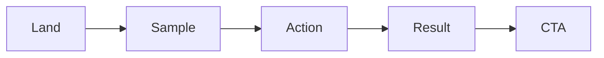

# 데모 만들기

> 포트폴리오 프로젝트 101 시리즈 (4/10)


## 이 글에서 다룰 문제

*데모* 가 *살아 있어야* *프로젝트* 가 *살아 있다*.

## 전체 흐름


## Before/After

**Before**: *로그인 후 빈 화면*.

**After**: *시드 + 핵심 흐름* 이 보인다.

## 데모 표

### 1단계 — 시나리오

```python
flow = ["land", "sample", "action", "result"]
```

### 2단계 — 시드 데이터

```python
seed = {"users": 5, "tasks": 12}
```

### 3단계 — 데모 계정

```python
demo = {"id": "guest@demo", "pw": "demo1234"}
```

### 4단계 — 백업 영상

```python
video_url = "https://youtu.be/example"
```

### 5단계 — 헬스체크

```python
health = "/healthz"
```

## 이 코드에서 주목할 점

- *첫 화면* 에 *시드* 가 보인다.
- *계정* 은 *공유*.
- *영상* 은 *백업*.

## 자주 하는 실수 5가지

1. ***로그인* 부터 막힌다.**
2. ***시드* 가 없다.**
3. ***계정* 이 *비공개*.**
4. ***백업 영상* 이 없다.**
5. ***헬스체크* 가 없다.**

## 실무에서는 이렇게 쓰입니다

SaaS 회사도 *게스트 모드* 로 *30초* 데모를 제공합니다.

## 체크리스트

- [ ] *시나리오* 4단계.
- [ ] *시드* 데이터.
- [ ] *공유 계정*.
- [ ] *백업 영상*.

## 정리 및 다음 단계

다음 글은 *배포하기* 입니다.

<!-- toc:begin -->
- [포트폴리오 프로젝트란 무엇인가](./01-what-is-a-portfolio-project.md)
- [좋은 프로젝트의 조건](./02-traits-of-a-good-project.md)
- [README 작성](./03-writing-the-readme.md)
- **데모 만들기 (현재 글)**
- 배포하기 (예정)
- 테스트와 문서화 (예정)
- 기술적 의사결정 기록 (예정)
- 블로그 글로 정리하기 (예정)
- 면접에서 설명하기 (예정)
- 포트폴리오 개선 체크리스트 (예정)
<!-- toc:end -->

## 참고 자료

- [Demo-Driven Development - Robert Reppel](https://www.amazon.com/Demo-Driven-Development-Robert-Reppel/dp/B08GFL12CJ)
- [Great Demo - Peter Cohan](https://greatdemo.com/)
- [Showing the Product](https://basecamp.com/shapeup/2.4-chapter-09)
- [Heroku Buttons](https://devcenter.heroku.com/articles/heroku-button)
