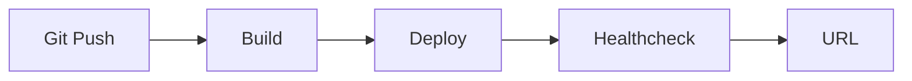

# 배포하기

> 포트폴리오 프로젝트 101 시리즈 (5/10)

<!-- a-grade-intro:begin -->

**핵심 질문**: *로컬에서만 도는 코드* 가 *왜 포트폴리오* 가 되지 못할까요?

> *접근* 할 수 없으면 *증명* 도 없기 때문입니다.

<!-- a-grade-intro:end -->

## 이 글에서 배울 것

- *호스팅* 선택
- *도메인* 연결
- *환경 변수*
- *지속 배포*
- *비용 관리*

## 왜 중요한가

*배포* 는 *작품* 을 *세상* 에 *연결* 합니다.

## 개념 한눈에 보기



## 핵심 용어 정리

- **hosting**: *서버 제공자*.
- **domain**: *주소*.
- **env var**: *환경 변수*.
- **CD**: *지속 배포*.
- **cost**: *월 비용*.

## Before/After

**Before**: *localhost* 만 돈다.

**After**: *공개 URL* 이 있다.

## 실습: 배포 표

### 1단계 — 호스팅 선택

```python
host = "fly.io"  # 또는 render, railway
```

### 2단계 — 환경 변수

```python
env = {"DATABASE_URL": "...", "SECRET_KEY": "..."}
```

### 3단계 — 빌드 명령

```bash
docker build -t app .
```

### 4단계 — 배포

```bash
fly deploy
```

### 5단계 — 헬스체크

```python
url = "https://app.fly.dev/healthz"
```

## 이 코드에서 주목할 점

- *호스팅* 은 *무료 등급*.
- *환경 변수* 는 *시크릿*.
- *헬스체크* 는 *자동*.

## 자주 하는 실수 5가지

1. ***시크릿* 을 *코드* 에 넣는다.**
2. ***도메인* 이 *없다*.**
3. ***헬스체크* 가 *없다*.**
4. ***비용* 을 *모른다*.**
5. ***재배포* 가 *수동*.**

## 실무에서는 이렇게 쓰입니다

스타트업도 *Render*, *Fly.io*, *Vercel* 등으로 *MVP* 를 띄웁니다.

## 시니어 엔지니어는 이렇게 생각합니다

- *호스팅* 은 *간단*.
- *도메인* 은 *프로페셔널*.
- *시크릿* 은 *환경 변수*.
- *지속 배포* 는 *Git push*.
- *비용* 은 *월 단위*.

## 체크리스트

- [ ] *호스팅* 결정.
- [ ] *공개 URL*.
- [ ] *환경 변수*.
- [ ] *헬스체크*.

## 연습 문제

1. *호스팅* 의 정의 한 줄.
2. *환경 변수* 의 목적 한 줄.
3. *헬스체크* 의 역할 한 줄.

## 정리 및 다음 단계

다음 글은 *테스트와 문서화* 입니다.

<!-- toc:begin -->
- [포트폴리오 프로젝트란 무엇인가](./01-what-is-a-portfolio-project.md)
- [좋은 프로젝트의 조건](./02-traits-of-a-good-project.md)
- [README 작성](./03-writing-the-readme.md)
- [데모 만들기](./04-building-the-demo.md)
- **배포하기 (현재 글)**
- 테스트와 문서화 (예정)
- 기술적 의사결정 기록 (예정)
- 블로그 글로 정리하기 (예정)
- 면접에서 설명하기 (예정)
- 포트폴리오 개선 체크리스트 (예정)
<!-- toc:end -->

## 참고 자료

- [Fly.io Docs](https://fly.io/docs/)
- [Render Docs](https://render.com/docs)
- [The Twelve-Factor App](https://12factor.net/)
- [Deployment Strategies - Martin Fowler](https://martinfowler.com/bliki/BlueGreenDeployment.html)
