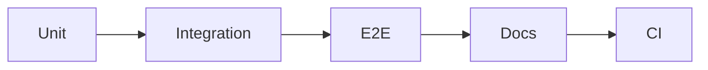

# 테스트와 문서화

> 포트폴리오 프로젝트 101 시리즈 (6/10)


## 이 글에서 다룰 문제

*테스트 + 문서* 는 *전문성* 의 *증명* 입니다.

## 전체 흐름


## Before/After

**Before**: *수동* 으로만 확인.

**After**: *Push* 시 *자동* 검증.

## 테스트 표

### 1단계 — 단위 테스트

```python
def test_add():
    assert 1 + 1 == 2
```

### 2단계 — 통합

```python
def test_api(client):
    assert client.get("/health").status_code == 200
```

### 3단계 — E2E

```python
e2e_steps = ["login", "create", "delete"]
```

### 4단계 — CI 설정

```yaml
on: [push]
jobs:
  test:
    runs-on: ubuntu-latest
```

### 5단계 — 문서

```python
docs = ["README", "API.md", "CHANGELOG.md"]
```

## 이 코드에서 주목할 점

- *단위* 는 *빠르다*.
- *통합* 은 *경계*.
- *E2E* 는 *흐름*.

## 자주 하는 실수 5가지

1. ***단위* 만 쓴다.**
2. ***E2E* 가 없다.**
3. ***CI* 가 없다.**
4. ***API 문서* 가 없다.**
5. ***CHANGELOG* 가 없다.**

## 실무에서는 이렇게 쓰입니다

오픈소스도 *Push* 시 *CI* 를 돌립니다.

## 체크리스트

- [ ] *단위* 테스트.
- [ ] *E2E* 1개.
- [ ] *CI* 워크플로.
- [ ] *API 문서*.

## 정리 및 다음 단계

다음 글은 *기술적 의사결정 기록* 입니다.

<!-- toc:begin -->
- [포트폴리오 프로젝트란 무엇인가](./01-what-is-a-portfolio-project.md)
- [좋은 프로젝트의 조건](./02-traits-of-a-good-project.md)
- [README 작성](./03-writing-the-readme.md)
- [데모 만들기](./04-building-the-demo.md)
- [배포하기](./05-deploying-the-project.md)
- **테스트와 문서화 (현재 글)**
- 기술적 의사결정 기록 (예정)
- 블로그 글로 정리하기 (예정)
- 면접에서 설명하기 (예정)
- 포트폴리오 개선 체크리스트 (예정)
<!-- toc:end -->

## 참고 자료

- [Test Pyramid - Martin Fowler](https://martinfowler.com/articles/practical-test-pyramid.html)
- [pytest Docs](https://docs.pytest.org/)
- [GitHub Actions Docs](https://docs.github.com/actions)
- [Keep a Changelog](https://keepachangelog.com/)
