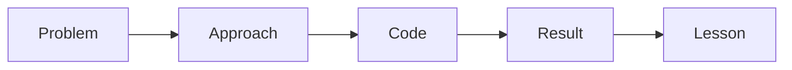

# 블로그 글로 정리하기

> 포트폴리오 프로젝트 101 시리즈 (8/10)


## 이 글에서 다룰 문제

*블로그* 가 *프로젝트* 를 *발견* 가능하게 만듭니다.

## 전체 흐름


## Before/After

**Before**: *코드 덤프* 글.

**After**: *문제 - 해결 - 결과* 글.

## 글 골격

### 1단계 — 문제 한 줄

```markdown
> 팀 일정 분실 문제를 어떻게 해결했나
```

### 2단계 — 접근

```python
approach = ["관찰", "가설", "MVP", "배포"]
```

### 3단계 — 코드 발췌

```python
def normalize(date_str):
    return date_str.replace(".", "-")
```

### 4단계 — 결과

```python
result = {"users": 30, "latency_ms": 120}
```

### 5단계 — 학습

```python
lesson = "MVP 는 작아야 산다"
```

## 이 코드에서 주목할 점

- *문제* 는 *한 줄*.
- *코드* 는 *발췌*.
- *결과* 는 *수치*.

## 자주 하는 실수 5가지

1. ***코드 덤프*.**
2. ***결과* 가 없다.**
3. ***SEO 제목* 이 *모호*.**
4. ***스크린샷* 이 없다.**
5. ***다음 글* 링크가 없다.**

## 실무에서는 이렇게 쓰입니다

엔지니어 블로그도 *문제 - 해결 - 결과* 형식을 씁니다.

## 체크리스트

- [ ] *문제* 1줄.
- [ ] *코드* 3개 이내.
- [ ] *결과* 수치.
- [ ] *학습* 1줄.

## 정리 및 다음 단계

다음 글은 *면접에서 설명하기* 입니다.

<!-- toc:begin -->
- [포트폴리오 프로젝트란 무엇인가](./01-what-is-a-portfolio-project.md)
- [좋은 프로젝트의 조건](./02-traits-of-a-good-project.md)
- [README 작성](./03-writing-the-readme.md)
- [데모 만들기](./04-building-the-demo.md)
- [배포하기](./05-deploying-the-project.md)
- [테스트와 문서화](./06-tests-and-documentation.md)
- [기술적 의사결정 기록](./07-recording-tech-decisions.md)
- **블로그 글로 정리하기 (현재 글)**
- 면접에서 설명하기 (예정)
- 포트폴리오 개선 체크리스트 (예정)
<!-- toc:end -->

## 참고 자료

- [On Writing Well - William Zinsser](https://www.harpercollins.com/products/on-writing-well-william-zinsser)
- [Google Search Central](https://developers.google.com/search/docs)
- [Hashnode for Devs](https://hashnode.com/)
- [Writing for Engineers - Heinemeier Hansson](https://world.hey.com/dhh)
