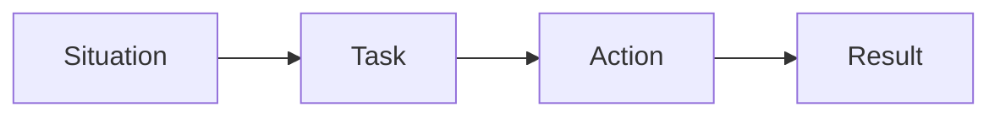

# 면접에서 설명하기

> 포트폴리오 프로젝트 101 시리즈 (9/10)

<!-- a-grade-intro:begin -->

**핵심 질문**: *면접관* 이 *포트폴리오* 에서 *듣고* 싶은 건 *무엇* 일까요?

> *코드* 보다 *판단* 입니다.

<!-- a-grade-intro:end -->

## 이 글에서 배울 것

- *STAR* 형식
- *문제 - 해결* 서사
- *수치* 로 말하기
- *질문* 예측
- *2분* 요약

## 왜 중요한가

*면접* 은 *짧고*, *기억* 은 *서사* 로 남기 때문입니다.

## 개념 한눈에 보기



## 핵심 용어 정리

- **STAR**: *상황 - 과제 - 행동 - 결과*.
- **elevator pitch**: *2분 요약*.
- **trade-off**: *선택의 대가*.
- **metric**: *수치 지표*.
- **follow-up**: *후속 질문*.

## Before/After

**Before**: "*Flask* 로 *API* 를 *만들었습니다*."

**After**: "*30명* 이 *동시 접속* 하는 *문제* 를 *Flask + Redis* 로 *해결* 했습니다."

## 실습: 2분 답변

### 1단계 — 상황

```python
situation = "팀 일정이 흩어져 분실되었다"
```

### 2단계 — 과제

```python
task = "한 화면에서 일정을 통합 조회"
```

### 3단계 — 행동

```python
action = ["Flask API", "PostgreSQL", "Render 배포"]
```

### 4단계 — 결과

```python
result = {"users": 30, "latency_ms": 120}
```

### 5단계 — 학습

```python
lesson = "MVP 는 작아야 산다"
```

## 이 코드에서 주목할 점

- *STAR* 가 *순서* 다.
- *수치* 가 *증거* 다.
- *학습* 이 *마무리* 다.

## 자주 하는 실수 5가지

1. ***기술 나열* 만 한다.**
2. ***수치* 가 없다.**
3. ***트레이드오프* 를 못 말한다.**
4. ***개인 기여* 가 모호하다.**
5. ***학습* 이 없다.**

## 실무에서는 이렇게 쓰입니다

시니어 엔지니어도 *프로젝트 회고* 를 *STAR* 로 *문서화* 합니다.

## 시니어 엔지니어는 이렇게 생각합니다

- *상황* 은 *공감*.
- *과제* 는 *명확*.
- *행동* 은 *나의 몫*.
- *결과* 는 *수치*.
- *학습* 은 *정직*.

## 체크리스트

- [ ] *2분* 안에 끝낸다.
- [ ] *수치* 1개 이상.
- [ ] *트레이드오프* 1개.
- [ ] *학습* 1개.

## 연습 문제

1. *STAR* 의 풀이 한 줄.
2. *trade-off* 의 정의 한 줄.
3. *elevator pitch* 의 길이 한 줄.

## 정리 및 다음 단계

다음 글은 *포트폴리오 개선 체크리스트* 입니다.

<!-- toc:begin -->
- [포트폴리오 프로젝트란 무엇인가](./01-what-is-a-portfolio-project.md)
- [좋은 프로젝트의 조건](./02-traits-of-a-good-project.md)
- [README 작성](./03-writing-the-readme.md)
- [데모 만들기](./04-building-the-demo.md)
- [배포하기](./05-deploying-the-project.md)
- [테스트와 문서화](./06-tests-and-documentation.md)
- [기술적 의사결정 기록](./07-recording-tech-decisions.md)
- [블로그 글로 정리하기](./08-summarizing-as-blog-posts.md)
- **면접에서 설명하기 (현재 글)**
- 포트폴리오 개선 체크리스트 (예정)
<!-- toc:end -->

## 참고 자료

- [STAR Method - Indeed](https://www.indeed.com/career-advice/interviewing/how-to-use-the-star-interview-response-technique)
- [Cracking the Coding Interview - McDowell](https://www.crackingthecodinginterview.com/)
- [Behavioral Interviews - Google re:Work](https://rework.withgoogle.com/guides/hiring-use-structured-interviewing/steps/introduction/)
- [The Tech Resume Inside Out - Orosz](https://thetechresume.com/)
