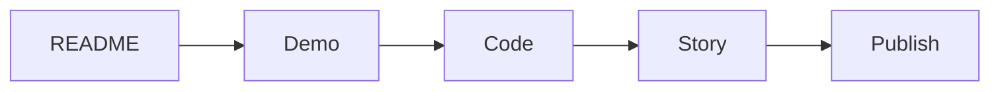

# 포트폴리오 개선 체크리스트

> 포트폴리오 프로젝트 101 시리즈 (10/10)


## 이 글에서 다룰 문제

*첫 인상* 은 *3분* 안에 결정됩니다.

## 전체 흐름


## Before/After

**Before**: *README* 는 *작성자* 만 안다.

**After**: *처음 본 사람* 도 *5분* 안에 *실행* 한다.

## 점검 5단계

### 1단계 — README 검수

```python
readme = ["What", "Why", "How", "Demo", "License"]
```

### 2단계 — 데모 검수

```python
demo = {"url": "https://demo.example.com", "uptime": 0.99}
```

### 3단계 — 코드 검수

```python
code = {"tests": True, "lint": True, "ci": True}
```

### 4단계 — 서사 검수

```python
story = ["문제", "해결", "결과", "학습"]
```

### 5단계 — 공개

```python
launch = ["GitHub", "Blog", "LinkedIn"]
```

## 이 코드에서 주목할 점

- *README* 가 *입구*.
- *데모* 가 *증거*.
- *서사* 가 *기억*.

## 자주 하는 실수 5가지

1. ***README* 가 *오래됨*.**
2. ***데모* 링크 *깨짐*.**
3. ***테스트* 가 *깨짐*.**
4. ***라이선스* 가 *없음*.**
5. ***스크린샷* 이 *없음*.**

## 실무에서는 이렇게 쓰입니다

오픈소스 프로젝트도 *릴리스 전* 동일한 *체크리스트* 를 돌립니다.

## 체크리스트

- [ ] *README* 5요소 완비.
- [ ] *데모* 링크 *작동*.
- [ ] *테스트* 통과.
- [ ] *라이선스* 명시.
- [ ] *스크린샷* 1장 이상.

## 정리 및 다음 단계

이 글은 *포트폴리오 프로젝트 101* 의 *마지막* 글입니다. 다음 시리즈에서는 *기술 글쓰기* 를 다룹니다.

<!-- toc:begin -->
- [포트폴리오 프로젝트란 무엇인가](./01-what-is-a-portfolio-project.md)
- [좋은 프로젝트의 조건](./02-traits-of-a-good-project.md)
- [README 작성](./03-writing-the-readme.md)
- [데모 만들기](./04-building-the-demo.md)
- [배포하기](./05-deploying-the-project.md)
- [테스트와 문서화](./06-tests-and-documentation.md)
- [기술적 의사결정 기록](./07-recording-tech-decisions.md)
- [블로그 글로 정리하기](./08-summarizing-as-blog-posts.md)
- [면접에서 설명하기](./09-explaining-in-interviews.md)
- **포트폴리오 개선 체크리스트 (현재 글)**
<!-- toc:end -->

## 참고 자료

- [The Pragmatic Programmer - Hunt & Thomas](https://pragprog.com/titles/tpp20/the-pragmatic-programmer-20th-anniversary-edition/)
- [Open Source Guides - GitHub](https://opensource.guide/)
- [Release Engineering - Google SRE Book](https://sre.google/sre-book/release-engineering/)
- [Choose a License](https://choosealicense.com/)
