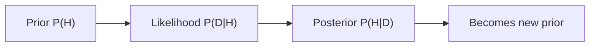

# 베이즈 정리

> Probability 101 시리즈 (4/10)

<!-- a-grade-intro:begin -->

**핵심 질문**: *데이터를 보았을 때* 우리의 *믿음* 은 *어떻게 갱신* 될까요? *한 식* 이 *AI, 통계, 의사결정* 의 공통 언어가 됩니다.

> *Posterior ∝ Likelihood × Prior.*

<!-- a-grade-intro:end -->

## 이 글에서 배울 것

- 베이즈 정리의 *식과 직관*
- *사전/우도/사후* 관계
- *오즈* 와 *베이즈 인자*
- 5단계 베이즈 실습
- 흔한 함정 5가지

## 왜 중요한가

베이즈 정리는 *불확실성을 갱신* 하는 *유일한 일관된 규칙* 입니다. *스팸 분류, 의료 진단, A/B, RL* 모두 이 식을 씁니다.

> *Bayes' theorem is the engine of inference.*

## 개념 한눈에 보기



## 핵심 용어 정리

- **사전 P(H)**: 데이터 보기 *전* 의 믿음.
- **우도 P(D|H)**: 가설 H 가 *맞다고 할 때* 데이터 D 가 나올 확률.
- **사후 P(H|D)**: 데이터를 *본 후* 의 믿음.
- **증거 P(D)**: *전체 데이터 확률* (정규화 상수).
- **베이즈 인자**: P(D|H₁) / P(D|H₂).

## Before/After

**Before**: *“검사 양성 → 병이 있다.”*

**After**: *P(병|+) = P(+|병)·P(병) / P(+)* — 기저율이 작으면 *PPV* 가 작다.

## 실습: 5단계 베이즈

### 1단계 — 사전 / 우도

```python
prior = 0.01           # P(disease)
sens = 0.99            # P(+|disease)
spec = 0.95            # P(-|no disease)
```

### 2단계 — 증거 P(+)

```python
p_pos = sens * prior + (1 - spec) * (1 - prior)
print("P(+):", p_pos)
```

### 3단계 — 사후 P(질병 | +)

```python
post = sens * prior / p_pos
print("P(disease | +):", post)
```

### 4단계 — 두 번째 양성 갱신

```python
prior2 = post
p_pos2 = sens * prior2 + (1 - spec) * (1 - prior2)
post2 = sens * prior2 / p_pos2
print("after 2 positives:", post2)
```

### 5단계 — 오즈 형태

```python
prior_odds = 0.01 / 0.99
likelihood_ratio = sens / (1 - spec)
post_odds = prior_odds * likelihood_ratio
print("posterior odds:", post_odds, "P:", post_odds / (1 + post_odds))
```

## 이 코드에서 주목할 점

- *기저율* 이 작으면 *민감한 검사* 도 *PPV* 가 낮다.
- *사후* 가 다음 *사전* 이 된다 — *순차 갱신*.
- *오즈 형태* 가 계산을 단순화한다.

## 자주 하는 실수 5가지

1. ***P(D|H) = P(H|D)*** *(아님)*.
2. ***기저율* 무시.**
3. ***사전* 이 *없는 척*.**
4. ***우도* 와 *확률* 혼동.**
5. ***순차 갱신* 에서 *독립* 가정 누락.**

## 실무에서는 이렇게 쓰입니다

스팸 필터(Naive Bayes), A/B 테스트(Bayesian), 의료 진단, RL 의 *belief state* — *베이즈 추론* 은 *probabilistic ML* 의 핵심입니다.

## 시니어 엔지니어는 이렇게 생각합니다

- *사전* 을 *명시* 한다.
- *우도* 와 *확률* 을 구분한다.
- *오즈* 와 *베이즈 인자* 를 사용한다.
- *순차 갱신* 의 *독립성* 을 검증한다.
- *민감도 분석* 을 한다.

## 체크리스트

- [ ] 베이즈 정리를 *식* 으로 안다.
- [ ] *사전/우도/사후* 를 구분한다.
- [ ] *PPV* 계산을 안다.
- [ ] *순차 갱신* 을 할 수 있다.

## 연습 문제

1. *기저율 0.001*, *민감도 0.99*, *특이도 0.99* 일 때 *PPV* 를 계산하세요.
2. *베이즈 인자 = 10* 의 *실무적 의미* 를 적으세요.
3. *사전이 강할 때* 와 *약할 때* 사후의 차이를 비교하세요.

## 정리 및 다음 단계

베이즈 정리는 *학습의 수학* 입니다. 다음 글에서는 *확률변수* 로 *수치적 결과* 를 다룹니다.

<!-- toc:begin -->
- [확률이란 무엇인가?](./01-what-is-probability.md)
- [사건과 표본공간](./02-events-and-sample-space.md)
- [조건부확률](./03-conditional-probability.md)
- **베이즈 정리 (현재 글)**
- 확률변수 (예정)
- 기대값과 분산 (예정)
- 이산분포 (예정)
- 연속분포 (예정)
- 대수의 법칙과 중심극한정리 (예정)
- 머신러닝에서의 확률 (예정)
<!-- toc:end -->

## 참고 자료

- [3Blue1Brown — Bayes' theorem](https://www.3blue1brown.com/lessons/bayes-theorem)
- [Wikipedia — Bayes' theorem](https://en.wikipedia.org/wiki/Bayes%27_theorem)
- [Stanford CS109 — Notes](https://web.stanford.edu/class/cs109/)
- [Kevin Murphy — Probabilistic ML](https://probml.github.io/pml-book/book1.html)
