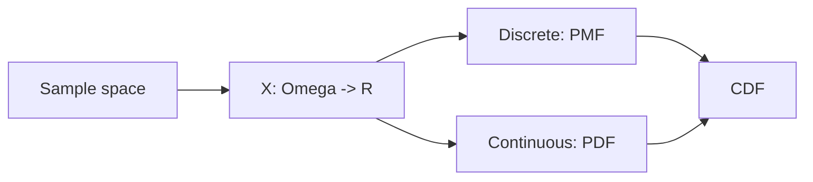

# 확률변수

> Probability 101 시리즈 (5/10)


## 이 글에서 다룰 문제

확률변수가 있어야 *기대값, 분산, 분포, 회귀* 같은 *수치 통계* 가 가능합니다. *모든 ML 모델 출력* 은 확률변수입니다.

> *Random variables put numbers on outcomes.*

## 전체 흐름


## Before/After

**Before**: *“주사위 결과”* — 단순 사건.

**After**: *X = 주사위 눈* → *기대값 3.5*, *분산 2.92* 같은 *수치 분석* 가능.

## 5단계 확률변수

### 1단계 — 이산 확률변수

```python
import numpy as np
x = np.array([1, 2, 3, 4, 5, 6])
p = np.full(6, 1/6)  # PMF
print("sum p:", p.sum())
```

### 2단계 — CDF

```python
cdf = np.cumsum(p)
print("CDF:", cdf)
```

### 3단계 — 연속 확률변수 (정규)

```python
from scipy import stats
rv = stats.norm(loc=0, scale=1)
print("PDF at 0:", rv.pdf(0), "CDF at 0:", rv.cdf(0))
```

### 4단계 — 표본 추출

```python
import numpy as np
samples = np.random.default_rng(0).normal(0, 1, 10_000)
print("mean:", samples.mean(), "std:", samples.std())
```

### 5단계 — 확률 계산

```python
from scipy import stats
rv = stats.norm()
print("P(-1 <= X <= 1):", rv.cdf(1) - rv.cdf(-1))
```

## 이 코드에서 주목할 점

- *PMF* 는 *값* 이 확률, *PDF* 는 *밀도* (확률 아님).
- *연속* 에서 *P(X = x) = 0*.
- *CDF* 는 *항상* 정의된다.

## 자주 하는 실수 5가지

1. ***PDF 값을 확률* 로 해석**.
2. ***이산/연속*** 혼동.
3. ***PMF 합 ≠ 1*** 인데 정의로 사용.
4. ***CDF* 와 *PDF* 혼동**.
5. ***표본 통계* 를 *모수* 로 단정**.

## 실무에서는 이렇게 쓰입니다

ML 모델 출력의 *softmax 확률*, *정규 노이즈* 가정, *생존시간* 분석 — *확률변수* 가 *모든 모델링* 의 기본입니다.

## 체크리스트

- [ ] *이산/연속* 을 구분한다.
- [ ] *PMF/PDF/CDF* 를 안다.
- [ ] *scipy.stats* 로 분포를 다룬다.
- [ ] *표본 추출* 로 시뮬레이션한다.

## 정리 및 다음 단계

확률변수는 *확률을 수치 분석으로* 옮기는 다리입니다. 다음 글에서는 *기대값과 분산* 을 봅니다.

<!-- toc:begin -->
- [확률이란 무엇인가?](./01-what-is-probability.md)
- [사건과 표본공간](./02-events-and-sample-space.md)
- [조건부확률](./03-conditional-probability.md)
- [베이즈 정리](./04-bayes-theorem.md)
- **확률변수 (현재 글)**
- 기대값과 분산 (예정)
- 이산분포 (예정)
- 연속분포 (예정)
- 대수의 법칙과 중심극한정리 (예정)
- 머신러닝에서의 확률 (예정)
<!-- toc:end -->

## 참고 자료

- [Khan Academy — Random variables](https://www.khanacademy.org/math/statistics-probability/random-variables-stats-library)
- [Wikipedia — Random variable](https://en.wikipedia.org/wiki/Random_variable)
- [scipy.stats](https://docs.scipy.org/doc/scipy/reference/stats.html)
- [Stanford CS109 — Notes](https://web.stanford.edu/class/cs109/)
