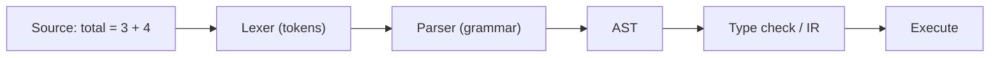

# syntax와 semantics

> Programming Languages 101 시리즈 (2/10)

<!-- a-grade-intro:begin -->

**핵심 질문**: 컴파일은 통과했는데 결과가 이상한 이유는 무엇이고, 반대로 너무 사소한 콤마 하나로 빌드가 깨지는 이유는 무엇일까요?

> 모든 프로그래밍 언어는 두 축 위에 서 있습니다. **syntax**는 어떤 글자 배열이 합법인지에 답하고, **semantics**는 그 합법인 글자 배열이 실제로 무엇을 한다는 뜻인지에 답합니다. 둘은 자주 섞여서 이야기되지만, 분리해서 보는 순간 컴파일 에러와 런타임 버그가 왜 다른 동물인지가 보입니다.

<!-- a-grade-intro:end -->

## 이 글에서 배울 것

- syntax와 semantics의 정확한 경계
- 토큰 → 문법 → AST로 이어지는 파싱의 전체 흐름
- "문법은 맞는데 의미가 이상한" 코드의 정체
- 정적 의미와 동적 의미의 차이

## 왜 중요한가

에러 메시지를 빠르게 읽고, 새 언어 문법을 빠르게 익히고, 같은 코드가 다른 언어에서 왜 다르게 동작하는지를 이해하려면 두 축을 분리해서 봐야 합니다. 또한 시리즈 후반의 type system, scope, closure는 모두 "syntax는 동일해도 semantics가 다른" 사례입니다.

> "이 코드는 빌드가 된다"는 말은 syntax 통과를 뜻할 뿐, semantics가 의도와 같다는 뜻이 아닙니다.

## 개념 한눈에 보기



`Lexer`는 글자를 토큰으로 자르고, `Parser`는 토큰이 문법에 맞는지 본 뒤 트리(AST)를 만듭니다. 여기까지가 syntax 단계입니다. 그 뒤로 의미를 해석하는 단계 — 타입 검사, 평가 — 가 semantics입니다.

## 핵심 용어 정리

- **Token**: 의미를 갖는 최소 단위 글자 묶음(`if`, `=`, `42`).
- **Grammar (BNF/EBNF)**: 토큰들이 어떤 순서로 모여야 합법인지의 규칙.
- **AST (Abstract Syntax Tree)**: 코드를 트리로 표현한 것.
- **Static semantics**: 실행 전에 정해지는 의미(타입 검사, 이름 해석).
- **Dynamic semantics**: 실행 중에 일어나는 의미(평가, 부수 효과).

## Before/After

**Before — syntax 에러 vs 의도 에러를 섞어서 본다**

```python
# 둘 다 "에러"로만 인식하면 혼란스럽다
print("hello"   # SyntaxError
divide(10, 0)   # 합법인 syntax, 실행 시 ZeroDivisionError
```

둘은 완전히 다른 단계의 에러입니다. 첫 번째는 파서가 거부한 것이고, 두 번째는 의미를 평가하다가 발생한 것입니다.

**After — 어느 단계의 에러인지 분리해서 읽기**

```python
import ast

src_ok  = "total = 3 + 4"
src_bad = "total = 3 +"

print(ast.parse(src_ok))   # syntax 통과 → AST 생성
ast.parse(src_bad)         # SyntaxError: invalid syntax
```

`ast.parse`가 통과했는지를 보면 syntax 단계 통과 여부를 명확히 알 수 있습니다. 의도와 일치하는지는 그 뒤의 일입니다.

## 실습: 작은 표현식을 직접 파싱해 보기

`3 + 4 * 2` 같은 표현식을 토큰으로 자르고, 트리로 만들고, 평가해 봅니다.

### 1단계 — 토큰화

```python
# 1_lex.py
import re

def tokenize(src: str) -> list[tuple[str, str]]:
    spec = [
        ("NUM", r"\d+"),
        ("OP",  r"[+*\-/()]"),
        ("WS",  r"\s+"),
    ]
    regex = "|".join(f"(?P<{n}>{p})" for n, p in spec)
    return [
        (m.lastgroup, m.group())
        for m in re.finditer(regex, src)
        if m.lastgroup != "WS"
    ]

print(tokenize("3 + 4 * 2"))
# [('NUM', '3'), ('OP', '+'), ('NUM', '4'), ('OP', '*'), ('NUM', '2')]
```

여기까지는 "글자를 의미 있는 조각으로 자르는" 일이며, 의미를 해석하지 않습니다.

### 2단계 — 문법 정의

대략 다음과 같습니다(BNF 풍).

```
expr    = term  ("+" term  | "-" term)*
term    = factor ("*" factor | "/" factor)*
factor  = NUM | "(" expr ")"
```

`*`가 `+`보다 더 깊이(`term` 안에서) 묶이는 것이 우선순위를 만듭니다.

### 3단계 — 파서로 AST 만들기

```python
# 3_parse.py
class P:
    def __init__(self, toks):
        self.toks, self.i = toks, 0
    def peek(self): return self.toks[self.i] if self.i < len(self.toks) else (None, None)
    def eat(self):  t = self.peek(); self.i += 1; return t
    def expr(self):
        node = self.term()
        while self.peek()[1] in ("+", "-"):
            op = self.eat()[1]; node = (op, node, self.term())
        return node
    def term(self):
        node = self.factor()
        while self.peek()[1] in ("*", "/"):
            op = self.eat()[1]; node = (op, node, self.factor())
        return node
    def factor(self):
        k, v = self.eat()
        if k == "NUM": return int(v)
        if v == "(":
            node = self.expr(); self.eat(); return node
        raise SyntaxError(f"unexpected {v}")

from pprint import pprint
pprint(P(tokenize("3 + 4 * 2")).expr())
# ('+', 3, ('*', 4, 2))
```

트리는 우선순위를 그대로 보여 줍니다. `4 * 2`가 한 노드로 묶여 `+`의 오른쪽에 들어갑니다.

### 4단계 — 평가(semantics)

```python
# 4_eval.py
def evaluate(node) -> int:
    if isinstance(node, int):
        return node
    op, a, b = node
    return {
        "+": lambda x, y: x + y,
        "-": lambda x, y: x - y,
        "*": lambda x, y: x * y,
        "/": lambda x, y: x // y,
    }[op](evaluate(a), evaluate(b))

print(evaluate(("+", 3, ("*", 4, 2))))  # 11
```

이 단계가 dynamic semantics입니다. AST를 어떻게 해석할지를 정의해야 비로소 결과가 나옵니다. 같은 AST라도 evaluator를 바꾸면 의미가 달라집니다.

### 5단계 — 같은 syntax, 다른 semantics

```python
# 5_two_semantics.py
def evaluate_strange(node):
    if isinstance(node, int): return node
    op, a, b = node
    if op == "+": return evaluate_strange(a) * evaluate_strange(b)  # +를 곱셈처럼!
    return 0

print(evaluate_strange(("+", 3, ("*", 4, 2))))  # 24 — 의미가 바뀌었다
```

이 예가 극단적이긴 하지만, 같은 syntax를 다른 semantics로 해석할 수 있다는 사실을 보여 줍니다. 두 축이 분리돼 있다는 증거입니다.

## 이 코드에서 주목할 점

- syntax는 "이 글자가 합법인가?"이고, semantics는 "그래서 무엇을 한다는 뜻인가?"입니다.
- 파서가 만드는 AST는 syntax의 마지막 산출물이자, semantics의 입력입니다.
- 같은 AST에 다른 evaluator를 붙이면 의미가 바뀝니다 — 인터프리터/컴파일러가 하는 일의 본질입니다.
- 우선순위와 결합 방향(left/right)은 문법 정의로 결정됩니다.

## 자주 하는 실수 5가지

1. **모든 에러를 한 묶음으로 본다.** SyntaxError와 TypeError와 RuntimeError는 단계가 다르며, 디버깅 방법도 다릅니다.
2. **"빌드가 된다 = 코드가 맞다"고 믿는다.** syntax 통과는 의미 정확성을 보장하지 않습니다.
3. **연산자 우선순위를 외우려 한다.** 외우지 말고 괄호로 의도를 적어 두세요. 6개월 뒤의 자신을 위한 친절입니다.
4. **언어마다 같은 기호가 같은 의미라고 가정한다.** `+`는 Python에서 문자열 연결, JavaScript에서 종종 강제 변환을 동반합니다.
5. **AST를 본 적이 한 번도 없다.** 한 번이라도 직접 보면, 에러 메시지가 갑자기 더 잘 읽힙니다.

## 실무에서는 이렇게 쓰입니다

코드 포매터, 린터, 리팩터링 도구, 코드 변환기는 모두 AST를 다룹니다. Python의 `ast` 모듈, JavaScript의 Babel, TypeScript의 컴파일러 API가 그 예입니다. "이 함수의 모든 호출을 찾기"나 "deprecated API를 자동으로 바꾸기" 같은 작업은 정규식이 아니라 AST 기반으로 접근하는 것이 표준입니다.

에러 로그를 읽을 때도 도움이 됩니다. `Unexpected token`은 syntax 단계, `is not a function`은 dynamic semantics 단계의 메시지라는 사실을 알면, 어디서부터 살펴야 할지가 분명해집니다.

## 시니어 엔지니어는 이렇게 생각합니다

- 에러를 보면 먼저 단계를 분류합니다 — syntax, static semantics, dynamic semantics.
- 새 언어를 익힐 때 **AST를 한 번 직접 출력해 봅니다**. 머릿속 모델이 정확해집니다.
- 우선순위를 외우는 대신 괄호를 씁니다. 가독성과 유지보수가 우선입니다.
- 같은 기호의 다른 의미에 민감합니다. 언어 비교는 키워드보다 의미 차이를 봅니다.
- 코드 변환 작업은 정규식이 아니라 AST로 접근합니다.

## 체크리스트

- [ ] syntax와 semantics를 한 문장으로 구별할 수 있는가?
- [ ] AST가 무엇이고 왜 만드는지 설명할 수 있는가?
- [ ] static semantics와 dynamic semantics의 차이를 한 줄로 답할 수 있는가?
- [ ] 에러 메시지를 보고 어느 단계의 문제인지 가늠하는 습관이 있는가?
- [ ] 같은 syntax가 언어마다 다른 semantics를 가질 수 있다는 사실을 받아들였는가?

## 연습 문제

1. 위 실습의 표현식 평가기에 `**`(거듭제곱) 연산자를 추가해 보세요. 우선순위는 `*`보다 높아야 합니다. 문법과 평가기를 모두 손봐야 합니다.
2. Python에서 `1 + "2"`와 JavaScript에서 `1 + "2"`의 결과를 적고, 어느 축(syntax/semantics) 차이로 결과가 달라지는지 한 줄로 답하세요.
3. "빌드는 됐는데 결과가 이상한" 최근 버그 하나를 떠올려, syntax · static semantics · dynamic semantics 중 어느 단계의 문제였는지 분류해 보세요.

## 정리 및 다음 단계

syntax는 "합법인가"의 문제고, semantics는 "무슨 뜻인가"의 문제입니다. 두 축을 분리해서 보면 에러의 정체가 분명해지고, 새 언어를 만났을 때 무엇부터 봐야 할지 알 수 있습니다. 다음 글에서는 static semantics의 가장 큰 도구 — type system — 을 살펴봅니다.

<!-- toc:begin -->
- [프로그래밍 언어란 무엇인가?](./01-what-is-a-programming-language.md)
- **syntax와 semantics (현재 글)**
- type system (예정)
- scope와 binding (예정)
- 함수와 closure (예정)
- 객체와 prototype (예정)
- memory management (예정)
- interpreter와 compiler (예정)
- static vs dynamic language (예정)
- 좋은 언어 설계란 무엇인가? (예정)
<!-- toc:end -->

## 참고 자료

- [Python ast module documentation](https://docs.python.org/3/library/ast.html)
- [Crafting Interpreters (Bob Nystrom)](https://craftinginterpreters.com/)
- [Compilers: Principles, Techniques, and Tools (Dragon Book)](https://suif.stanford.edu/dragonbook/)
- [Backus–Naur Form (Wikipedia)](https://en.wikipedia.org/wiki/Backus%E2%80%93Naur_form)
