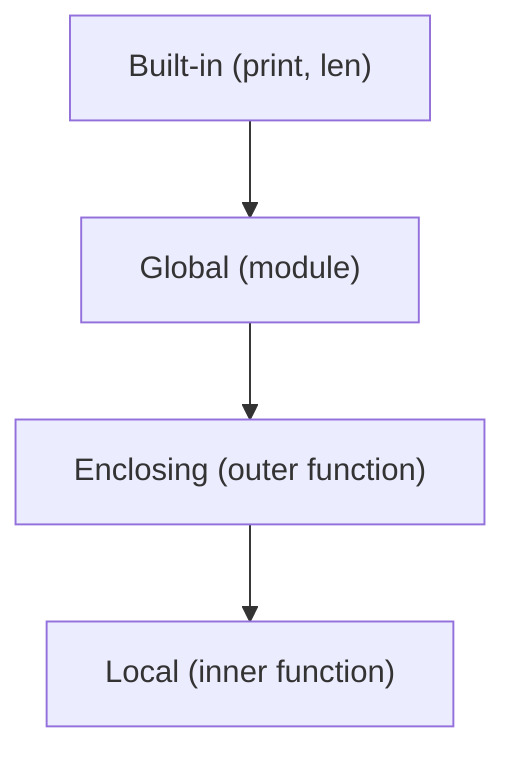

# scope와 binding

> Programming Languages 101 시리즈 (4/10)


## 이 글에서 다룰 문제

scope를 모르면 "왜 이 변수가 갱신되지 않지?", "왜 갑자기 NameError가 나지?" 같은 버그가 미스터리가 됩니다. scope를 정확히 이해하면 함수, 모듈, 클로저가 다 같은 규칙의 변형이라는 사실이 보입니다.

> binding은 "이름과 값을 묶는 일"이고, scope는 "그 묶음이 보이는 영역"입니다.

## 전체 흐름


Python의 LEGB 규칙은 이름을 안쪽부터 바깥쪽으로 찾는 순서입니다. 가장 가까운 곳에서 발견된 binding이 이깁니다.

## Before/After

**Before — 전역 변수에 의존**

```python
LIMIT = 10

def is_ok(x):
    return x < LIMIT

def main():
    LIMIT = 5      # 새 지역 변수 — 위 함수에 영향 없음
    print(is_ok(7))  # True
```

`main`의 `LIMIT`은 `is_ok`에 보이지 않습니다. lexical scope이기 때문입니다.

**After — 의존을 명시적으로**

```python
def is_ok(x, limit=10):
    return x < limit

print(is_ok(7, limit=5))  # False
```

scope에 묻어 둔 의존을 인자로 끌어내면 의도가 분명해집니다.

## 가장 중요한 네 가지 예제

### 1단계 — LEGB 직접 보기

```python
# 1_legb.py
x = "global"
def outer():
    x = "enclosing"
    def inner():
        x = "local"
        print(x)
    inner()
    print(x)

outer()
print(x)
# local / enclosing / global
```

같은 이름이 가장 안쪽 binding부터 우선 보입니다.

### 2단계 — UnboundLocalError의 정체

```python
# 2_unbound.py
x = 1
def f():
    print(x)   # UnboundLocalError
    x = 2

f()
```

함수 안에서 `x = 2`가 나타나면, Python은 그 함수 전체에서 `x`를 지역 이름으로 처리합니다. 그래서 `print(x)`가 아직 묶이지 않은 지역 이름을 보고 에러가 납니다.

### 3단계 — `nonlocal`로 enclosing 갱신

```python
# 3_nonlocal.py
def make_counter():
    n = 0
    def step():
        nonlocal n
        n += 1
        return n
    return step

c = make_counter()
print(c(), c(), c())  # 1 2 3
```

`nonlocal`이 없다면 `n += 1`은 새 지역을 만들려다 위와 같은 에러를 냅니다.

### 4단계 — lexical vs dynamic 가상의 비교

```python
# 4_lexical.py
y = "outer"
def show():
    print(y)

def caller():
    y = "inner"
    show()   # lexical scope이므로 'outer' 출력

caller()
```

만약 dynamic scope였다면 `show()`가 호출자의 `y`를 보고 `'inner'`를 찍었을 겁니다. 현대 언어 대부분이 lexical을 택한 이유는 **읽기만 해도 값이 어디서 오는지 결정되기 때문**입니다.

### 5단계 — shadowing의 함정

```python
# 5_shadow.py
def total(items):
    sum = 0   # 내장 sum을 가렸다
    for x in items:
        sum += x
    return sum  # 동작은 하지만, 같은 함수 안에서 sum(...)을 호출하지 못함
```

가린 이름이 같은 scope 안에서 또 필요해지면 그제서야 사고가 납니다. 짧은 함수에서도 의도적이지 않은 shadowing은 피하는 편이 안전합니다.

## 이 코드에서 주목할 점

- 같은 이름이 항상 같은 값을 가리키지는 않습니다 — scope가 결정합니다.
- 함수 안의 단일 할당 한 줄이 그 함수 전체의 binding 처리 방식을 바꿉니다.
- `nonlocal`/`global`은 흔하게 필요한 게 아니라, 의도된 갱신을 표시하는 도구입니다.
- lexical scope는 "읽으면 알 수 있다"는 가독성을 줍니다 — dynamic은 그렇지 않습니다.

## 자주 하는 실수 5가지

1. **전역 변수로 함수 사이의 상태를 공유한다.** 변경의 출처가 흐려져 디버깅이 어려워집니다.
2. **내장 이름을 가린다.** `list`, `dict`, `id`, `sum`을 변수명으로 쓰면 한참 뒤에야 알아챕니다.
3. **`global`을 도배한다.** 모듈 인터페이스를 명시 인자/반환으로 정리하는 편이 거의 항상 낫습니다.
4. **함수 안에서 갑자기 같은 이름을 할당해 UnboundLocalError를 만든다.** 위의 2단계가 그 사례입니다.
5. **dynamic scope처럼 동작할 거라 가정한다.** 현대 언어에서는 거의 항상 틀립니다.

## 실무에서는 이렇게 쓰입니다

scope 규칙은 코드 리뷰에서 자주 다투는 주제입니다. "이 변수는 어디서 왔나?"의 답이 한눈에 보이는 코드가 좋은 코드입니다. 큰 함수를 잘게 쪼개고, 의존을 인자로 끌어내고, 모듈 변수의 변경 지점을 한 곳으로 모으는 습관이 lexical scope의 이점을 극대화합니다.

테스트도 마찬가지입니다. 함수의 동작이 전역 상태에 의존하면 단위 테스트가 어려워지고, 인자로 명시적으로 받으면 곧바로 테스트가 가능해집니다.

## 체크리스트

- [ ] LEGB의 네 단계를 답할 수 있는가?
- [ ] UnboundLocalError가 왜 생기는지 한 줄로 설명할 수 있는가?
- [ ] `nonlocal`과 `global`을 언제 쓰는지 구별하는가?
- [ ] 함수가 의존하는 외부 상태를 인자로 끌어낸 경험이 있는가?
- [ ] lexical scope의 가독성 이점을 한 문장으로 답할 수 있는가?

## 정리 및 다음 단계

scope는 "이름이 보이는 영역"이고, binding은 "이름과 값을 묶는 일"입니다. lexical scope를 깊이 이해하면, 다음 글에서 다룰 closure가 자연스럽게 따라옵니다 — 클로저는 결국 lexical scope의 직접적인 결과이기 때문입니다.

<!-- toc:begin -->
- [프로그래밍 언어란 무엇인가?](./01-what-is-a-programming-language.md)
- [syntax와 semantics](./02-syntax-and-semantics.md)
- [type system](./03-type-system.md)
- **scope와 binding (현재 글)**
- 함수와 closure (예정)
- 객체와 prototype (예정)
- memory management (예정)
- interpreter와 compiler (예정)
- static vs dynamic language (예정)
- 좋은 언어 설계란 무엇인가? (예정)
<!-- toc:end -->

## 참고 자료

- [Python Language Reference — Naming and binding](https://docs.python.org/3/reference/executionmodel.html#naming-and-binding)
- [Structure and Interpretation of Computer Programs — Chapter 3](https://mitpress.mit.edu/sites/default/files/sicp/full-text/book/book-Z-H-21.html)
- [Programming Language Pragmatics (Scott) — Chapter 3 Names, Scopes, and Bindings](https://www.elsevier.com/books/programming-language-pragmatics/scott/978-0-12-410409-9)
- [MDN — Scope](https://developer.mozilla.org/en-US/docs/Glossary/Scope)
