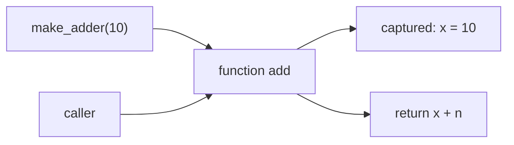

# 함수와 closure

> Programming Languages 101 시리즈 (5/10)


## 이 글에서 다룰 문제

closure는 콜백, 데코레이터, 부분 적용, 모듈 캡슐화의 토대입니다. 동작 원리를 정확히 모르면 "for 루프 안에서 만든 함수가 다 같은 값을 출력한다" 같은 클래식 함정에 빠집니다.

> closure는 "함수 + 그 함수가 자란 자리의 환경"입니다.

## 전체 흐름


`make_adder`가 만든 `add`는 `x = 10`이라는 binding을 함께 들고 다닙니다. 호출자는 그 안을 볼 수 없지만, `add`는 그 환경 위에서 계산합니다.

## Before/After

**Before — 전역 상태로 누적**

```python
total = 0
def add(n):
    global total
    total += n
add(3); add(4)
print(total)  # 7
```

전역에 의존하니 같은 함수를 두 군데서 동시에 쓸 수 없습니다.

**After — closure로 격리된 상태**

```python
def make_accumulator():
    total = 0
    def add(n):
        nonlocal total
        total += n
        return total
    return add

a = make_accumulator()
b = make_accumulator()
print(a(3), a(4))  # 3 7
print(b(10))       # 10  (a와 독립)
```

각 호출이 자신만의 `total`을 캡처합니다. 격리는 "객체"의 본질이기도 합니다 — 다음 글의 복선입니다.

## closure를 다섯 가지 각도로

### 1단계 — 가장 단순한 클로저

```python
# 1_basic.py
def make_adder(x):
    def add(n):
        return x + n
    return add

add10 = make_adder(10)
add20 = make_adder(20)
print(add10(5), add20(5))  # 15 25
```

`x`가 각 closure 안에 따로 살아 있습니다.

### 2단계 — 참조 캡처의 증거

```python
# 2_reference.py
def make_pair():
    state = {"n": 0}
    def get(): return state["n"]
    def inc(): state["n"] += 1
    return get, inc

g, i = make_pair()
i(); i(); i()
print(g())  # 3
```

같은 `state`를 두 함수가 공유합니다. 값 복사가 아니라 같은 binding에 대한 참조이기 때문입니다.

### 3단계 — 늦은 binding 함정

```python
# 3_late_binding.py
fns = []
for i in range(3):
    fns.append(lambda: i)

print([f() for f in fns])  # [2, 2, 2]  — 다 같은 i!
```

세 lambda 모두 같은 `i`를 캡처했고, 호출 시점에 `i`는 이미 2입니다.

### 4단계 — 즉시 캡처로 고치기

```python
# 4_fix.py
fns = [(lambda i=i: i) for i in range(3)]
print([f() for f in fns])  # [0, 1, 2]
```

기본 인자는 함수 정의 시점에 평가되므로, 그 순간의 값을 그대로 가져옵니다.

### 5단계 — 메모이제이션

```python
# 5_memo.py
def memo(fn):
    cache = {}
    def wrapper(*args):
        if args not in cache:
            cache[args] = fn(*args)
        return cache[args]
    return wrapper

@memo
def slow_square(n):
    return n * n

print(slow_square(7), slow_square(7))  # 49 49 — 두 번째는 캐시
```

`cache`는 `wrapper`의 closure에 들어 있습니다. 외부에서 보이지 않지만, 호출마다 살아 있습니다.

## 이 코드에서 주목할 점

- closure는 함수 자체가 아니라, 함수와 그 환경의 묶음입니다.
- 캡처는 값이 아니라 binding 참조입니다 — 같은 closure를 여러 함수가 공유할 수 있습니다.
- 늦은 binding 함정은 "정의된 시점에 값을 굳히고 싶다"와 "참조를 유지하고 싶다"의 차이를 보여 줍니다.
- 데코레이터·콜백·팩토리는 closure의 응용이 거의 전부입니다.

## 자주 하는 실수 5가지

1. **루프 안에서 만든 lambda가 같은 변수를 캡처한다는 사실을 잊는다.** 위 3단계가 그 사례.
2. **closure를 객체와 무관한 것으로 본다.** 사실 두 가지는 같은 아이디어의 서로 다른 표현입니다(다음 글에서 다룹니다).
3. **닫혀 있는 상태를 외부에서 직접 만지려 한다.** closure의 핵심은 "외부에서 못 만진다"입니다.
4. **`nonlocal`을 잊는다.** `+=` 같은 갱신은 `nonlocal` 없이는 새 지역을 만듭니다.
5. **메모리 누수를 만든다.** 큰 객체를 캡처한 closure를 오래 보관하면 GC가 그 객체를 풀지 못합니다.

## 실무에서는 이렇게 쓰입니다

JavaScript의 콜백, Python의 데코레이터, 함수형 라이브러리의 부분 적용은 모두 closure 위에 서 있습니다. UI 이벤트 핸들러가 "버튼이 클릭되면 이 상태를 갱신한다"고 적을 수 있는 것도 closure 덕분입니다.

라이브러리 설계에서도 자주 쓰입니다 — "사용자가 원하는 함수를 받아 들이고, 우리만의 환경에서 호출해 주기" 같은 패턴은 callback + closure의 조합으로 가장 깔끔하게 표현됩니다.

## 체크리스트

- [ ] 일급 함수와 고차 함수의 차이를 한 줄로 설명할 수 있는가?
- [ ] closure가 값 캡처가 아니라 참조 캡처라는 사실을 알고 있는가?
- [ ] 늦은 binding 함정과 그 회피 방법을 알고 있는가?
- [ ] `nonlocal`이 closure에서 왜 자주 필요한지 답할 수 있는가?
- [ ] closure로 작은 메모이제이션을 직접 짜본 적이 있는가?

## 정리 및 다음 단계

closure는 "함수 + 환경"입니다. lexical scope와 일급 함수가 만나면 자연스럽게 나옵니다. 다음 글에서는 같은 아이디어를 또 다른 모습으로 표현하는 — 객체와 prototype — 을 살펴봅니다.

<!-- toc:begin -->
- [프로그래밍 언어란 무엇인가?](./01-what-is-a-programming-language.md)
- [syntax와 semantics](./02-syntax-and-semantics.md)
- [type system](./03-type-system.md)
- [scope와 binding](./04-scope-and-binding.md)
- **함수와 closure (현재 글)**
- 객체와 prototype (예정)
- memory management (예정)
- interpreter와 compiler (예정)
- static vs dynamic language (예정)
- 좋은 언어 설계란 무엇인가? (예정)
<!-- toc:end -->

## 참고 자료

- [SICP — Procedures and the Processes They Generate](https://mitpress.mit.edu/sites/default/files/sicp/full-text/book/book-Z-H-11.html)
- [MDN — Closures](https://developer.mozilla.org/en-US/docs/Web/JavaScript/Closures)
- [Python functools — partial, lru_cache](https://docs.python.org/3/library/functools.html)
- [On Lambdas, Captures and Closures (PLT)](https://wiki.c2.com/?ClosuresThatWorkLikeObjects)
