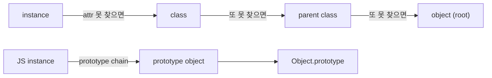

# 객체와 prototype

> Programming Languages 101 시리즈 (6/10)

<!-- a-grade-intro:begin -->

**핵심 질문**: 같은 OOP라는 단어를 쓰는데 Java 클래스와 JavaScript 프로토타입은 왜 그렇게 달라 보일까요?

> 객체는 **상태와 그 상태를 다루는 방법(메서드)**의 묶음입니다. 그 묶음을 만드는 방식은 두 갈래로 나뉩니다 — 미리 짜둔 청사진을 찍어 내는 **클래스 기반**과, 기존 객체를 직접 본떠 만드는 **프로토타입 기반**. 두 모델은 메서드를 어떻게 찾는지에서 결정적으로 갈립니다.

<!-- a-grade-intro:end -->

## 이 글에서 배울 것

- "객체가 무엇인가"를 두 가지 모델로 정리
- 클래스 기반과 프로토타입 기반의 메서드 탐색 차이
- Python의 클래스가 사실은 객체이기도 하다는 사실
- 상속과 위임(delegation)의 관계
- closure와 객체가 같은 아이디어의 두 모습이라는 점

## 왜 중요한가

객체 모델을 정확히 이해하면 "왜 이 메서드가 호출되지?", "왜 super가 이렇게 동작하지?" 같은 의문에 한 번에 답할 수 있습니다. 두 모델을 다 보면, 새 OOP 언어를 만나도 빠르게 적응할 수 있습니다.

> 객체 = 상태 + 행동. 클래스든 prototype이든, 그 묶음을 만드는 다른 도구일 뿐입니다.

## 개념 한눈에 보기



위는 클래스 기반, 아래는 프로토타입 기반의 탐색입니다. 본질은 같습니다 — **못 찾으면 한 단계 위로 위임**.

## 핵심 용어 정리

- **Instance**: 한 시점의 상태를 가진 구체 객체.
- **Class**: 인스턴스의 모양과 행동을 정의한 청사진.
- **Prototype**: 다른 객체가 위임할 수 있는 베이스 객체.
- **Method resolution**: 메서드를 어디까지 거슬러 올라가 찾을지를 정하는 규칙.
- **Delegation**: 못 찾은 속성을 다른 객체에게 떠넘겨 처리하는 방식.

## Before/After

**Before — 자료와 함수가 흩어져 있다**

```python
def make_user(name, age):
    return {"name": name, "age": age}

def greet(user):
    return f"hi, {user['name']}"

u = make_user("kim", 30)
print(greet(u))
```

데이터와 그것을 다루는 함수가 분리돼 있어 호출자가 늘 둘을 함께 들고 다녀야 합니다.

**After — 클래스로 묶기**

```python
class User:
    def __init__(self, name: str, age: int) -> None:
        self.name, self.age = name, age
    def greet(self) -> str:
        return f"hi, {self.name}"

print(User("kim", 30).greet())
```

상태와 행동이 한 단위로 묶이고, 사용자는 객체 하나만 들고 다닙니다.

## 실습: 두 모델을 직접 따라가 보기

### 1단계 — 클래스 기반의 탐색

```python
# 1_class.py
class A:
    def hi(self): return "A.hi"

class B(A):
    pass

print(B().hi())          # 'A.hi' — B에 없으니 부모로 위임
print(B.__mro__)          # 탐색 순서
```

`MRO`(method resolution order)가 탐색 경로 그 자체입니다.

### 2단계 — 클래스도 객체다

```python
# 2_class_is_object.py
class A: ...
print(type(A))         # <class 'type'>  — 클래스는 type의 인스턴스
A.tag = "v1"            # 클래스 객체에 속성을 붙일 수 있다
print(A.tag)
```

클래스 자체도 일등 시민 객체이고, 동적으로 다룰 수 있습니다.

### 3단계 — Python에서 프로토타입 풍 표현

```python
# 3_prototype.py
base = {"hi": lambda self: "base.hi"}

def lookup(obj, key):
    if key in obj: return obj[key]
    if "__proto__" in obj: return lookup(obj["__proto__"], key)
    raise KeyError(key)

inst = {"__proto__": base}
print(lookup(inst, "hi")(inst))   # 'base.hi'
```

Python에는 직접 prototype 체인이 없지만, "못 찾으면 위로" 원리는 똑같습니다.

### 4단계 — 메서드 오버라이드와 super

```python
# 4_super.py
class A:
    def hi(self): return "A"
class B(A):
    def hi(self): return "B+" + super().hi()

print(B().hi())  # B+A
```

`super`는 MRO의 다음 단계에 위임합니다. 다중 상속에서도 한 줄로 모든 부모를 거치게 만드는 도구입니다.

### 5단계 — closure로 객체를 흉내 내기

```python
# 5_object_as_closure.py
def make_user(name):
    def greet(): return f"hi, {name}"
    return {"greet": greet}

u = make_user("kim")
print(u["greet"]())  # hi, kim
```

상태(`name`)와 행동(`greet`)이 closure로 묶였습니다. 클래스가 없어도 객체의 본질은 가능하다는 증거입니다.

## 이 코드에서 주목할 점

- 두 모델 모두 본질은 "못 찾으면 위로 위임"입니다.
- Python에서는 클래스 자체도 객체이고, 그 사실이 메타프로그래밍을 가능하게 합니다.
- `super`는 MRO의 다음 단계로 보내는 화살표입니다.
- closure로도 같은 일을 할 수 있다는 사실은, 두 개념이 서로의 뒤집은 형태임을 보여 줍니다.

## 자주 하는 실수 5가지

1. **상속을 너무 깊게 짠다.** 4단 이상의 상속 트리는 거의 모든 경우 위임이나 합성으로 평탄화하는 편이 좋습니다.
2. **MRO를 모른다.** 다중 상속에서 `super`가 왜 그렇게 도는지 모르면 디버깅이 막힙니다.
3. **상태 없이 메서드만 잔뜩 있는 클래스.** 그건 모듈/네임스페이스이지 객체가 아닙니다.
4. **prototype을 클래스의 흉내로만 본다.** "객체에 직접 메서드를 추가/교체할 수 있다"는 유연함이 본 모습입니다.
5. **closure와 객체를 별개로 본다.** 같은 아이디어의 두 표현이라는 사실을 받아들이면 두 도구를 더 잘 씁니다.

## 실무에서는 이렇게 쓰입니다

대부분의 백엔드 코드는 클래스 기반 OOP입니다. 도메인 모델을 클래스로, 동작을 메서드로 묶는 관행이 표준입니다. JavaScript는 클래스 문법을 도입했지만 내부는 여전히 prototype이고, 그래서 `Object.create`나 `Object.getPrototypeOf` 같은 API가 살아 있습니다.

설계할 때는 "이 객체가 가진 상태가 무엇인가"를 먼저 적습니다. 상태가 없으면 클래스가 필요 없을 가능성이 큽니다. 상속보다 합성(composition)이 기본이고, 상속은 정말 같은 종류일 때만 씁니다.

## 시니어 엔지니어는 이렇게 생각합니다

- "이 클래스의 상태는 무엇인가?"를 먼저 묻습니다. 답이 비면 다른 도구를 고려합니다.
- 합성을 우선, 상속은 마지막 카드입니다.
- 다중 상속을 쓸 때 MRO를 한 번 머릿속에 그립니다.
- 클래스/객체/프로토타입은 도구일 뿐, 적합도가 우선입니다.
- closure로 풀 일과 객체로 풀 일을 같은 무게로 봅니다.

## 체크리스트

- [ ] 클래스 기반과 프로토타입 기반의 차이를 한 줄로 답할 수 있는가?
- [ ] Python에서 MRO를 출력해 본 적이 있는가?
- [ ] `super`가 무엇을 하는지 한 줄로 설명할 수 있는가?
- [ ] 상속과 합성 중 합성을 기본으로 두는가?
- [ ] closure로 객체를 흉내 내본 적이 있는가?

## 연습 문제

1. 다중 상속 클래스 두 개를 만들어 `__mro__`를 출력하고, 그 순서가 왜 그렇게 되는지 한 문단으로 설명해 보세요.
2. 위 실습 5단계의 closure 객체에 "상태 변경" 동작을 추가해 보세요. `nonlocal`이 필요할 겁니다.
3. 가장 최근에 짠 클래스 중 상속을 합성으로 바꿀 수 있는 것을 하나 골라, 어떻게 바꿀지 설계해 보세요.

## 정리 및 다음 단계

객체는 상태와 행동의 묶음이고, 두 모델은 그 묶음을 만드는 다른 방식입니다. 어느 쪽이든 본질은 위임입니다. 다음 글에서는 그 객체들이 메모리에서 어떻게 살아가고 사라지는지 — memory management — 를 살펴봅니다.

<!-- toc:begin -->
- [프로그래밍 언어란 무엇인가?](./01-what-is-a-programming-language.md)
- [syntax와 semantics](./02-syntax-and-semantics.md)
- [type system](./03-type-system.md)
- [scope와 binding](./04-scope-and-binding.md)
- [함수와 closure](./05-functions-and-closures.md)
- **객체와 prototype (현재 글)**
- memory management (예정)
- interpreter와 compiler (예정)
- static vs dynamic language (예정)
- 좋은 언어 설계란 무엇인가? (예정)
<!-- toc:end -->

## 참고 자료

- [Python Data Model — object](https://docs.python.org/3/reference/datamodel.html)
- [MDN — Inheritance and the prototype chain](https://developer.mozilla.org/en-US/docs/Web/JavaScript/Inheritance_and_the_prototype_chain)
- [Self: The Power of Simplicity (Ungar & Smith)](https://bibliography.selflanguage.org/_static/self-power.pdf)
- [Design Patterns — Composition vs Inheritance](https://en.wikipedia.org/wiki/Composition_over_inheritance)
