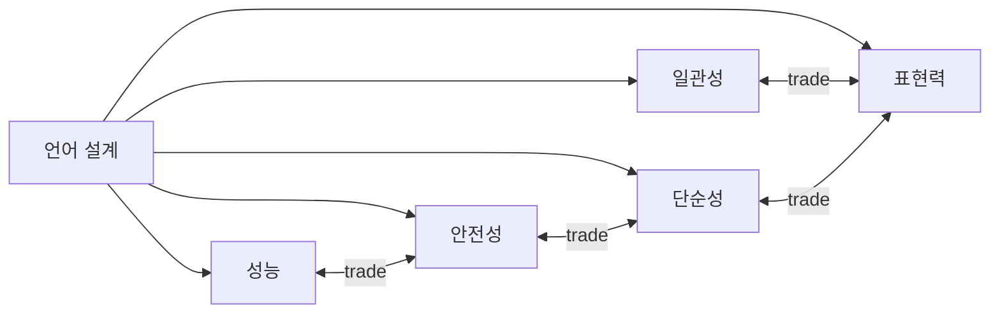

# 좋은 언어 설계란 무엇인가?

> Programming Languages 101 시리즈 (10/10)

<!-- a-grade-intro:begin -->

**핵심 질문**: "이 언어 잘 만들었네"라고 말할 때, 우리는 정확히 무엇에 점수를 주고 있는 걸까요?

> 언어 설계는 트레이드오프의 학문입니다. 표현력을 높이면 일관성이 줄고, 안전을 강화하면 표현이 무거워집니다. 좋은 설계란 모두를 동시에 갖추는 것이 아니라, **이 언어가 잘하려는 일에 가장 잘 맞도록 균형을 잡는 일**입니다.

<!-- a-grade-intro:end -->

## 이 글에서 배울 것

- 언어 설계를 평가할 때 쓰는 다섯 가지 기준
- 일관성·단순성·표현력·안전성·성능 사이의 트레이드오프
- Python, Go, Rust가 같은 문제에 다른 답을 낸 사례
- 시리즈에서 본 모든 개념이 왜 그렇게 설계되었는지
- 새 언어를 만나면 가장 먼저 봐야 할 질문 다섯 개

## 왜 중요한가

설계 감각은 언어를 평가할 때만 쓰는 게 아니라, **API와 라이브러리, 사내 DSL을 만들 때마다 똑같이 쓰입니다**. 작은 함수 시그니처 한 개도 같은 트레이드오프를 만납니다.

> 좋은 설계는 "모두에게 좋은 답"이 아니라 "선택을 명확히 한 답"입니다.

## 개념 한눈에 보기



다섯 축은 서로 묶여 있습니다 — 한쪽을 누르면 다른 쪽이 올라옵니다.

## 핵심 용어 정리

- **Consistency (일관성)**: 같은 모양의 문제는 같은 모양의 코드로 풀린다.
- **Simplicity (단순성)**: 학습하고 기억해야 할 규칙의 수가 적다.
- **Expressiveness (표현력)**: 의도를 짧고 정확하게 적을 수 있다.
- **Safety (안전성)**: 잘못된 프로그램이 빌드 또는 실행 단계에서 막힌다.
- **Performance (성능)**: 같은 일에 드는 시간/메모리가 적다.

## Before/After

**Before — 기준 없이 "느낌"으로 평가**

> "이 언어 좋다." → 이유 설명 못 함.

**After — 다섯 축으로 분해**

> "이 언어는 표현력과 단순성을 위해 안전성을 일부 양보했다. 단기 스크립트에는 적합하지만 장기 서비스에는 약하다."

같은 사실을 두고도 두 번째 표현은 트레이드오프를 명시합니다.

## 실습: 다섯 축으로 세 언어를 평가하기

### 1단계 — 같은 문제, 세 답

같은 작업("문자열 리스트의 길이 합")을 세 언어로 적습니다.

```python
# Python
def total_len(xs: list[str]) -> int:
    return sum(len(x) for x in xs)
```

```go
// Go
func TotalLen(xs []string) int {
    n := 0
    for _, x := range xs {
        n += len(x)
    }
    return n
}
```

```rust
// Rust
fn total_len(xs: &[String]) -> usize {
    xs.iter().map(|x| x.len()).sum()
}
```

같은 일을 같은 모양으로 표현하지만, 길이·명시성·안전성이 다릅니다.

### 2단계 — 일관성 점수 매기기

```python
# 2_consistency.py
# Python: 컬렉션이 무엇이든 sum/len/for의 모양이 같다 — 일관성 ↑
print(sum([1,2,3]))
print(sum((1,2,3)))
print(sum({1,2,3}))
```

같은 인터페이스가 컬렉션 전체를 가로지르면 일관성이 높습니다. Go도 비슷한 철학을 (적은 키워드로) 추구합니다.

### 3단계 — 단순성과 표현력의 충돌

```python
# 3_expressiveness.py
xs = [1, 2, 3, 4, 5]
print([x*x for x in xs if x % 2])     # 표현력 ↑
# Go에는 list comprehension이 없다 → 단순성 ↑, 표현력 ↓
```

Python은 한 줄로 의도를 적게 해 줍니다. Go는 같은 일을 for로 풀게 강제해 학습량을 줄입니다.

### 4단계 — 안전성과 단순성의 충돌

```rust
// 4_safety.rs
fn first(xs: &[i32]) -> Option<&i32> {
    xs.first()           // None을 컴파일 시점에 다루게 강제
}
```

Rust는 "값이 없을 수 있다"를 타입으로 강제합니다 — 안전성 ↑, 학습량 ↑. Python의 `None`은 같은 일을 더 가볍게(그리고 더 위험하게) 처리합니다.

### 5단계 — 시리즈 전체의 선택을 한 표로

| 주제 | Python | Go | Rust |
| --- | --- | --- | --- |
| 메모리 (ep07) | GC + 참조 카운팅 | GC | 컴파일 타임 소유권 |
| 실행 (ep08) | 인터프리터 + 바이트코드 | AOT | AOT |
| 타입 (ep09) | 점진적 (선택) | 정적 (단순) | 정적 + 풍부 |
| 객체 (ep06) | 클래스, 동적 | 구조체 + 인터페이스 | 구조체 + trait |
| 함수 (ep05) | first-class, closure | first-class, 단순 | first-class, 명시적 lifetime |

각 언어의 답이 "잘하려는 일"에 맞춰 다르게 정렬돼 있습니다.

## 이 코드에서 주목할 점

- 같은 일을 푸는 세 답은 정답·오답이 아니라 **다른 우선순위**의 결과입니다.
- 일관성이 높으면 "방금 배운 패턴이 어디서나 통한다"는 안정감을 얻습니다.
- 표현력이 높으면 짧지만, 모르는 사람에게는 더 어려워 보입니다.
- 안전성을 강하게 하면 컴파일러와 더 많이 싸우게 됩니다 — 그 대가로 production 사고가 줍니다.

## 자주 하는 실수 5가지

1. **"가장 좋은 언어"를 찾는다.** 좋은 언어는 작업 맥락 위에서만 정의됩니다.
2. **표현력을 항상 미덕으로 본다.** 너무 짧으면 읽기 어려워집니다.
3. **안전성을 무조건 우선한다.** 1주 짜리 프로토타입에 Rust는 과합니다.
4. **일관성을 무시한다.** 같은 문제를 매번 다른 모양으로 풀면 코드 베이스가 빠르게 무너집니다.
5. **자신이 좋아하는 언어를 객관적이라고 착각한다.** 트레이드오프 표를 그려 보면 편향이 보입니다.

## 실무에서는 이렇게 쓰입니다

새 프로젝트를 시작할 때 "어떤 언어를 쓸까"는 단순히 인기 순위가 아니라 다섯 축의 가중치 결정입니다. 짧고 빨리 검증하는 일은 Python이, 운영 안정성과 단순한 코드 베이스는 Go가, 성능과 메모리 안전이 결정적이라면 Rust가 강합니다.

내부 라이브러리/API를 설계할 때도 똑같습니다. "이 함수는 표현력을 우선하는가, 안전성을 우선하는가?" 답을 명확히 적어 두면 리뷰가 훨씬 빨라집니다.

## 시니어 엔지니어는 이렇게 생각합니다

- "이 결정이 어느 축을 양보했는가?"를 항상 적습니다.
- 모든 축에서 1등인 답은 없다는 사실을 받아들입니다.
- 자신이 익숙한 언어의 트레이드오프를 글로 정리해 둘 수 있어야 합니다.
- API 설계에도 같은 다섯 축을 적용합니다.
- 새 언어를 평가할 때 "내가 풀려는 문제와 잘 맞는가"부터 묻습니다.

## 체크리스트

- [ ] 다섯 축을 한 줄씩 정의할 수 있는가?
- [ ] 가장 자주 쓰는 언어의 트레이드오프를 한 문단으로 적을 수 있는가?
- [ ] 최근 만든 API에서 어느 축을 우선했는지 답할 수 있는가?
- [ ] "좋은 언어"의 의미를 맥락 없이 단정하지 않는가?
- [ ] 새 언어를 평가할 때 다섯 축을 일부러 떠올리는가?

## 연습 문제

1. 가장 자주 쓰는 두 언어를 다섯 축에 따라 점수 매기고, 차이를 한 문단으로 정리하세요.
2. 최근에 만든 라이브러리의 공개 API 한 곳을 골라, 같은 작업에 대한 "더 안전한" 버전과 "더 표현적인" 버전을 두 가지로 적어 보세요.
3. 시리즈의 어떤 글이 가장 인상 깊었는지, 그 글의 주제가 다섯 축 중 어디에 닿는지 한 문단으로 적어 보세요.

## 정리 및 다음 단계

좋은 언어 설계는 다섯 축의 가중치를 정직하게 선언한 결과물입니다. 시리즈에서 본 syntax·타입·scope·closure·객체·메모리·실행 모델·정적/동적 — 이 모든 것이 그 가중치의 표현이었습니다. 다음 단계는 이 감각을 자신의 코드와 API 설계에 그대로 옮기는 일입니다.

이 시리즈는 여기서 마칩니다. 다음 학습 경로로는 [compilers-101](../../compilers-101/), [api-design-101](../../api-design-101/), [software-design-101](../../software-design-101/)을 권합니다.

<!-- toc:begin -->
- [프로그래밍 언어란 무엇인가?](./01-what-is-a-programming-language.md)
- [syntax와 semantics](./02-syntax-and-semantics.md)
- [type system](./03-type-system.md)
- [scope와 binding](./04-scope-and-binding.md)
- [함수와 closure](./05-functions-and-closures.md)
- [객체와 prototype](./06-objects-and-prototypes.md)
- [memory management](./07-memory-management.md)
- [interpreter와 compiler](./08-interpreter-and-compiler.md)
- [static vs dynamic language](./09-static-vs-dynamic.md)
- **좋은 언어 설계란 무엇인가? (현재 글)**
<!-- toc:end -->

## 참고 자료

- [Programming language design (Wikipedia)](https://en.wikipedia.org/wiki/Programming_language)
- [Rob Pike — Less is exponentially more (Go)](https://commandcenter.blogspot.com/2012/06/less-is-exponentially-more.html)
- [Bjarne Stroustrup — Foundations of C++](https://www.stroustrup.com/ETAPS-corrected-draft.pdf)
- [PEP 20 — The Zen of Python](https://peps.python.org/pep-0020/)
