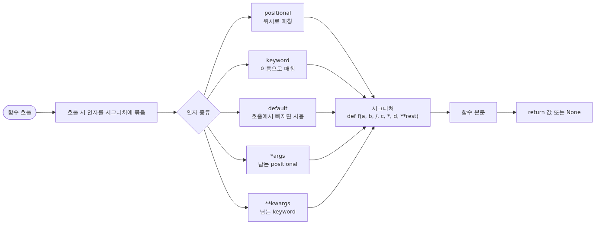
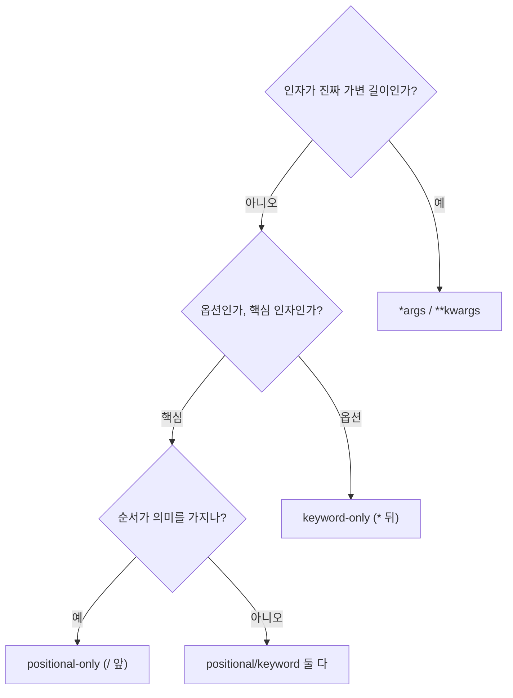

# 함수와 인자: def, args, kwargs, default, lambda


## 이 글에서 다룰 문제

함수는 코드를 묶는 가장 작은 단위입니다. 분기와 루프를 함수로 잘라 두면 같은 일을 반복하지 않게 되고, 테스트와 변경의 단위도 함수가 됩니다. 그런데 Python 함수는 인자를 다루는 방식이 풍부한 편이라 처음에는 어디서 어떤 형태를 써야 하는지 헷갈립니다. positional만 쓰면 호출이 순서에 묶이고, 기본값을 잘못 쓰면 호출 사이에 상태가 새고, `*args`와 `**kwargs`를 남발하면 시그니처가 불투명해집니다.

이 글은 다섯 가지 인자 형태를 한 장에 정리해, 함수 시그니처를 의도적으로 설계할 수 있도록 돕습니다. 다음 글의 모듈·패키지에서 함수가 모듈 경계를 넘어 호출되기 시작하면 시그니처가 곧 공개 인터페이스가 되므로, 그 전에 짚고 가는 편이 좋습니다.

또 한 가지, mutable 기본값 함정은 입문자가 가장 자주 빠지는 함수 관련 버그입니다. 한 번 정확히 이해해 두면 같은 실수를 반복하지 않습니다.

## Mental Model

> 함수 시그니처는 "호출자가 무엇을 줘야 하고, 함수가 무엇을 돌려주는가"의 계약이며, 다섯 인자 형태와 `/`·`*` 구분자는 그 계약의 강도를 단계별로 조절하는 도구입니다.
함수 시그니처를 다음과 같이 한 장에 펼쳐 두면 호출 규칙이 머릿속에서 정렬됩니다.



*Mental Model*
세 가지 핵심 규칙입니다.

1. **인자는 호출 시점에 묶이고, 본문은 그 묶음 위에서 실행**됩니다. 시그니처는 "어떤 이름으로 어떻게 받을지"를 미리 약속해 둔 인터페이스입니다.
2. **시그니처 안의 순서는 정해져 있습니다.** positional-only → positional/keyword → `*args` 또는 `*` → keyword-only → `**kwargs`. 이 순서를 어기면 `SyntaxError`가 납니다.
3. **기본값은 함수 정의 시점에 한 번 평가**됩니다. 그래서 mutable 객체를 기본값으로 쓰면 호출 사이에 그 객체가 공유됩니다.



*시그니처 설계 결정 트리: 인자의 의미가 시그니처 형태를 결정합니다.*

## 핵심 개념

### 1. `def`와 `return`

`def`는 새 함수 객체를 만들고 같은 이름에 묶습니다. 함수는 일급 객체라서 변수에 담거나 인자로 전달할 수 있습니다.

```python
def add(a, b):
    return a + b

f = add
print(f(2, 3))   # 5
```

`return`이 없으면 함수는 `None`을 돌려줍니다. 의도적으로 `None`을 반환하고 싶다면 그 의도를 시그니처와 docstring에 적어 둡니다. 한 함수가 "값을 돌려주거나, 부수효과만 일으키거나" 둘 중 하나에 집중하면 호출부가 단순해집니다.

### 2. positional과 keyword 인자

같은 함수도 호출 방식에 따라 positional 또는 keyword로 받을 수 있습니다.

```python
def greet(name, message):
    return f"{message}, {name}"

greet("ada", "hello")             # positional
greet(name="ada", message="hello")  # keyword
greet("ada", message="hello")       # 혼합 (positional이 keyword 앞)
```

혼합 호출에서는 positional 인자가 keyword 인자보다 먼저 와야 합니다. 시그니처가 길어질수록 호출부에서 keyword를 쓰는 편이 각 값의 의미를 더 분명하게 드러냅니다.

### 3. default 인자

기본값은 정의 시점에 한 번 평가되고, 호출에서 해당 인자가 빠지면 사용됩니다.

```python
def power(base, exp=2):
    return base ** exp

power(3)        # 9
power(3, 3)     # 27
power(3, exp=4) # 81
```

기본값이 있는 인자는 시그니처 뒤쪽에 모입니다. 그래야 positional 호출이 자연스럽게 들어맞습니다.

### 4. `*args`와 `**kwargs`

`*args`는 시그니처에 적힌 이름으로 묶이지 않은 positional 인자를 tuple로 모읍니다. `**kwargs`는 묶이지 않은 keyword 인자를 dict로 모읍니다.

```python
def collect(*args, **kwargs):
    return list(args), dict(kwargs)

collect(1, 2, 3, x=10, y=20)
# ([1, 2, 3], {'x': 10, 'y': 20})
```

`*args`/`**kwargs`는 (a) 데코레이터나 wrapper처럼 모든 인자를 그대로 넘겨야 할 때, (b) 진짜로 가변 길이가 필요한 API에서 자연스럽습니다. 그 외에는 명시적 인자 이름을 쓰는 편이 시그니처를 읽기 좋게 만듭니다.

### 5. positional-only(`/`)와 keyword-only(`*`)

Python 3.8 이후로 시그니처 안에 `/`와 `*`를 두어 호출 형태를 강제할 수 있습니다.

```python
def write(path, /, *, mode="w", encoding="utf-8"):
    ...
```

위 함수는 `path`를 무조건 positional로, `mode`와 `encoding`은 무조건 keyword로 받습니다. 호출이 `write("a.txt", mode="w")`처럼 강제되어 시그니처를 바꿀 때 호환성이 좋아집니다. positional-only로 두면 나중에 인자 이름을 바꿔도 호출부가 깨지지 않고, keyword-only로 두면 나중에 인자 순서를 바꿔도 호출부가 깨지지 않습니다.

### 6. `lambda`

`lambda`는 한 표현식만 담는 작은 익명 함수입니다.

```python
nums = [3, 1, 4, 1, 5, 9, 2, 6]
nums.sort(key=lambda n: -n)
print(nums)  # [9, 6, 5, 4, 3, 2, 1, 1]
```

이름 붙은 함수가 더 읽기 좋다면 그쪽을 씁니다. `lambda`는 "이 자리에서만 한 번 쓰고 끝나는, 한 줄짜리 변환"에 어울립니다. 본문이 두 줄 이상이거나, 같은 동작을 다시 쓸 일이 있으면 `def`로 분리합니다.

### 7. 가벼운 type hint

타입 힌트는 런타임에 강제되지 않지만, 시그니처를 읽는 사람과 IDE에게 의도를 알려 줍니다.

```python
def label(score: int) -> str:
    if score >= 60:
        return "pass"
    return "fail"
```

함수 단위로 입력과 출력의 타입을 적어 두는 것만으로 호출부의 오해가 크게 줄어듭니다.

## Before-After

같은 동작을 "장황한 시그니처" → "의도가 분명한 시그니처"로 다시 써 봅니다. 사용자 정보를 받아 인사말을 만드는 함수입니다.

**Before — positional이 길게 늘어선 함수**

```python
def make_greeting(name, lang, formal, prefix, suffix):
    head = "Dear" if formal else "Hi"
    if lang == "ko":
        head = "안녕하세요" if formal else "안녕"
    return f"{prefix}{head} {name}{suffix}"

print(make_greeting("ada", "en", True, ">> ", "!"))
```

호출부 `make_greeting("ada", "en", True, ">> ", "!")`만 봐서는 `True`가 무엇을 뜻하는지 알기 어렵습니다. 다섯 번째 인자 `"!"`도 무엇이 끝에 붙는지 시그니처를 다시 봐야 알 수 있습니다.

**After — keyword-only와 default로 의도 표현**

```python
def make_greeting(name: str, *, lang: str = "en", formal: bool = False,
                  prefix: str = "", suffix: str = "") -> str:
    head = "Dear" if formal else "Hi"
    if lang == "ko":
        head = "안녕하세요" if formal else "안녕"
    return f"{prefix}{head} {name}{suffix}"

print(make_greeting("ada", lang="en", formal=True, prefix=">> ", suffix="!"))
```

호출부에서 각 인자가 무엇인지 한눈에 보입니다. `*` 뒤의 인자들은 keyword로만 받을 수 있어, 호출부가 의미 없는 boolean 자리 인자에 의존하지 않습니다. 기본값을 둔 덕분에 가벼운 호출도 가능합니다.

```python
print(make_greeting("ada"))                # "Hi ada"
print(make_greeting("ada", lang="ko"))     # "안녕 ada"
```

이 패턴은 라이브러리 함수에서 흔히 보입니다. 시그니처가 짧으면서도 "확장 인자는 keyword로, 핵심 인자는 positional로"라는 의도를 분명히 전달합니다.

## 단계별 실습

REPL에서 차례대로 실행해 봅니다. `>>>`가 붙은 줄은 입력, 아래 줄은 출력입니다.

1. **mutable 기본값 함정을 직접 확인합니다.**

```python
>>> def buggy(item, items=[]):
...     items.append(item)
...     return items
>>> buggy(1)
[1]
>>> buggy(2)
[1, 2]
>>> buggy(3)
[1, 2, 3]
```

호출 사이에 같은 리스트가 공유되고 있습니다. 안전한 패턴은 다음과 같습니다.

```python
>>> def safe(item, items=None):
...     items = items if items is not None else []
...     items.append(item)
...     return items
>>> safe(1)
[1]
>>> safe(2)
[2]
```

`items if items is not None else []`는 호출자가 `items=[]`를 명시적으로 넘긴 경우와 빠뜨린 경우를 구분합니다. `items or []`는 두 경우를 똑같이 취급해 의도가 흐려집니다.

2. **`*args`와 `**kwargs`로 인자를 모아 봅니다.**

```python
>>> def show(*args, **kwargs):
...     print("args =", args)
...     print("kwargs =", kwargs)
>>> show(1, 2, x=10)
args = (1, 2)
kwargs = {'x': 10}
```

unpacking으로 다시 펼치는 것도 같은 표시법을 씁니다.

```python
>>> def add3(a, b, c):
...     return a + b + c
>>> nums = [1, 2, 3]
>>> add3(*nums)
6
>>> kw = {"a": 1, "b": 2, "c": 3}
>>> add3(**kw)
6
```

3. **keyword-only와 positional-only로 시그니처를 잠급니다.**

```python
>>> def make_url(host, /, *, scheme="https", path="/"):
...     return f"{scheme}://{host}{path}"
>>> make_url("example.com")
'https://example.com/'
>>> make_url("example.com", scheme="http", path="/api")
'http://example.com/api'
>>> make_url(host="example.com")
Traceback (most recent call last):
    ...
TypeError: make_url() got some positional-only arguments passed as keyword arguments: 'host'
```

`host`는 positional로만 받습니다. `scheme`과 `path`는 keyword로만 받습니다. 호출 형태가 강제되어 나중에 시그니처를 바꿀 때 호환성을 지키기 쉽습니다.

4. **`lambda`를 정렬 키로 사용합니다.**

```python
>>> users = [{"name": "ada", "score": 71}, {"name": "bob", "score": 92}]
>>> sorted(users, key=lambda u: u["score"], reverse=True)
[{'name': 'bob', 'score': 92}, {'name': 'ada', 'score': 71}]
```

키 함수가 한 표현식이라면 `lambda`가 짧고 분명합니다. 두 줄이 넘어가면 같은 일을 하는 `def`로 빼는 편이 읽기 좋습니다.

## 이 코드에서 주목할 점

- **`*` 뒤 keyword-only 옵션** — `lang`, `formal`, `prefix`, `suffix`가 호출부에서 모두 이름으로 전달되어 boolean 자리 인자의 의미 불명 문제가 사라집니다.
- **type hint로 시그니처 자체가 문서** — `name: str`, `*, lang: str = "en"`, `-> str`만 봐도 호출자가 무엇을 줘야 하는지 한눈에 보입니다.
- **default가 모두 immutable** — 빈 문자열 `""`, `False`, `"en"` 모두 immutable이라 mutable 기본값 함정에서 자유롭습니다.
- **`safe(item, items=None)` 패턴의 `is not None` 검사** — `items or []`는 호출자가 명시적으로 `[]`를 넘긴 경우와 빠뜨린 경우를 같게 취급합니다. `is not None`은 그 둘을 구분합니다.
- **`make_url(host, /, *, scheme, path)`의 두 구분자** — `host`는 이름을 바꿔도 호출부가 안 깨지고, `scheme`/`path`는 순서를 바꿔도 호출부가 안 깨집니다. API 호환성 도구입니다.

## 자주 하는 실수

1. **mutable 기본 인자.**
   `def f(items=[]):`는 정의 시점에 리스트를 한 번 만들고 호출 사이에 공유합니다. 호출이 누적될수록 리스트가 자랍니다. 기본값이 빈 리스트여야 한다면 `def f(items=None): items = items if items is not None else []`로 작성합니다.

2. **`return`을 빠뜨립니다.**
   `return`이 없는 함수는 `None`을 돌려줍니다. 호출부 `result = compute(...)`에서 `result`가 계속 `None`이라면 함수 본문 끝에 `return`이 빠졌는지 먼저 확인합니다.

3. **positional과 keyword를 섞어 호출하다 충돌.**
   `f(1, a=2)`처럼 첫 positional이 이미 `a`에 묶이는데 다시 `a=2`를 주면 `TypeError`가 납니다. 시그니처를 다시 보고 어느 자리가 어떤 이름인지 확인합니다.

4. **`*args`와 `**kwargs`를 남용합니다.**
   진짜 가변 길이가 아니라면 명시적 이름을 쓰는 편이 시그니처를 읽기 좋게 합니다. 모든 인자를 `**kwargs`로 받으면 IDE 자동완성과 타입 검사기가 도와주지 못합니다.

5. **`lambda`로 두 줄짜리 동작을 욱여넣습니다.**
   `lambda`는 한 표현식만 담을 수 있습니다. 본문이 길어지면 `def`로 빼고 이름을 붙입니다. 이름 자체가 문서가 됩니다.

6. **scope 혼동.**
   함수 안에서 모듈 전역 변수를 단순히 읽는 것은 가능하지만, 같은 이름에 새 값을 대입하면 함수 안의 지역 변수가 됩니다. 진짜 전역을 바꾸고 싶다면 `global` 키워드를 명시합니다. 다만 이 패턴은 가능하면 피하고, 값을 인자로 받고 결과를 반환하는 형태로 다시 짭니다.

## 실무

실무에서는 함수 시그니처가 곧 공개 API가 됩니다. 두 가지 패턴을 짚어 둡니다.

**(1) 옵션은 keyword-only로 받습니다.**

```python
def export_csv(rows, path, *, encoding="utf-8", delimiter=",", quote_all=False):
    ...
```

호출부 `export_csv(rows, "out.csv", quote_all=True)`처럼 옵션이 keyword로만 들어오게 하면 나중에 인자 순서를 바꿔도 호출부가 깨지지 않습니다. 라이브러리에서 흔한 패턴입니다.

**(2) wrapper에서 모든 인자를 그대로 넘깁니다.**

```python
def with_logging(fn):
    def wrapper(*args, **kwargs):
        print("call", fn.__name__, args, kwargs)
        result = fn(*args, **kwargs)
        print("done", fn.__name__)
        return result
    return wrapper
```

`*args`/`**kwargs`가 진짜로 빛나는 자리입니다. 데코레이터나 미들웨어처럼 어떤 함수든 받아 그대로 넘겨야 할 때 명시적 이름은 오히려 방해가 됩니다.

이 두 패턴은 다음 글의 모듈·패키지에서 import 경계를 넘어 호출될 때 다시 등장합니다.

## 체크리스트

- [ ] `def`로 함수를 만들고 `return` 값과 부수효과를 구분해서 설명할 수 있습니다.
- [ ] positional, keyword, default, `*args`, `**kwargs` 다섯 가지 인자 형태를 시그니처에 섞어 쓸 수 있습니다.
- [ ] mutable 기본값 함정을 한 줄로 설명하고 안전한 패턴을 쓸 수 있습니다.
- [ ] `/`와 `*` 구분자로 positional-only / keyword-only를 강제할 수 있습니다.
- [ ] `lambda`가 적합한 자리와 그렇지 않은 자리를 한 가지씩 들 수 있습니다.
- [ ] 함수 시그니처에 가벼운 type hint를 붙일 수 있습니다.

## 정리·다음 글

- 함수 시그니처는 호출부와 본문 사이의 인터페이스입니다. positional, keyword, default, `*args`, `**kwargs` 다섯 형태를 의식적으로 조합합니다.
- 기본값은 정의 시점에 한 번 평가됩니다. mutable 기본값 대신 `None` + `is not None` 패턴을 씁니다.
- `/`와 `*`로 호출 형태를 잠그면 시그니처를 바꿀 때 호환성이 좋아집니다.
- `lambda`는 한 줄짜리 변환에 어울립니다. 두 줄 이상이면 `def`로 이름을 붙입니다.
- 가벼운 type hint는 런타임에 강제되지 않지만 호출부의 오해를 줄여 줍니다.

다음 글에서는 모듈과 패키지를 다룹니다. `import`, `__init__.py`, `__name__`을 정리하고, 함수 묶음을 모듈 경계 너머에서 어떻게 노출하고 숨기는지 살핍니다.

<!-- toc:begin -->
<!-- toc:end -->

## 참고 자료

- Python 공식 튜토리얼 — Defining Functions: https://docs.python.org/3/tutorial/controlflow.html#defining-functions
- Python 공식 문서 — Function Definitions: https://docs.python.org/3/reference/compound_stmts.html#function-definitions
- PEP 3102 — Keyword-Only Arguments: https://peps.python.org/pep-3102/
- PEP 570 — Python Positional-Only Parameters: https://peps.python.org/pep-0570/
- PEP 484 — Type Hints: https://peps.python.org/pep-0484/
