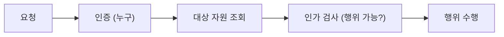

# 인가와 권한

> Secure Coding 101 시리즈 (4/10)

<!-- a-grade-intro:begin -->

**핵심 질문**: *로그인은 됐다.* 그런데 *이 사용자가 이 자원에 접근해도 되는가* 는 누가 결정할까요?

> *인가는 *역할로 결정되는 게 아니라 *행위로 결정* 된다. 매 요청마다 *서버에서 다시 묻는다*.*

<!-- a-grade-intro:end -->

## 이 글에서 배울 것

- *RBAC* 와 *ABAC* 의 차이
- *IDOR* 의 정체와 방어
- *Least privilege* 원칙의 실제 적용
- 인가 흐름 5단계
- 흔한 함정 5가지

## 왜 중요한가

OWASP Top 10 의 1위는 종종 *Broken Access Control* 입니다. UI 가 버튼을 숨기는 것 만으로는 *방어가 아니다*. 모든 결정은 *서버에서* 이뤄져야 합니다.

> *인가는 *route 레벨* 이 아니라 *자원 레벨* 에서 검증한다.*

## 개념 한눈에 보기



## 핵심 용어 정리

- **RBAC**: *역할* 기반 (admin, editor, viewer).
- **ABAC**: *속성* 기반 (소유자, 부서, 시간).
- **IDOR**: *id 만 바꿔* 남의 자원에 접근.
- **Least privilege**: 권한은 *기본 거부*, 필요한 만큼만 *허용*.
- **Policy**: 결정 규칙을 *코드와 분리* 한 것.

## Before/After

**Before**: route 에 `if user.role == 'admin'` 만 있다. 자원 *소유 여부* 는 안 본다.

**After**: 모든 자원 호출에 `can(user, action, resource)` 를 *명시* 한다.

## 실습: 인가 흐름 5단계

### 1단계 — 자원에 *소유자* 를 붙인다

```python
class Post:
    def __init__(self, id, author_id, content):
        self.id, self.author_id, self.content = id, author_id, content
```

### 2단계 — 정책 함수

```python
def can_edit(user, post) -> bool:
    return user.id == post.author_id or user.role == "admin"
```

### 3단계 — 자원 단위 검증

```python
def edit_post(user, post_id, new_text):
    post = posts.get(post_id)
    if not can_edit(user, post):
        raise PermissionError("forbidden")
    post.content = new_text
```

### 4단계 — 목록 조회에서도 *필터*

```python
def my_posts(user):
    return [p for p in posts.all() if p.author_id == user.id]
```

### 5단계 — Default deny

```python
def authorize(user, action, resource):
    handler = POLICIES.get(action)
    if not handler:
        raise PermissionError("no policy")  # default deny
    if not handler(user, resource):
        raise PermissionError("forbidden")
```

## 이 코드에서 주목할 점

- 정책은 *함수 한 곳* 에 모인다.
- *Default* 가 *deny* 이다.
- 자원 단위 검증이 *route 검증을 보완*.

## 자주 하는 실수 5가지

1. **UI 숨김으로 *권한* 을 대체.** API 는 *그대로 호출*.
2. **`?id=` 만 보고 *소유 검증 생략*.** *IDOR* 의 전형.
3. **Role 만 보고 *자원 소유* 무시.** admin 이 아닌 *editor 도* 모두 본다.
4. **정책을 *route 에 흩어 놓는다*.** 한 곳을 빠뜨리면 *전부 위험*.
5. **목록 API 에서 *필터링 없이 전체 반환*.** 페이지에서 다시 *모두 노출*.

## 실무에서는 이렇게 쓰입니다

대부분의 팀은 *정책 모듈* (`policies.py`) 을 두고, *route* 에서 `authorize(user, action, resource)` 만 호출합니다. 복잡한 조직은 *OPA / Cedar* 같은 *외부 정책 엔진* 도 씁니다.

## 시니어 엔지니어는 이렇게 생각합니다

- *권한은 *자원 단위* 로 본다.*
- *정책은 *데이터처럼* 다룬다.*
- *Default 는 *deny*.*
- *목록 API 도 *권한 필터* 가 있다.*
- *권한 변경은 *감사 로그* 에 남긴다.*

## 체크리스트

- [ ] *can_xxx* 함수가 *한 모듈* 에 있다.
- [ ] *Default deny* 정책이다.
- [ ] *IDOR* 방어가 자원 단위로 있다.
- [ ] *목록 API* 에 *권한 필터* 가 있다.

## 연습 문제

1. *RBAC* 와 *ABAC* 를 함께 쓰는 예시를 한 가지.
2. *IDOR* 취약점을 만드는 코드 한 줄과 고치는 한 줄을.
3. *권한 변경* 감사 로그 schema 를 적어 보세요.

## 정리 및 다음 단계

권한이 *명시* 되면 사고가 *짧게 끝납니다*. 다음은 *자원 자체를 안전하게* — *데이터 저장* 입니다.

<!-- toc:begin -->
- [Secure Coding이란 무엇인가?](./01-what-is-secure-coding.md)
- [입력값 검증](./02-input-validation.md)
- [인증과 세션](./03-authentication-and-session.md)
- **인가와 권한 (현재 글)**
- 안전한 데이터 저장 (예정)
- Secret과 키 관리 (예정)
- SQL Injection과 ORM 안전 사용 (예정)
- XSS와 CSRF 방어 (예정)
- Dependency 취약점 관리 (예정)
- 안전한 로깅과 감사 (예정)
<!-- toc:end -->

## 참고 자료

- [OWASP Top 10 — Broken Access Control](https://owasp.org/Top10/A01_2021-Broken_Access_Control/)
- [OWASP Authorization Cheat Sheet](https://cheatsheetseries.owasp.org/cheatsheets/Authorization_Cheat_Sheet.html)
- [NIST RBAC](https://csrc.nist.gov/projects/role-based-access-control)
- [Open Policy Agent](https://www.openpolicyagent.org/)
