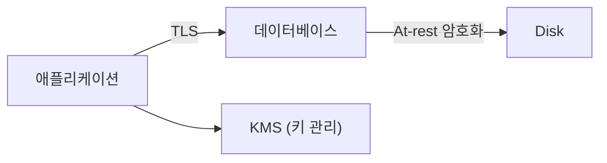

# 안전한 데이터 저장

> Secure Coding 101 시리즈 (5/10)


## 이 글에서 다룰 문제

법적으로도(GDPR, 개인정보보호법) 사고 비용 면에서도, *민감 데이터 누출* 은 가장 비싼 사고입니다. 평문 저장은 *시한폭탄* 입니다.

> *민감 데이터는 *덜 모으고, 잘게 나누고, 강하게 잠근다*.*

## 전체 흐름


## Before/After

**Before**: 주민번호와 카드번호를 *그대로* DB 에 저장. log 에도 *그대로*.

**After**: 주민번호는 *해시*, 카드번호는 *tokenize*, 저장은 *KMS 키* 로 암호화.

## 안전한 저장 5단계

### 1단계 — 데이터 분류

```python
SENSITIVE = {"ssn", "card_number", "password", "address"}
def is_sensitive(field): return field in SENSITIVE
```

### 2단계 — 전송은 TLS

```python
# 클라이언트와 DB 사이에 항상 TLS, 인증서 검증을 끄지 않는다.
import psycopg
conn = psycopg.connect("postgresql://...?sslmode=verify-full")
```

### 3단계 — 저장은 envelope 암호화

```python
from cryptography.fernet import Fernet
data_key = Fernet(kms.get_data_key())
ciphertext = data_key.encrypt(b"card-number")
```

### 4단계 — 검색이 필요하면 *결정적 해시*

```python
import hmac, hashlib
def lookup_hash(value, key):
    return hmac.new(key, value.encode(), hashlib.sha256).hexdigest()
```

### 5단계 — 백업도 같이 보호

```bash
# 백업 파일 자체를 암호화, 키는 별도 저장
gpg --symmetric --cipher-algo AES256 backup.sql
```

## 이 코드에서 주목할 점

- *Envelope 암호화* 는 *데이터 키* 와 *KMS 키* 를 분리한다.
- *결정적 해시* 는 검색 가능, 단 *salt* 는 시스템 단위.
- 전송과 저장이 *둘 다* 보호된다.

## 자주 하는 실수 5가지

1. **민감 데이터를 *평문* 으로 저장.** 디스크 한 장이면 끝.
2. **암호화 키를 *코드와 함께* 둔다.** 분리하는 의미가 없다.
3. **TLS 인증서 *검증을 끈다*.** *MITM* 에 노출.
4. **로그에 *민감 데이터* 가 흘러간다.** 로그도 *데이터 저장소*.
5. **백업이 *평문*.** 사고 시 가장 *큰 피해*.

## 실무에서는 이렇게 쓰입니다

대부분의 팀은 *KMS* (AWS KMS, GCP KMS, Vault) 로 키를 관리하고, *envelope encryption* 으로 application 데이터 키를 *주기적으로 회전* 합니다. 카드번호 같은 데이터는 *tokenization* 으로 *우리 시스템에 안 들이는* 전략을 씁니다.

## 체크리스트

- [ ] PII 가 *목록화* 되어 있다.
- [ ] 저장이 *KMS 기반* 으로 암호화된다.
- [ ] 전송이 *TLS, 인증서 검증* 으로 보호된다.
- [ ] 백업이 *암호화* 되어 있다.

## 정리 및 다음 단계

데이터가 안전해도 *키가 새면* 무용지물입니다. 다음 글은 *secret 과 키 관리* 입니다.

<!-- toc:begin -->
- [Secure Coding이란 무엇인가?](./01-what-is-secure-coding.md)
- [입력값 검증](./02-input-validation.md)
- [인증과 세션](./03-authentication-and-session.md)
- [인가와 권한](./04-authorization-and-permissions.md)
- **안전한 데이터 저장 (현재 글)**
- Secret과 키 관리 (예정)
- SQL Injection과 ORM 안전 사용 (예정)
- XSS와 CSRF 방어 (예정)
- Dependency 취약점 관리 (예정)
- 안전한 로깅과 감사 (예정)
<!-- toc:end -->

## 참고 자료

- [OWASP Cryptographic Storage Cheat Sheet](https://cheatsheetseries.owasp.org/cheatsheets/Cryptographic_Storage_Cheat_Sheet.html)
- [AWS KMS — Envelope Encryption](https://docs.aws.amazon.com/kms/latest/developerguide/concepts.html)
- [Google Cloud KMS](https://cloud.google.com/kms/docs)
- [HashiCorp Vault](https://developer.hashicorp.com/vault/docs)
