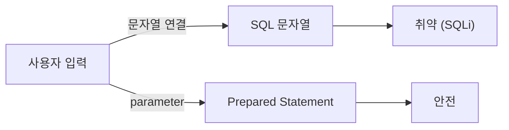

# SQL Injection과 ORM 안전 사용

> Secure Coding 101 시리즈 (7/10)

<!-- a-grade-intro:begin -->

**핵심 질문**: 25년이 지나도 *왜 SQL Injection 은 여전히 1위* 일까요?

> *원인은 늘 같다 — *문자열로 SQL 을 만든다*. 해법도 늘 같다 — *parameter 를 쓴다*.*

<!-- a-grade-intro:end -->

## 이 글에서 배울 것

- *SQL Injection* 의 원리
- *Parameterized query* 의 중요성
- ORM 이 *그래도 새는* 경우
- *Raw SQL* 을 *안전하게* 쓰는 법
- 방어 5단계와 흔한 함정 5가지

## 왜 중요한가

SQLi 한 번이면 *DB 전체* 가 노출됩니다. 인증 우회, 데이터 유출, 데이터 조작이 *동시에* 가능합니다.

> *문자열 연결로 SQL 을 만들면 *반드시* 새는 날이 온다.*

## 개념 한눈에 보기



## 핵심 용어 정리

- **SQL Injection**: 입력으로 *SQL 의미* 를 바꾸는 공격.
- **Parameterized query**: SQL 과 데이터를 *문법적으로 분리*.
- **Prepared statement**: DB 가 *미리 컴파일* 한 SQL.
- **ORM**: *객체 모델* 로 SQL 을 만드는 라이브러리.
- **Stored procedure**: DB 안에 *저장된 함수*.

## Before/After

**Before**: `f"SELECT * FROM users WHERE name='{name}'"` — *그대로 SQLi*.

**After**: `cursor.execute("SELECT * FROM users WHERE name=%s", (name,))` — *parameter*.

## 실습: SQLi 방어 5단계

### 1단계 — Parameter 사용

```python
cursor.execute(
    "SELECT id FROM users WHERE name=%s AND status=%s",
    (name, "active"),
)
```

### 2단계 — ORM 정상 사용

```python
from sqlalchemy import select
stmt = select(User).where(User.name == name)
result = session.scalars(stmt).all()
```

### 3단계 — 동적 컬럼은 *allowlist*

```python
ALLOWED = {"name", "created_at", "id"}
def order_by(field):
    if field not in ALLOWED:
        raise ValueError("invalid order field")
    return field  # 안전 후 SQL 에 합성
```

### 4단계 — Raw SQL 도 *parameter*

```python
session.execute(text("SELECT * FROM logs WHERE user_id=:uid"), {"uid": uid})
```

### 5단계 — 권한 분리

```sql
-- 애플리케이션 계정은 DML 만, DDL 은 별도 계정
GRANT SELECT, INSERT, UPDATE ON db.* TO 'app'@'%';
```

## 이 코드에서 주목할 점

- *문자열 연결* 이 보이면 *위험 신호*.
- ORM 도 `text()` / `raw` 를 잘못 쓰면 *동일하게 위험*.
- *동적 식별자* 는 *allowlist* 가 유일한 정답.

## 자주 하는 실수 5가지

1. **f-string 으로 SQL 작성.** 가장 흔한 *SQLi*.
2. **ORM `.filter()` 안에서 *문자열 합성*.** 의미 없는 안전감.
3. **검색 정렬 컬럼을 *입력 그대로*.** 동적 컬럼 *SQLi*.
4. **DB 계정에 *DROP 권한* 까지 부여.** 사고 시 *치명적*.
5. **에러 메시지에 *SQL 을 그대로* 노출.** *blind SQLi* 의 단서.

## 실무에서는 이렇게 쓰입니다

대부분의 팀은 *ORM 기본*, *raw SQL* 은 *예외* 로 둡니다. 모든 raw SQL 은 *코드 리뷰* 에서 *parameter 여부* 를 본다. *애플리케이션 DB 계정* 은 *최소 권한*.

## 시니어 엔지니어는 이렇게 생각합니다

- *문자열 SQL 은 *없는 것* 으로 취급.*
- *동적 식별자에는 *allowlist*.*
- *DB 계정도 *least privilege*.*
- *오류 메시지에 *SQL* 이 새지 않게.*
- *ORM 은 안전 *습관* 일 뿐, 만능이 아니다.*

## 체크리스트

- [ ] 모든 SQL 이 *parameter* 화.
- [ ] 동적 컬럼/테이블이 *allowlist*.
- [ ] DB 계정이 *역할 별 분리*.
- [ ] 에러 메시지가 *안전*.

## 연습 문제

1. *Blind SQLi* 의 동작을 한 문단으로.
2. ORM 에서 *raw text* 를 안전하게 쓰는 두 가지 패턴.
3. *동적 정렬 컬럼* allowlist 함수.

## 정리 및 다음 단계

DB 가 안전하면 *공격자의 가장 큰 보상* 이 사라집니다. 다음은 *브라우저 측* 의 두 공격 — *XSS 와 CSRF*.

<!-- toc:begin -->
- [Secure Coding이란 무엇인가?](./01-what-is-secure-coding.md)
- [입력값 검증](./02-input-validation.md)
- [인증과 세션](./03-authentication-and-session.md)
- [인가와 권한](./04-authorization-and-permissions.md)
- [안전한 데이터 저장](./05-safe-data-storage.md)
- [Secret과 키 관리](./06-secret-and-key-management.md)
- **SQL Injection과 ORM 안전 사용 (현재 글)**
- XSS와 CSRF 방어 (예정)
- Dependency 취약점 관리 (예정)
- 안전한 로깅과 감사 (예정)
<!-- toc:end -->

## 참고 자료

- [OWASP SQL Injection Prevention Cheat Sheet](https://cheatsheetseries.owasp.org/cheatsheets/SQL_Injection_Prevention_Cheat_Sheet.html)
- [PortSwigger — SQL injection](https://portswigger.net/web-security/sql-injection)
- [SQLAlchemy security](https://docs.sqlalchemy.org/)
- [psycopg parameter binding](https://www.psycopg.org/psycopg3/docs/basic/params.html)
