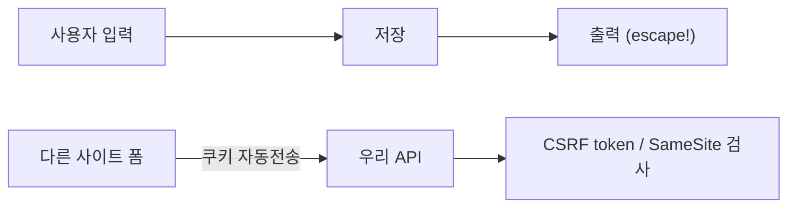

# XSS와 CSRF 방어

> Secure Coding 101 시리즈 (8/10)


## 이 글에서 다룰 문제

*XSS* 한 번이면 세션이 *탈취* 됩니다. *CSRF* 는 *사용자가 모르게* 송금/삭제를 일으킵니다.

> *기본 원칙은 *출력은 escape, 요청은 origin 확인*.*

## 전체 흐름


## Before/After

**Before**: `<div>{{ comment }}</div>` 그대로 출력. `<script>` 가 *그대로 실행*.

**After**: 출력 escape, *CSP* 적용, 쿠키 *SameSite=Lax*, 변경 요청에 *CSRF token*.

## 방어 5단계

### 1단계 — Output escape

```python
import html
def render_comment(text):
    return f"<div>{html.escape(text)}</div>"
```

### 2단계 — Content Security Policy

```python
response.headers["Content-Security-Policy"] = "default-src 'self'; script-src 'self'"
```

### 3단계 — SameSite 쿠키

```python
response.set_cookie(
    "session", sid,
    httponly=True, secure=True, samesite="Lax",
)
```

### 4단계 — CSRF token

```python
import secrets
def issue_csrf():
    return secrets.token_urlsafe(32)

def verify_csrf(form_token, session_token):
    return secrets.compare_digest(form_token, session_token)
```

### 5단계 — 위험한 sink 금지

```javascript
// element.innerHTML = userInput;  // 금지
element.textContent = userInput;    // 안전
```

## 이 코드에서 주목할 점

- 출력 escape 는 *컨텍스트 별* 로 (HTML, JS, attribute, URL).
- CSP 는 *심층 방어* — escape 가 새도 *마지막 방어선*.
- *SameSite* 와 *CSRF token* 은 *함께* 쓴다.

## 자주 하는 실수 5가지

1. **Markdown 을 *그대로 HTML* 로 출력.** *script* 가 들어간다.
2. **`innerHTML` 으로 *사용자 입력* 삽입.** 전형적 *DOM XSS*.
3. **CSP 를 `unsafe-inline` 으로 둔다.** 의미가 *없다*.
4. **CSRF token 을 *GET* 에 의존.** 캐시에 *남는다*.
5. **API 가 *Origin/Referer* 를 안 본다.** CSRF 가 *통과*.

## 실무에서는 이렇게 쓰입니다

대부분의 팀은 템플릿 엔진의 *기본 escape* 를 켭니다. *CSP* 를 *report-only* 로 시작해 점진적으로 강화. 모든 변경 API 는 *CSRF token* 또는 *Origin* 검증.

## 체크리스트

- [ ] 템플릿 *기본 escape* 가 켜져 있다.
- [ ] *CSP* 가 적용.
- [ ] 쿠키가 *SameSite*.
- [ ] 변경 요청에 *CSRF 검증*.

## 정리 및 다음 단계

브라우저 측 공격은 *기본기* 로 막습니다. 다음은 *우리가 안 짠 코드* — *dependency 취약점* 입니다.

<!-- toc:begin -->
- [Secure Coding이란 무엇인가?](./01-what-is-secure-coding.md)
- [입력값 검증](./02-input-validation.md)
- [인증과 세션](./03-authentication-and-session.md)
- [인가와 권한](./04-authorization-and-permissions.md)
- [안전한 데이터 저장](./05-safe-data-storage.md)
- [Secret과 키 관리](./06-secret-and-key-management.md)
- [SQL Injection과 ORM 안전 사용](./07-sql-injection-and-orm.md)
- **XSS와 CSRF 방어 (현재 글)**
- Dependency 취약점 관리 (예정)
- 안전한 로깅과 감사 (예정)
<!-- toc:end -->

## 참고 자료

- [OWASP XSS Prevention Cheat Sheet](https://cheatsheetseries.owasp.org/cheatsheets/Cross_Site_Scripting_Prevention_Cheat_Sheet.html)
- [OWASP CSRF Prevention Cheat Sheet](https://cheatsheetseries.owasp.org/cheatsheets/Cross-Site_Request_Forgery_Prevention_Cheat_Sheet.html)
- [MDN — Content Security Policy](https://developer.mozilla.org/en-US/docs/Web/HTTP/CSP)
- [MDN — SameSite cookies](https://developer.mozilla.org/en-US/docs/Web/HTTP/Cookies)
