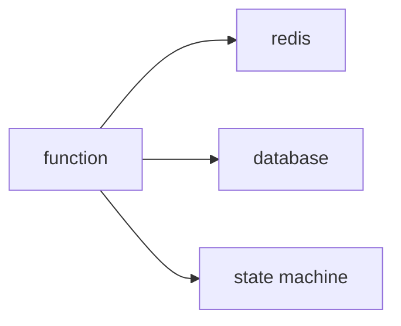

# State 관리

> Serverless 101 시리즈 (6/10)

<!-- a-grade-intro:begin -->

**핵심 질문**: *상태* 가 *없는* 함수에서 *상태* 가 필요한 *비즈니스* 를 어떻게 다루나요?

> *함수* 는 *stateless*, *상태* 는 *외부 저장소* 가 들고 있어야 합니다.

<!-- a-grade-intro:end -->

## 이 글에서 배울 것

- *stateless* 의 의미
- *세션/캐시* 위치
- *데이터베이스* 선택
- *워크플로* 상태
- *idempotent* 와의 결합

## 왜 중요한가

*함수 인스턴스* 는 *언제든* 사라집니다. *상태* 를 *외부* 에 두지 않으면 *데이터 유실* 입니다.

## 개념 한눈에 보기



## 핵심 용어 정리

- **stateless**: *함수* 가 *상태* 를 *들고 있지 않음*.
- **session store**: *Redis/DynamoDB* 등.
- **workflow state**: *Step Functions* 같은 *오케스트레이션*.
- **idempotency token**: *재시도* 안전.
- **TTL**: *상태* 의 *만료* 시간.

## Before/After

**Before**: *글로벌 변수* 에 캐시 → *유실*.

**After**: *Redis* + *TTL* + *idempotent 키*.

## 실습: 외부 상태

### 1단계 — 키-값 캐시 추상화

```python
class Cache:
    def __init__(self):
        self.store = {}
    def get(self, k):
        return self.store.get(k)
    def set(self, k, v, ttl=60):
        self.store[k] = (v, ttl)
```

### 2단계 — 세션 핸들러

```python
def with_session(handler, cache):
    def wrap(event, ctx):
        sid = event.get("session")
        state = cache.get(sid) or {}
        result = handler(event, ctx, state)
        cache.set(sid, state)
        return result
    return wrap
```

### 3단계 — 멱등 토큰

```python
def use_token(cache, token):
    if cache.get(token):
        return False
    cache.set(token, "done", ttl=3600)
    return True
```

### 4단계 — 워크플로 상태 (의사 코드)

```python
"""
states:
  Validate -> Charge -> Notify
on Failure: -> Refund
"""
```

### 5단계 — 데이터 모델 분리

```python
def model(record):
    return {"id": record["id"], "status": record.get("status", "new")}
```

## 이 코드에서 주목할 점

- *세션* 은 *외부* 에.
- *멱등 토큰* 으로 *재시도* 안전.
- *워크플로* 는 *상태 머신* 으로.

## 자주 하는 실수 5가지

1. ***글로벌 변수* 캐시 의존.**
2. ***DB 커넥션* 을 *함수* 마다 *새로* 열기.**
3. ***TTL* 없이 *무한 누적*.**
4. ***멱등 토큰* 누락.**
5. ***복잡한 흐름* 을 *함수 한 개* 에 욱여넣기.**

## 실무에서는 이렇게 쓰입니다

*세션* 은 *Redis*, *데이터* 는 *DynamoDB/RDS*, *복잡한 흐름* 은 *Step Functions* 같은 *오케스트레이션* 에 둡니다.

## 시니어 엔지니어는 이렇게 생각합니다

- *Stateless* 는 *제약* 이자 *자유*.
- *상태 위치* 가 *아키텍처*.
- *TTL* 이 *비용* 을 *지킨다*.
- *워크플로* 는 *코드* 보다 *상태 머신*.
- *데이터 모델* 은 *진화* 한다.

## 체크리스트

- [ ] *세션* 외부화.
- [ ] *DB 커넥션* 재사용.
- [ ] *TTL* 설정.
- [ ] *워크플로* 분리.

## 연습 문제

1. *Stateless* 의 의미 한 줄로.
2. *멱등 토큰* 의 *역할* 한 줄로.
3. *워크플로 상태 머신* 의 *이점* 한 줄로.

## 정리 및 다음 단계

다음 글은 *Queue* 와 *이벤트 드리븐 아키텍처* 입니다.

<!-- toc:begin -->
- [Serverless란 무엇인가?](./01-what-is-serverless.md)
- [Function as a Service](./02-function-as-a-service.md)
- [Trigger와 Event](./03-trigger-and-event.md)
- [Cold Start](./04-cold-start.md)
- [Scaling](./05-scaling.md)
- **State 관리 (현재 글)**
- Queue와 Event-driven Architecture (예정)
- Observability (예정)
- Cost (예정)
- Serverless 앱 설계 (예정)
<!-- toc:end -->

## 참고 자료

- [DynamoDB 단일 테이블 설계](https://docs.aws.amazon.com/amazondynamodb/latest/developerguide/bp-modeling-nosql-B.html)
- [ElastiCache 개요](https://docs.aws.amazon.com/AmazonElastiCache/latest/red-ug/WhatIs.html)
- [Step Functions](https://docs.aws.amazon.com/step-functions/latest/dg/welcome.html)
- [Idempotency 패턴](https://docs.aws.amazon.com/prescriptive-guidance/latest/cloud-design-patterns/idempotency.html)
