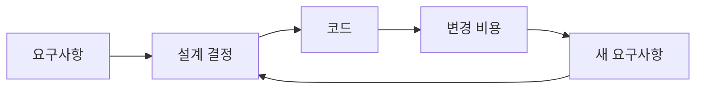

# 소프트웨어 설계란 무엇인가?

> Software Design 101 시리즈 (1/10)


## 이 글에서 다룰 문제

설계는 보이지 않습니다. 그러나 다음 변경의 비용으로 매번 모습을 드러냅니다.

> 설계 부채는 언제나 이자가 붙는다.

## 전체 흐름


설계는 변경 비용을 결정합니다.

## Before/After

**Before**

```text
"동작하기만 하면 된다."
→ 첫 출시는 빠르지만, 6개월 뒤 변경이 어렵다.
```

**After**

```text
"6개월 뒤에도 변경 가능해야 한다."
→ 첫 출시는 약간 느리지만, 누적 비용이 작다.
```

설계는 누적 비용 게임입니다.

## 좋은 설계를 식별하는 5단계

### 1단계 — 변경 시뮬레이션

```python
# 1_change_sim.py
# "결제 수단을 추가한다"가 손대야 할 파일이 몇 개인가?
files_touched = ["payment.py"]  # 1개면 좋은 설계
```

변경 영향이 작을수록 좋은 설계.

### 2단계 — 의존성 그래프

```python
# 2_deps.py
# A -> B -> C 단방향이면 OK
# A <-> B 순환이면 설계 신호
```

순환 의존은 거의 항상 적신호.

### 3단계 — 모듈 책임

```python
# 3_responsibility.py
# 모듈 한 줄 설명을 못 하면 책임이 흐릿함.
PAYMENT = "결제 도메인 — 외부 게이트웨이 호출과 도메인 규칙"
```

이름과 한 줄 설명이 합치되어야 합니다.

### 4단계 — 테스트 가능성

```python
# 4_testable.py
# 도메인 모듈이 IO 없이 단독 테스트 가능한가?
def can_test_alone(module):
    return module.no_io and module.no_globals
```

설계 품질의 가장 정직한 척도.

### 5단계 — 신규 인원의 학습 곡선

```text
# 5_onboard.txt
새 팀원이 한 모듈을 30분 안에 이해할 수 있는가?
```

설계는 결국 사람의 작업입니다.

## 이 코드에서 주목할 점

- 변경 영향, 의존성, 책임, 테스트 가능성을 한꺼번에 봅니다.
- 신규 인원의 학습 곡선이 가장 강력한 신호입니다.

## 자주 하는 실수 5가지

1. **한 번에 큰 설계.** 정보 부족 상태의 결정은 거의 틀립니다.
2. **변경 비용을 측정하지 않음.** 설계 부채가 보이지 않습니다.
3. **순환 의존 방치.** 점점 더 단단해집니다.
4. **모듈 책임이 두 줄 이상.** 응집도 낮음.
5. **설계 결정 기록 없음.** 같은 토론을 반복합니다.

## 실무에서는 이렇게 쓰입니다

좋은 팀은 ADR(Architecture Decision Record)로 결정을 글로 남깁니다. 결정과 그 이유가 함께 보존되어 새 팀원이 같은 토론을 반복하지 않습니다.

## 체크리스트

- [ ] 모듈 책임을 한 줄로 말할 수 있나?
- [ ] 의존성에 순환이 없나?
- [ ] 변경 시 손대는 파일이 적은가?
- [ ] 도메인 모듈이 단독 테스트 가능한가?
- [ ] 결정이 ADR로 기록되었나?

## 정리 및 다음 단계

설계는 다음 변경의 비용을 결정합니다. 다음 글에서 가장 기본 — 관심사 분리 — 부터 시작합니다.

<!-- toc:begin -->
- **소프트웨어 설계란 무엇인가? (현재 글)**
- 관심사 분리 (예정)
- 모듈과 경계 (예정)
- 의존성 방향 (예정)
- 인터페이스와 추상화 (예정)
- 계층 아키텍처 (예정)
- 데이터 흐름 설계 (예정)
- 변경 영향 줄이기 (예정)
- 설계 원칙 모음 (예정)
- 작은 프로젝트로 설계 연습 (예정)
<!-- toc:end -->

## 참고 자료

- [A Philosophy of Software Design (J. Ousterhout)](https://web.stanford.edu/~ouster/cgi-bin/aposd.php)
- [Software Architecture Guide (Martin Fowler)](https://martinfowler.com/architecture/)
- [Architecture Decision Records (ADR)](https://adr.github.io/)
- [Designing Data-Intensive Applications](https://dataintensive.net/)
