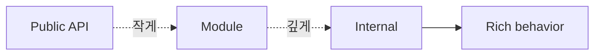

# 모듈과 경계

> Software Design 101 시리즈 (3/10)

<!-- a-grade-intro:begin -->

**핵심 질문**: 좋은 모듈 경계는 무엇으로 결정되나요?

> 외부에 보이는 표면적이 작고, 내부 변경이 외부에 영향을 주지 않을 때입니다.

<!-- a-grade-intro:end -->

## 이 글에서 배울 것

- 모듈의 정의
- 깊은 모듈과 얕은 모듈
- 공개 API 설계 원칙
- 캡슐화와 정보 은닉
- 패키지 구조의 신호

## 왜 중요한가

모듈 경계는 변경을 가두는 벽입니다. 벽이 좋으면 한쪽 변경이 다른 쪽으로 새지 않습니다.

> 좋은 경계는 무지를 허용한다.

## 개념 한눈에 보기



표면은 작게, 내부는 깊게.

## 핵심 용어 정리

- **Module**: 책임 단위로 묶인 코드의 묶음.
- **Public API**: 모듈이 외부에 약속하는 표면.
- **Deep module**: 작은 표면, 풍부한 내부.
- **Encapsulation**: 내부를 숨기고 인터페이스로만 소통.
- **Information hiding (Parnas)**: 변경 가능성이 큰 결정을 모듈 안에 숨김.

## Before/After

**Before**

```python
# 얕은 모듈: 함수마다 외부에 노출
def open_file(p): ...
def read_chunk(f, n): ...
def close_file(f): ...
```

**After**

```python
# 깊은 모듈: 표면 하나로 책임을 처리
def read_file(path) -> bytes: ...
```

호출자는 내부를 몰라도 됩니다.

## 실습: 좋은 경계를 만드는 5단계

### 1단계 — 표면 줄이기

```python
# 1_surface.py
# public이 10개면 의존자도 10개에 노출.
# 정말 필요한 것만 export.
__all__ = ["read_file"]
```

`__all__` / `index.ts`로 표면 통제.

### 2단계 — 내부 깊게 만들기

```python
# 2_deep.py
def read_file(path):
    f = _open(path)
    try: return _read_all(f)
    finally: _close(f)
```

호출자는 한 줄로 끝낼 수 있습니다.

### 3단계 — 변경 가능성 격리

```python
# 3_hide.py
class CacheBackend:  # 외부는 인터페이스만 안다
    def get(self, k): ...
    def set(self, k, v): ...
```

Redis냐 메모리냐는 내부 구현 결정.

### 4단계 — 데이터 객체 노출 제한

```python
# 4_dto.py
# 내부 모델을 그대로 노출하지 말고 DTO로.
def public_user(u): return {"id": u.id, "name": u.name}
```

내부 변경이 외부 계약을 깨지 않게.

### 5단계 — 의존 방향 단방향

```python
# 5_one_way.py
# domain은 infra를 몰라야 한다.
# infra가 domain을 import한다.
```

경계는 의존 방향으로 강화됩니다.

## 이 코드에서 주목할 점

- 표면이 작고 의도가 명확합니다.
- 내부 변경이 외부에 새지 않습니다.
- 호출자는 적게 알고도 많이 합니다.

## 자주 하는 실수 5가지

1. **모든 함수를 public.** 모듈 경계가 사실상 없음.
2. **내부 자료구조 그대로 반환.** 외부가 내부에 결합.
3. **모듈을 너무 잘게 쪼갬.** 의존 그래프 폭발.
4. **얕은 모듈만 잔뜩.** 추상화 가치 없음.
5. **변경 가능성 큰 결정을 외부에 노출.** 자유도 0.

## 실무에서는 이렇게 쓰입니다

좋은 라이브러리(예: `requests`)는 표면이 매우 작고 내부가 매우 깊습니다. 그래서 사용은 쉽고 진화는 자유롭습니다.

## 시니어 엔지니어는 이렇게 생각합니다

- 모듈은 깊을수록 좋다.
- 표면은 의도를 표현한다.
- 변경 가능성은 안에 숨긴다.
- DTO로 내부 모델을 보호한다.
- 의존 방향이 경계를 강화한다.

## 체크리스트

- [ ] 모듈의 표면이 작은가?
- [ ] 내부가 풍부한가?
- [ ] DTO로 외부 계약을 보호하나?
- [ ] 변경 가능성 큰 결정이 안에 숨었나?
- [ ] 의존이 단방향인가?

## 연습 문제

1. 본인 모듈의 public 표면을 절반으로 줄여 보세요.
2. 외부에 노출되는 자료구조를 DTO로 감싸 보세요.
3. 모듈 안의 변경 가능성 높은 결정 1개를 식별해 두세요.

## 정리 및 다음 단계

좋은 경계는 변경을 가둡니다. 다음 글에서는 경계가 가진 또 하나의 무기 — 의존성 방향 — 을 봅니다.

<!-- toc:begin -->
- [소프트웨어 설계란 무엇인가?](./01-what-is-software-design.md)
- [관심사 분리](./02-separation-of-concerns.md)
- **모듈과 경계 (현재 글)**
- 의존성 방향 (예정)
- 인터페이스와 추상화 (예정)
- 계층 아키텍처 (예정)
- 데이터 흐름 설계 (예정)
- 변경 영향 줄이기 (예정)
- 설계 원칙 모음 (예정)
- 작은 프로젝트로 설계 연습 (예정)
<!-- toc:end -->

## 참고 자료

- [Parnas — On the Criteria To Be Used in Decomposing Systems into Modules](https://www.win.tue.nl/~wstomv/edu/2ip30/references/criteria_for_modularization.pdf)
- [A Philosophy of Software Design — Deep Modules](https://web.stanford.edu/~ouster/cgi-bin/aposd.php)
- [Effective Java — API Design](https://www.oracle.com/technical-resources/articles/java/bloch-effective-08-qa.html)
- [Domain-Driven Design — Bounded Context](https://martinfowler.com/bliki/BoundedContext.html)
