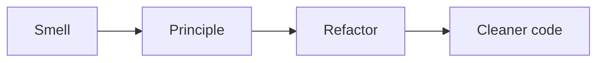

# 설계 원칙 모음

> Software Design 101 시리즈 (9/10)


## 이 글에서 다룰 문제

원칙은 정답이 아니라 진단 도구입니다. 코드 냄새가 나면 어떤 원칙이 깨졌는지 가리키고, 어떻게 고칠지 힌트를 줍니다.

> 원칙은 "왜"를 묻게 한다.

## 전체 흐름


냄새 → 원칙 → 리팩토링.

## Before/After

**Before**

```python
class UserService:
    def signup(self, payload):
        # 검증 + 저장 + 이메일 + 통계 + 로깅 + 결제까지
        ...
```

**After**

```python
class SignupValidator: ...
class UserRepo: ...
class WelcomeMailer: ...
class SignupService:
    def __init__(self, validator, repo, mailer): ...
    def run(self, payload): ...
```

SRP를 적용해 협력하는 작은 단위로.

## 원칙을 꺼내는 5가지 상황

### 1단계 — "이 클래스 왜 이렇게 큼?" → SRP

```python
# 1_srp.py
# 변경 이유 두 개 이상이면 분리.
```

### 2단계 — "또 if-elif 체인" → OCP

```python
# 2_ocp.py
# 분기를 다형성/등록표로.
```

### 3단계 — "하위 클래스가 예외" → LSP

```python
# 3_lsp.py
# 상속 계층을 의심.
```

### 4단계 — "쓰지도 않는 메서드 강요" → ISP

```python
# 4_isp.py
# 인터페이스를 쪼갠다.
```

### 5단계 — "도메인이 DB를 안다" → DIP

```python
# 5_dip.py
# 추상을 도메인 쪽에.
```

## 이 코드에서 주목할 점

- 각 원칙이 다른 종류의 냄새를 가리킵니다.
- 원칙은 *코드를* 고치게 만듭니다, 만 하지 않게.
- 한 번에 한 원칙만 적용하면 가독성이 유지됩니다.

## 자주 하는 실수 5가지

1. **DRY 과잉.** 우연히 비슷한 코드를 무리하게 합치고 결합 폭발.
2. **YAGNI 무시.** 미래의 가정으로 추상화 미리 추가.
3. **SOLID 강박.** 작은 스크립트도 5계층 분리.
4. **KISS를 게으름의 변명으로.** 단순함이 아니라 회피.
5. **원칙을 규칙처럼 적용.** 맥락을 잊는다.

## 실무에서는 이렇게 쓰입니다

코드 리뷰의 공통 언어가 됩니다. "이건 SRP가 깨진 것 같아"라고 말하면 동료가 같은 그림을 떠올립니다.

## 체크리스트

- [ ] 변경 이유가 하나로 모이나? (SRP)
- [ ] 새 기능 추가가 기존 코드 수정 없이 가능한가? (OCP)
- [ ] 하위 타입이 약속을 깨지 않는가? (LSP)
- [ ] 인터페이스가 사용자별로 적절한가? (ISP)
- [ ] 도메인이 추상에만 의존하는가? (DIP)

## 정리 및 다음 단계

원칙은 길잡이입니다. 마지막 글에서는 이 시리즈의 모든 도구를 — 작은 프로젝트 — 에 적용해 봅니다.

<!-- toc:begin -->
- [소프트웨어 설계란 무엇인가?](./01-what-is-software-design.md)
- [관심사 분리](./02-separation-of-concerns.md)
- [모듈과 경계](./03-modules-and-boundaries.md)
- [의존성 방향](./04-dependency-direction.md)
- [인터페이스와 추상화](./05-interfaces-and-abstraction.md)
- [계층 아키텍처](./06-layered-architecture.md)
- [데이터 흐름 설계](./07-data-flow-design.md)
- [변경 영향 줄이기](./08-reducing-change-impact.md)
- **설계 원칙 모음 (현재 글)**
- 작은 프로젝트로 설계 연습 (예정)
<!-- toc:end -->

## 참고 자료

- [SOLID Principles (Robert C. Martin)](https://web.archive.org/web/20151010224057/http://www.objectmentor.com/resources/articles/Principles_and_Patterns.pdf)
- [Law of Demeter](https://en.wikipedia.org/wiki/Law_of_Demeter)
- [The Wrong Abstraction (Sandi Metz)](https://sandimetz.com/blog/2016/1/20/the-wrong-abstraction)
- [YAGNI (Martin Fowler)](https://martinfowler.com/bliki/Yagni.html)
