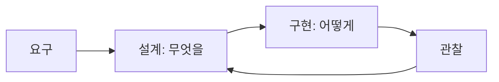

# 설계와 구현의 차이

> Software Engineering 101 시리즈 (3/10)

<!-- a-grade-intro:begin -->

**핵심 질문**: "잘 짠 코드"와 "잘 설계된 시스템"은 같은 말인가요?

> 설계는 무엇을, 구현은 어떻게입니다. 둘이 섞이면 둘 다 흐려집니다.

<!-- a-grade-intro:end -->

## 이 글에서 배울 것

- 설계와 구현의 정의
- ADR(Architecture Decision Record)
- trade-off를 글로 남기는 법
- 좋은 설계의 신호 5가지
- 과설계(over-engineering)를 피하는 법

## 왜 중요한가

설계 결정은 코드보다 오래 살아남습니다. 잘못된 설계는 좋은 코드로 가릴 수 없습니다.

> 코드는 새로 쓸 수 있지만, 결정의 흔적은 평생 따라옵니다.

## 개념 한눈에 보기



설계가 구현의 한계를 정합니다.

## 핵심 용어 정리

- **설계(Design)**: 컴포넌트, 책임, 경계, 인터페이스 결정.
- **구현(Implementation)**: 위 결정을 코드로 실현.
- **ADR**: 결정과 그 이유를 짧게 기록한 문서.
- **Trade-off**: 무엇을 얻고 무엇을 포기하는가.
- **YAGNI**: 지금 필요 없는 것은 만들지 않는다.

## Before/After

**Before — 코드로 설계**

```text
"일단 짜보고 리팩터링하자" -> 결정이 코드 안에 숨음
```

**After — ADR로 명시**

```text
선택지 A/B/C, 선택과 이유, 회수 가능 여부 -> 코드 단순화
```

설계가 보이면 코드가 단순해집니다.

## 실습: 결정을 글로 남기기

### 1단계 — 인터페이스 먼저

```python
# 1_iface.py
from typing import Protocol

class Notifier(Protocol):
    def send(self, user_id: str, body: str) -> None: ...
```

구현보다 인터페이스가 먼저.

### 2단계 — 두 가지 구현

```python
# 2_impls.py
class EmailNotifier:
    def send(self, user_id, body): ...
class SMSNotifier:
    def send(self, user_id, body): ...
```

다형성으로 구현을 교체 가능하게.

### 3단계 — ADR 작성

```text
# 3_adr.md
# ADR 0007: 알림 채널 추상화
- Context: 이메일/SMS/푸시 추가가 잦음
- Decision: Notifier 프로토콜로 추상화
- Alternatives: 직접 if/elif, 외부 SaaS 통합
- Consequences: 단위 테스트 용이, 성능 손실 무시 가능
```

결정의 이유를 한 페이지로.

### 4단계 — YAGNI 적용 (제거)

```python
# 4_remove.py
# class NotifierFactory: ...        # 지금 1개 채널이면 불필요
# class NotifierRegistry: ...       # 미래의 자유보다 현재의 단순함
```

미래 가정보다 현재의 단순함.

### 5단계 — 관찰 가능성 (구현 단계)

```python
# 5_obs.py
import logging
log = logging.getLogger(__name__)

class EmailNotifier:
    def send(self, user_id, body):
        log.info("notify", extra={"user": user_id, "channel": "email"})
        # ...
```

설계는 관찰 가능성도 의도해야 합니다.

## 이 코드에서 주목할 점

- 인터페이스가 책임을 정합니다.
- 다형성은 미래 변경 비용을 결정합니다.
- ADR은 변경의 정당성을 남깁니다.
- 관찰은 설계 단계의 결정입니다.

## 자주 하는 실수 5가지

1. **설계를 코드 안에 묻기.** 결정의 이유 사라짐.
2. **과설계(미래 가정).** 사용 안 되는 추상화는 부채.
3. **인터페이스 없이 구현 공유.** 다른 호출자에 새고.
4. **ADR 누락.** 사고 시 "왜 이렇게?"가 영원히 반복.
5. **재설계 회피.** 잘못된 결정을 코드로 보강.

## 실무에서는 이렇게 쓰입니다

대형 조직은 ADR을 git에 두고 PR로 변경. 시스템 다이어그램(C4 모델)을 README에 첨부. 새 기능은 항상 "설계 -> 리뷰 -> 구현" 순서로 진행됩니다.

## 시니어 엔지니어는 이렇게 생각합니다

- 코드 전에 ADR을 씁니다.
- 인터페이스로 책임 경계를 명확히.
- 미래의 자유보다 현재의 단순함.
- 관찰 가능성을 설계의 일부로.
- 결정은 회수 가능한 형태로 남깁니다.

## 체크리스트

- [ ] 주요 결정에 ADR이 있는가?
- [ ] 인터페이스가 명시적인가?
- [ ] YAGNI에 따라 추상화를 줄였는가?
- [ ] 관찰 가능성이 설계에 들어 있는가?
- [ ] 회수 가능한 결정인가?

## 연습 문제

1. 본인 프로젝트의 큰 결정 한 가지를 ADR로 적어 보세요.
2. 사용 안 되는 추상화를 두 가지 찾아 제거 안을 적어 보세요.
3. 관찰 가능성이 빠진 모듈을 골라 추가 항목을 적어 보세요.

## 정리 및 다음 단계

설계와 구현은 다른 일이고, 다른 도구로 다룹니다. 다음 글에서는 코드 품질의 마지막 관문 — 코드 리뷰 — 를 봅니다.

<!-- toc:begin -->
- [소프트웨어 엔지니어링이란 무엇인가?](./01-what-is-software-engineering.md)
- [요구사항 이해하기](./02-understanding-requirements.md)
- **설계와 구현의 차이 (현재 글)**
- 코드 리뷰 (예정)
- 테스트 전략 (예정)
- 버전 관리와 릴리스 (예정)
- 문서화 (예정)
- 협업 프로세스 (예정)
- 유지보수와 기술부채 (예정)
- 좋은 소프트웨어의 기준 (예정)
<!-- toc:end -->

## 참고 자료

- [Michael Nygard — Documenting Architecture Decisions](https://cognitect.com/blog/2011/11/15/documenting-architecture-decisions)
- [C4 Model — Simon Brown](https://c4model.com/)
- [ThoughtWorks — Architecture Decision Records](https://www.thoughtworks.com/radar/techniques/lightweight-architecture-decision-records)
- [Designing Data-Intensive Applications — Martin Kleppmann](https://dataintensive.net/)
