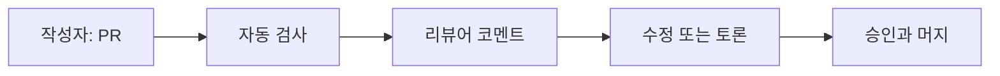

# 코드 리뷰

> Software Engineering 101 시리즈 (4/10)

<!-- a-grade-intro:begin -->

**핵심 질문**: 코드 리뷰는 결함을 잡는 일인가요, 지식을 나누는 일인가요?

> 둘 다입니다. 하지만 잘못 운영하면 둘 다 못 합니다.

<!-- a-grade-intro:end -->

## 이 글에서 배울 것

- 코드 리뷰의 진짜 목적
- PR(Pull Request)을 잘 쓰는 법
- 리뷰어가 실제로 보는 항목
- 코멘트 톤과 의사결정 신호
- 자동화로 줄일 수 있는 리뷰 부담

## 왜 중요한가

코드 리뷰는 코드 품질뿐 아니라 팀의 지식 분포를 결정합니다. 한 사람만 아는 코드가 늘어나면 조직은 곧 멈춥니다.

> 리뷰는 합격/불합격이 아니라 합의 과정입니다.

## 개념 한눈에 보기



자동화가 먼저, 사람은 판단에 집중합니다.

## 핵심 용어 정리

- **PR(Pull Request)**: 변경 단위와 토론 공간.
- **Reviewer**: 코드의 책임을 함께 나누는 동료.
- **Nit**: 가벼운 제안, 머지를 막지 않음.
- **Blocking comment**: 머지 전 반드시 해소해야 하는 의견.
- **Approve with comments**: 신뢰 기반 승인.

## Before/After

**Before — 한 PR, 800줄, "작은 수정 포함"**

```text
PR 제목: Refactor user module + bug fix + log cleanup
-> 리뷰 불가, 의도 분리 안 됨
```

**After — 분리된 PR, 각 200줄 이하**

```text
1) fix: null user crash
2) refactor: extract notification port
3) chore: prune verbose logs
```

작은 PR은 빨리 머지되고 사고도 줄입니다.

## 실습: 리뷰 가능한 PR 만들기

### 1단계 — 변경의 의도 한 줄

```text
# 1_pr_title.txt
fix(auth): handle expired refresh token without 500
```

제목이 변경의 본질을 말합니다.

### 2단계 — 본문 템플릿

```text
# 2_pr_body.md
## What
만료된 refresh token에 대한 401 응답 추가.

## Why
현재 500이 발생해 모니터링 알람이 폭주.

## How
`AuthService.refresh()`에서 ExpiredTokenError를 401로 매핑.

## Test
unit + 수동 cURL.
```

리뷰어는 What/Why/How/Test로 빠르게 진입합니다.

### 3단계 — 자동화로 사람 부담 줄이기

```yaml
# 3_ci.yml
jobs:
  check:
    steps:
      - run: ruff check .
      - run: mypy app
      - run: pytest -q
```

포맷, 타입, 테스트는 사람이 보지 않습니다.

### 4단계 — 작은 단위로 분리

```text
# 4_split.md
- PR 1: 데이터 모델 변경
- PR 2: 서비스 로직
- PR 3: 핸들러와 라우팅
```

머지 가능한 가장 작은 단위로 쪼갭니다.

### 5단계 — 코멘트 톤 가이드

```text
# 5_tone.md
[nit] 변수명 user_id가 일관적이면 좋겠습니다.
[question] 이 분기에서 N+1 가능성이 있나요?
[blocking] 비밀키가 로그에 남습니다. 머지 전 수정 필요.
```

태그가 의사결정을 빠르게 만듭니다.

## 이 코드에서 주목할 점

- 자동화가 사람의 시선을 비웁니다.
- PR 본문 템플릿이 의사결정을 가속합니다.
- 코멘트 태그가 머지 차단 여부를 명확히 합니다.
- 분리된 PR은 회수 가능한 결정이 됩니다.

## 자주 하는 실수 5가지

1. **거대한 PR.** 리뷰 품질이 0에 수렴합니다.
2. **사람이 포맷을 지적.** 자동화로 옮기세요.
3. **코멘트 톤이 공격적.** 사람이 아닌 코드 이야기.
4. **승인 도장만 찍기.** 책임은 함께 집니다.
5. **테스트 없이 머지.** 리뷰는 테스트의 대체재가 아닙니다.

## 실무에서는 이렇게 쓰입니다

GitHub 기반 팀은 CODEOWNERS로 자동 리뷰어 지정, required reviews 1~2명, 보호 브랜치, CI 그린 강제. 큰 변경은 RFC 단계를 먼저 거칩니다.

## 시니어 엔지니어는 이렇게 생각합니다

- PR은 변경 의도의 압축이다.
- 자동화 가능한 것을 사람이 보면 모욕이다.
- 코멘트는 코드에 대한 것이지 사람에 대한 것이 아니다.
- 모든 승인은 공동 책임이다.
- 작게 자르는 능력이 시니어의 표시다.

## 체크리스트

- [ ] PR 제목이 변경 의도를 한 줄로 말하는가?
- [ ] PR 본문에 What/Why/How/Test가 있는가?
- [ ] CI가 포맷·타입·테스트를 모두 보는가?
- [ ] PR 크기가 200~400 lines 이하인가?
- [ ] 코멘트가 코드에 대한 것인가?

## 연습 문제

1. 최근 PR 한 개를 골라 위 템플릿으로 다시 써 보세요.
2. CI에서 사람이 아직도 보고 있는 항목을 찾아 자동화 안을 적어 보세요.
3. 팀 코멘트 가이드(태그 3개)를 한 페이지로 작성해 보세요.

## 정리 및 다음 단계

코드 리뷰는 결함 발견과 지식 분배를 동시에 합니다. 다음 글에서는 결함을 사람이 아닌 기계가 잡게 하는 방법 — 테스트 전략 — 을 봅니다.

<!-- toc:begin -->
- [소프트웨어 엔지니어링이란 무엇인가?](./01-what-is-software-engineering.md)
- [요구사항 이해하기](./02-understanding-requirements.md)
- [설계와 구현의 차이](./03-design-vs-implementation.md)
- **코드 리뷰 (현재 글)**
- 테스트 전략 (예정)
- 버전 관리와 릴리스 (예정)
- 문서화 (예정)
- 협업 프로세스 (예정)
- 유지보수와 기술부채 (예정)
- 좋은 소프트웨어의 기준 (예정)
<!-- toc:end -->

## 참고 자료

- [Google Engineering Practices — Code Review Developer Guide](https://google.github.io/eng-practices/review/)
- [Conventional Comments](https://conventionalcomments.org/)
- [GitHub Docs — About protected branches](https://docs.github.com/en/repositories/configuring-branches-and-merges-in-your-repository/managing-protected-branches/about-protected-branches)
- [Best Kept Secrets of Peer Code Review — Smart Bear](https://smartbear.com/resources/ebooks/best-kept-secrets-of-peer-code-review/)
