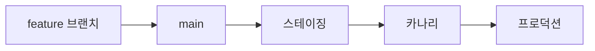

# 버전 관리와 릴리스

> Software Engineering 101 시리즈 (6/10)


## 이 글에서 다룰 문제

릴리스는 코드와 사용자가 만나는 유일한 순간입니다. 여기서 사고가 나면 그 전 모든 노력이 잊힙니다.

> 빠른 릴리스보다 안전한 릴리스가 신뢰를 만든다.

## 전체 흐름


각 단계에서 회수 비용이 작아집니다.

## Before/After

**Before — 거대 릴리스**

```text
2주마다 200개 PR 한꺼번에 -> 어디서 깨졌는지 불명
```

**After — 점진 릴리스**

```text
하루 다회 머지 -> 카나리 5% -> 모니터 -> 100%
```

작게 자주 보내는 것이 안전합니다.

## 작은 릴리스 파이프라인

### 1단계 — Conventional Commits

```text
# 1_commits.txt
feat(auth): add refresh token rotation
fix(billing): handle zero amount invoices
chore(deps): bump fastapi to 0.110
```

기계가 읽을 수 있는 메시지가 자동화의 시작입니다.

### 2단계 — SemVer 결정

```text
# 2_semver.md
feat -> MINOR
fix  -> PATCH
BREAKING CHANGE -> MAJOR
```

커밋이 버전을 결정합니다.

### 3단계 — 자동 체인지로그

```yaml
# 3_release.yml
- uses: googleapis/release-please-action@v4
  with:
    release-type: python
```

PR 머지로 자동 릴리스 PR이 생성됩니다.

### 4단계 — 카나리 배포

```yaml
# 4_canary.yml
strategy:
  canary:
    weight: 5
    after: { metrics: error_rate < 0.5%, duration: 10m }
```

소수에 먼저, 신호가 좋을 때 확장.

### 5단계 — 즉시 롤백

```bash
# 5_rollback.sh
kubectl rollout undo deployment/api
```

롤백이 1분 안에 가능해야 합니다.

## 이 코드에서 주목할 점

- 커밋 규약이 자동화의 입력입니다.
- 카나리는 회수 가능한 결정.
- 롤백 속도가 안전성의 척도.
- 체인지로그는 사용자 언어여야 합니다.

## 자주 하는 실수 5가지

1. **수동 버전 번호.** 사람이 잊습니다.
2. **롤백 미연습.** 사고 시 처음 시도가 실전.
3. **거대 릴리스.** 사고 원인 좁히기 불가.
4. **커밋 메시지 미규약.** 자동화가 멈춥니다.
5. **사용자 언어 부재의 릴리스 노트.** 신뢰 누수.

## 실무에서는 이렇게 쓰입니다

성숙한 팀은 trunk-based + feature flag + 자동 SemVer + 카나리 배포 + 즉시 롤백. 사고 발생 시 MTTR(평균 복구 시간)이 분 단위입니다.

## 체크리스트

- [ ] 브랜치 전략이 글로 적혀 있는가?
- [ ] 버전 결정이 자동인가?
- [ ] 체인지로그가 사용자 언어인가?
- [ ] 카나리 단계가 있는가?
- [ ] 롤백이 1분 안에 되는가?

## 정리 및 다음 단계

릴리스는 신뢰의 인터페이스입니다. 다음 글에서는 그 신뢰를 글로 남기는 — 문서화 — 를 봅니다.

<!-- toc:begin -->
- [소프트웨어 엔지니어링이란 무엇인가?](./01-what-is-software-engineering.md)
- [요구사항 이해하기](./02-understanding-requirements.md)
- [설계와 구현의 차이](./03-design-vs-implementation.md)
- [코드 리뷰](./04-code-review.md)
- [테스트 전략](./05-testing-strategy.md)
- **버전 관리와 릴리스 (현재 글)**
- 문서화 (예정)
- 협업 프로세스 (예정)
- 유지보수와 기술부채 (예정)
- 좋은 소프트웨어의 기준 (예정)
<!-- toc:end -->

## 참고 자료

- [Semantic Versioning 2.0.0](https://semver.org/)
- [Conventional Commits 1.0.0](https://www.conventionalcommits.org/)
- [Trunk-Based Development](https://trunkbaseddevelopment.com/)
- [Google SRE Book — Release Engineering](https://sre.google/sre-book/release-engineering/)
