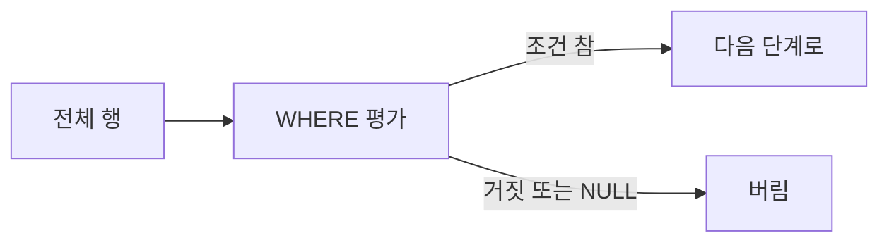

# WHERE와 조건

> SQL 101 시리즈 (3/10)


## 이 글에서 다룰 문제

WHERE 한 줄이 *비용의 90%* 를 결정합니다. *index 적중* 여부, *조회 행 수*, *서버 메모리*, 모두 WHERE 에서 결정됩니다. 그리고 *NULL* 은 가장 자주 *조용히 결과를 망치는* 부분입니다.

> *조건문이 *틀린 결과를 빠르게* 내는 일은 *생각보다 자주* 일어난다.*

## 전체 흐름


## Before/After

**Before**: `WHERE name LIKE '%kim%' OR age > 30` — *의도가 모호* 하다.

**After**: `WHERE (name LIKE '%kim%' OR age > 30) AND active = TRUE` — *괄호로* 의도 명시.

## 조건 5단계

### 1단계 — 비교

```sql
SELECT * FROM users WHERE age >= 18;
```

### 2단계 — 범위

```sql
SELECT * FROM orders WHERE total BETWEEN 100 AND 500;
```

### 3단계 — 목록

```sql
SELECT * FROM users WHERE country IN ('KR', 'JP', 'US');
```

### 4단계 — 패턴

```sql
SELECT * FROM users WHERE email LIKE '%@example.com';
```

### 5단계 — NULL 안전

```sql
SELECT * FROM users WHERE deleted_at IS NULL;
```

## 이 코드에서 주목할 점

- `LIKE '%xxx'` 는 *index 를 못 탄다*. 후방 일치는 *비싸다*.
- `IN` 은 *작은 목록* 에 좋다. 큰 목록은 *조인* 으로.
- `IS NULL` 만 NULL 을 *정확히* 잡는다. `= NULL` 은 *항상 거짓*.

## 자주 하는 실수 5가지

1. **`= NULL` 로 비교.** 결과는 *항상 NULL = 거짓 취급*. 행이 *사라진다*.
2. **AND/OR 괄호 생략.** AND 가 *먼저* 결합돼 *원치 않는 결과*.
3. **컬럼에 함수 적용.** `WHERE LOWER(email) = ...` 는 *index 적중 실패*.
4. **`LIKE '%kim%'`** *수백만 행 풀스캔*.
5. **타입 불일치.** `age = '18'` 같은 *암시적 변환* 이 *index 무력화*.

## 실무에서는 이렇게 쓰입니다

대시보드 필터, *검색 박스*, *권한 체크* 가 모두 WHERE 에 모입니다. 검색은 보통 *full-text index* 또는 *전용 검색 엔진* 으로 분리합니다. NULL 처리는 *팀 규칙* 으로 명문화합니다.

## 체크리스트

- [ ] `IS NULL` 과 `= NULL` 의 차이를 안다.
- [ ] AND/OR 우선순위를 안다.
- [ ] `LIKE` 가 언제 비싼지 안다.
- [ ] sargable 의 의미를 안다.

## 정리 및 다음 단계

WHERE 는 *데이터의 문지기* 입니다. 다음 글은 *JOIN* 입니다.

<!-- toc:begin -->
- [SQL이란 무엇인가?](./01-what-is-sql.md)
- [SELECT 기본](./02-select-basics.md)
- **WHERE와 조건 (현재 글)**
- JOIN (예정)
- GROUP BY와 aggregate (예정)
- Subquery (예정)
- Window Function (예정)
- INSERT, UPDATE, DELETE (예정)
- Index와 Query Plan (예정)
- 실전 분석 SQL (예정)
<!-- toc:end -->

## 참고 자료

- [PostgreSQL — WHERE clause](https://www.postgresql.org/docs/current/queries-table-expressions.html#QUERIES-WHERE)
- [PostgreSQL — Pattern Matching](https://www.postgresql.org/docs/current/functions-matching.html)
- [Use The Index, Luke — Where Clause](https://use-the-index-luke.com/sql/where-clause)
- [Mode — WHERE](https://mode.com/sql-tutorial/sql-where/)
