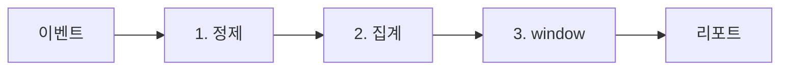

# 실전 분석 SQL

> SQL 101 시리즈 (10/10)


## 이 글에서 다룰 문제

대시보드의 *모든 숫자* 는 *몇 가지 패턴* 의 변주입니다. 이 패턴을 익혀 두면 *새 요청이 와도* *몇 분* 안에 *초안* 을 쓸 수 있습니다. 그리고 *팀의 SQL 자산* 이 됩니다.

> *분석 SQL 은 *시리즈의 마지막 시험* 이자 *시작점* 이다.*

## 전체 흐름


## Before/After

**Before**: 분석 요청마다 *처음부터* 새 쿼리를 짠다.

**After**: *cohort, funnel, retention* 의 *템플릿* 을 *조립* 만 한다.

## 5가지 분석 패턴

### 1단계 — DAU

```sql
SELECT event_at::date AS day, COUNT(DISTINCT user_id) AS dau
FROM events
GROUP BY day
ORDER BY day;
```

### 2단계 — Cohort retention

```sql
WITH cohort AS (
    SELECT user_id, MIN(event_at)::date AS cohort_day FROM events GROUP BY user_id
),
activity AS (
    SELECT e.user_id, c.cohort_day,
        (e.event_at::date - c.cohort_day) AS day_n
    FROM events e JOIN cohort c USING (user_id)
)
SELECT cohort_day, day_n, COUNT(DISTINCT user_id) AS users
FROM activity
GROUP BY cohort_day, day_n
ORDER BY cohort_day, day_n;
```

### 3단계 — Funnel

```sql
SELECT
    COUNT(DISTINCT user_id) FILTER (WHERE step = 'view')   AS s1_view,
    COUNT(DISTINCT user_id) FILTER (WHERE step = 'cart')   AS s2_cart,
    COUNT(DISTINCT user_id) FILTER (WHERE step = 'pay')    AS s3_pay
FROM events;
```

### 4단계 — Top-N per group

```sql
WITH ranked AS (
    SELECT product_id, total,
        ROW_NUMBER() OVER (PARTITION BY product_id ORDER BY total DESC) AS rk
    FROM orders
)
SELECT * FROM ranked WHERE rk <= 3;
```

### 5단계 — MoM 성장률

```sql
WITH monthly AS (
    SELECT DATE_TRUNC('month', day) AS month, SUM(revenue) AS rev
    FROM daily_revenue GROUP BY month
)
SELECT month, rev,
    rev - LAG(rev) OVER (ORDER BY month) AS diff,
    (rev - LAG(rev) OVER (ORDER BY month)) * 100.0
        / NULLIF(LAG(rev) OVER (ORDER BY month), 0) AS mom_pct
FROM monthly;
```

## 이 코드에서 주목할 점

- *DISTINCT user_id* 가 *활성 사용자* 의 표준 표현.
- *FILTER (WHERE ...)* 로 funnel 을 *한 줄* 에.
- *NULLIF* 로 *0으로 나눔* 을 막는다.

## 자주 하는 실수 5가지

1. **활성 정의 *팀별 다름*.** *문서화* 안 하면 *숫자가 어긋남*.
2. **타임존 처리 누락.** UTC vs 로컬 시간 *섞이면* 일자가 *밀린다*.
3. **cohort 정의 모호.** *가입* vs *첫 결제* 등 *명시* 필요.
4. **Funnel 의 *순서 무시*.** 단계는 *시간 순* 으로 *체크* 해야.
5. **NULLIF 누락.** *전월 0원* 에서 *나눗셈 오류*.

## 실무에서는 이렇게 쓰입니다

분석 팀은 보통 *이런 패턴 라이브러리* 를 운영합니다. *PR 리뷰* 와 *dbt 같은 도구* 로 *재사용 가능한 모델* 을 만듭니다. *대시보드 한 줄* 뒤에 *수십 줄의 검증된 SQL* 이 있습니다.

## 체크리스트

- [ ] DAU 를 한 줄로 쓸 수 있다.
- [ ] cohort retention 을 두 단계로 짤 수 있다.
- [ ] funnel 을 FILTER 로 쓸 수 있다.
- [ ] top-N per group 을 ROW_NUMBER 로 짤 수 있다.

## 정리 및 다음 단계

시리즈를 마치며: *SQL 은 *읽기, 쓰기, 분석* 의 공통 언어*. 다음 단계는 *Query Plan 깊이*, *PostgreSQL 운영*, 그리고 *데이터 웨어하우스* 입니다.

<!-- toc:begin -->
- [SQL이란 무엇인가?](./01-what-is-sql.md)
- [SELECT 기본](./02-select-basics.md)
- [WHERE와 조건](./03-where-and-conditions.md)
- [JOIN](./04-join.md)
- [GROUP BY와 aggregate](./05-group-by-and-aggregate.md)
- [Subquery](./06-subquery.md)
- [Window Function](./07-window-function.md)
- [INSERT, UPDATE, DELETE](./08-insert-update-delete.md)
- [Index와 Query Plan](./09-index-and-query-plan.md)
- **실전 분석 SQL (현재 글)**
<!-- toc:end -->

## 참고 자료

- [Mode — Advanced SQL](https://mode.com/sql-tutorial/)
- [PostgreSQL — Window Functions](https://www.postgresql.org/docs/current/tutorial-window.html)
- [dbt — Analytics Engineering](https://docs.getdbt.com/)
- [Looker — Block Library](https://cloud.google.com/looker/docs)
