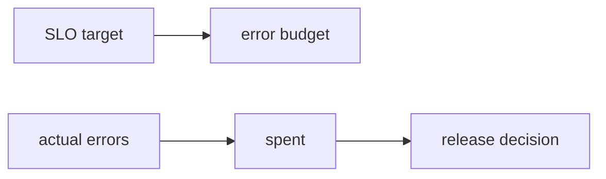

# Error Budget

> SRE 101 시리즈 (4/10)

<!-- a-grade-intro:begin -->

**핵심 질문**: *얼마나* *실패* 해도 *괜찮은가* 를 *어떻게* *정할까요*?

> *Error budget* 은 *목표* 와 *현실* 사이의 *허용된 거리* 입니다.

<!-- a-grade-intro:end -->

## 이 글에서 배울 것

- *Error budget* 의 *정의*
- *계산법*
- *소진 정책*
- *릴리스 결정* 과의 관계
- *팀 문화* 영향

## 왜 중요한가

*속도* 와 *안정성* 은 *적* 이 아니라 *예산* 으로 *조율* 됩니다.

## 개념 한눈에 보기



## 핵심 용어 정리

- **error budget**: *허용된 실패량*.
- **burn rate**: *소진 속도*.
- **freeze**: *릴리스 동결*.
- **window**: *측정 기간*.
- **policy**: *소진 시 행동*.

## Before/After

**Before**: *장애* 가 나면 *비난*.

**After**: *예산* 안에서는 *위험* 을 *감수*, *초과* 시 *동결*.

## 실습: 예산 운용

### 1단계 — 예산 계산

```python
def budget(target, total):
    return (1 - target) * total
```

### 2단계 — 소진 비율

```python
def spent(errors, allowed):
    return errors / allowed
```

### 3단계 — Burn rate

```python
def burn_rate(errors_in_h, allowed_per_h):
    return errors_in_h / allowed_per_h
```

### 4단계 — 정책 분기

```python
def policy(spent_ratio):
    if spent_ratio > 1.0:
        return "freeze"
    if spent_ratio > 0.5:
        return "review"
    return "ship"
```

### 5단계 — 알림

```python
def alert(burn):
    return burn > 14.4  # 14.4x: 빠른 소진
```

## 이 코드에서 주목할 점

- *예산* 은 *수치* 화 가능.
- *Burn rate* 가 *조기 경보*.
- *정책* 으로 *행동* 을 *명문화*.

## 자주 하는 실수 5가지

1. ***예산* 을 *문서* 로만.**
2. ***Burn rate* 무시.**
3. ***freeze* 정책 *없음*.**
4. ***SLO* 와 *예산* 이 *분리* 운영.**
5. ***예산* 을 *징벌* 도구로.**

## 실무에서는 이렇게 쓰입니다

*예산* 이 *남으면* *실험* 을 *허용*, *소진* 되면 *안정화* 에 *집중* 합니다.

## 시니어 엔지니어는 이렇게 생각합니다

- *예산* 은 *대화* 의 *언어*.
- *Burn rate* 가 *현재* 를 *말함*.
- *Freeze* 는 *벌* 이 아닌 *재정비*.
- *정책* 은 *팀* 과 *합의*.
- *예산* 은 *제품* 의 *일부*.

## 체크리스트

- [ ] *예산* 계산.
- [ ] *Burn rate* 알림.
- [ ] *Freeze* 정책.
- [ ] *오너* 명시.

## 연습 문제

1. *error budget* 의 의미 한 줄로.
2. *burn rate* 의 의미 한 줄로.
3. *freeze* 의 의미 한 줄로.

## 정리 및 다음 단계

다음 글은 *Monitoring* 의 *기본기* 입니다.

<!-- toc:begin -->
- [SRE란 무엇인가?](./01-what-is-sre.md)
- [Reliability](./02-reliability.md)
- [SLI, SLO, SLA](./03-sli-slo-sla.md)
- **Error Budget (현재 글)**
- Monitoring (예정)
- Incident Response (예정)
- Postmortem (예정)
- Toil 줄이기 (예정)
- Capacity Planning (예정)
- 운영 가능한 시스템 만들기 (예정)
<!-- toc:end -->

## 참고 자료

- [Embracing Risk - Google SRE Book](https://sre.google/sre-book/embracing-risk/)
- [Alerting on SLOs - Google SRE Workbook](https://sre.google/workbook/alerting-on-slos/)
- [Error Budgets - Atlassian](https://www.atlassian.com/incident-management/kpis/error-budget)
- [Error Budget Policy - Google](https://sre.google/workbook/error-budget-policy/)
