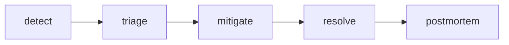

# Incident Response

> SRE 101 시리즈 (6/10)


## 이 글에서 다룰 문제

*혼란* 은 *영향* 을 *키웁니다*.

## 전체 흐름


## Before/After

**Before**: *발생* 즉시 *모두* 가 *동시* 에 *대응*.

**After**: *역할* 과 *채널* 을 *고정*.

## 절차 정의

### 1단계 — 심각도 매핑

```python
def severity(impact_users, duration_min):
    if impact_users > 10000 or duration_min > 60:
        return "SEV1"
    if impact_users > 1000:
        return "SEV2"
    return "SEV3"
```

### 2단계 — IC 지정

```python
def assign_ic(on_call):
    return on_call[0]
```

### 3단계 — 채널 생성

```python
def channel(name):
    return f"#inc-{name}"
```

### 4단계 — 상태 업데이트

```python
def update(channel, msg, every_min=15):
    return {"channel": channel, "msg": msg, "every": every_min}
```

### 5단계 — 종료 조건

```python
def can_close(mitigated, customer_impact_zero):
    return mitigated and customer_impact_zero
```

## 이 코드에서 주목할 점

- *심각도* 는 *영향* 으로 정의.
- *IC* 가 *단일* 의사결정자.
- *채널* 분리로 *기록* 보존.

## 자주 하는 실수 5가지

1. ***IC* 없이 *합의* 로 *지연*.**
2. ***영향* 을 *주관* 적으로 평가.**
3. ***고객 공지* 누락.**
4. ***종료* 기준 *모호*.**
5. ***기록* 없이 *복귀*.**

## 실무에서는 이렇게 쓰입니다

*PagerDuty* / *Statuspage* / *Slack* 의 *연동* 으로 *역할* 과 *공지* 가 *자동* 화 됩니다.

## 체크리스트

- [ ] *심각도* 정의.
- [ ] *IC* 로테이션.
- [ ] *공지* 템플릿.
- [ ] *종료* 기준.

## 정리 및 다음 단계

다음 글은 *Postmortem* 입니다.

<!-- toc:begin -->
- [SRE란 무엇인가?](./01-what-is-sre.md)
- [Reliability](./02-reliability.md)
- [SLI, SLO, SLA](./03-sli-slo-sla.md)
- [Error Budget](./04-error-budget.md)
- [Monitoring](./05-monitoring.md)
- **Incident Response (현재 글)**
- Postmortem (예정)
- Toil 줄이기 (예정)
- Capacity Planning (예정)
- 운영 가능한 시스템 만들기 (예정)
<!-- toc:end -->

## 참고 자료

- [Managing Incidents - Google SRE Book](https://sre.google/sre-book/managing-incidents/)
- [Incident Response - PagerDuty](https://response.pagerduty.com/)
- [Incident Command System](https://en.wikipedia.org/wiki/Incident_Command_System)
- [Atlassian Incident Handbook](https://www.atlassian.com/incident-management/handbook)
