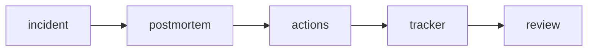

# Postmortem

> SRE 101 시리즈 (7/10)


## 이 글에서 다룰 문제

*반복되는 장애* 는 *학습 부재* 의 결과입니다.

## 전체 흐름


## Before/After

**Before**: *책임자 색출*.

**After**: *시스템 약점* 분석.

## Postmortem 작성

### 1단계 — 양식 정의

```python
template = {
    "title": "",
    "summary": "",
    "impact": "",
    "timeline": [],
    "root_cause": "",
    "actions": [],
    "lessons": [],
}
```

### 2단계 — 영향 정리

```python
def impact_line(users, minutes):
    return f"{users} users affected for {minutes} min"
```

### 3단계 — 타임라인

```python
def event(t, msg):
    return {"time": t, "event": msg}
```

### 4단계 — 액션 아이템

```python
def action(desc, owner, due):
    return {"desc": desc, "owner": owner, "due": due}
```

### 5단계 — 추적

```python
def open_actions(items):
    return [a for a in items if not a.get("done")]
```

## 이 코드에서 주목할 점

- *양식* 이 *기억* 을 *대체*.
- *오너* 와 *기한* 이 *추적* 의 *축*.
- *교훈* 이 *재사용* 가능 자산.

## 자주 하는 실수 5가지

1. ***개인 비난* 으로 *침묵* 유발.**
2. ***액션 아이템* 추적 *없음*.**
3. ***근본 원인* 을 *증상* 으로 대체.**
4. ***공유* 누락.**
5. ***템플릿* 만 따라하고 *학습* 없음.**

## 실무에서는 이렇게 쓰입니다

*Jira* / *Linear* 의 *티켓* 으로 *액션* 을 *추적* 하고, *주간 리뷰* 에서 *진행* 을 *확인* 합니다.

## 체크리스트

- [ ] *템플릿* 합의.
- [ ] *Blameless* 원칙.
- [ ] *액션 추적*.
- [ ] *공유* 채널.

## 정리 및 다음 단계

다음 글은 *Toil 줄이기* 입니다.

<!-- toc:begin -->
- [SRE란 무엇인가?](./01-what-is-sre.md)
- [Reliability](./02-reliability.md)
- [SLI, SLO, SLA](./03-sli-slo-sla.md)
- [Error Budget](./04-error-budget.md)
- [Monitoring](./05-monitoring.md)
- [Incident Response](./06-incident-response.md)
- **Postmortem (현재 글)**
- Toil 줄이기 (예정)
- Capacity Planning (예정)
- 운영 가능한 시스템 만들기 (예정)
<!-- toc:end -->

## 참고 자료

- [Postmortem Culture - Google SRE Book](https://sre.google/sre-book/postmortem-culture/)
- [Etsy Debriefing Guide](https://extfiles.etsy.com/DebriefingFacilitationGuide.pdf)
- [Blameless Postmortems - Atlassian](https://www.atlassian.com/incident-management/postmortem/blameless)
- [PagerDuty Postmortem Guide](https://postmortems.pagerduty.com/)
