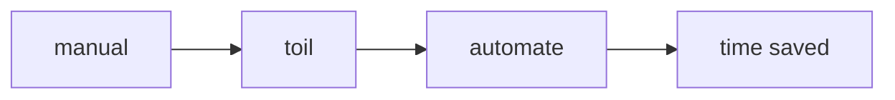

# Toil 줄이기

> SRE 101 시리즈 (8/10)

<!-- a-grade-intro:begin -->

**핵심 질문**: *반복 작업* 이 *팀* 의 *시간* 을 *얼마나* *갉아먹나요*?

> *Toil* 은 *자동화* 로 *없앨 수* 있는 *수동 노동* 입니다.

<!-- a-grade-intro:end -->

## 이 글에서 배울 것

- *Toil* 의 *정의*
- *측정* 방법
- *자동화 우선순위*
- *절감 전략*
- *기술 부채* 와의 관계

## 왜 중요한가

*Toil* 이 *50%* 를 넘으면 *개선* 이 *멈춥니다*.

## 개념 한눈에 보기



## 핵심 용어 정리

- **toil**: *반복적이고 자동화 가능* 한 작업.
- **runbook**: *수동 절차서*.
- **automation**: *자동화 코드*.
- **toil ratio**: *toil 시간 비율*.
- **break-even**: *자동화 손익 분기*.

## Before/After

**Before**: *야간 호출* 마다 *수동 복구*.

**After**: *복구 스크립트* 가 *자동* 으로 처리.

## 실습: Toil 측정과 자동화

### 1단계 — Toil 시간 기록

```python
def log_toil(task, minutes):
    return {"task": task, "minutes": minutes}
```

### 2단계 — Toil 비율

```python
def toil_ratio(toil_min, total_min):
    return toil_min / total_min
```

### 3단계 — 자동화 후보 점수

```python
def score(freq_per_week, minutes_each):
    return freq_per_week * minutes_each
```

### 4단계 — 손익 분기

```python
def break_even(saved_per_week, build_minutes):
    return build_minutes / saved_per_week
```

### 5단계 — 자동화 작성

```python
def auto_restart(service):
    return f"systemctl restart {service}"
```

## 이 코드에서 주목할 점

- *측정* 이 *우선순위* 의 출발점.
- *점수* 로 *후보* 정렬.
- *손익 분기* 로 *투자* 판단.

## 자주 하는 실수 5가지

1. ***Toil* 측정 *없음*.**
2. ***점수* 없이 *직감* 으로 자동화.**
3. ***runbook* 만 *쌓고* *코드* 화 *지연*.**
4. ***자동화 빚* 누적.**
5. ***후속 운영* 미고려.**

## 실무에서는 이렇게 쓰입니다

*복구 자동화* 는 *MTTR* 을 *수십 분* 에서 *수 분* 으로 줄입니다.

## 시니어 엔지니어는 이렇게 생각합니다

- *Toil* 은 *부채*.
- *자동화* 는 *반복* 위에.
- *50%* 가 *경계선*.
- *측정* 없이 *우선순위* 없음.
- *자동화* 도 *유지보수* 필요.

## 체크리스트

- [ ] *Toil 비율* 측정.
- [ ] *후보 목록*.
- [ ] *손익 분기* 산출.
- [ ] *자동화 오너*.

## 연습 문제

1. *toil* 의 의미 한 줄로.
2. *runbook* 의 의미 한 줄로.
3. *break-even* 의 의미 한 줄로.

## 정리 및 다음 단계

다음 글은 *Capacity Planning* 입니다.

<!-- toc:begin -->
- [SRE란 무엇인가?](./01-what-is-sre.md)
- [Reliability](./02-reliability.md)
- [SLI, SLO, SLA](./03-sli-slo-sla.md)
- [Error Budget](./04-error-budget.md)
- [Monitoring](./05-monitoring.md)
- [Incident Response](./06-incident-response.md)
- [Postmortem](./07-postmortem.md)
- **Toil 줄이기 (현재 글)**
- Capacity Planning (예정)
- 운영 가능한 시스템 만들기 (예정)
<!-- toc:end -->

## 참고 자료

- [Eliminating Toil - Google SRE Book](https://sre.google/sre-book/eliminating-toil/)
- [Identifying and Tracking Toil - Google SRE Workbook](https://sre.google/workbook/eliminating-toil/)
- [Automating Operations - Google SRE Book](https://sre.google/sre-book/automation-at-google/)
- [Toil Reduction - Atlassian](https://www.atlassian.com/incident-management/devops/toil)
