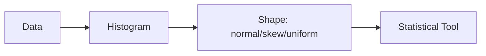

# 분포

> Statistics 101 시리즈 (3/10)

<!-- a-grade-intro:begin -->

**핵심 질문**: 데이터의 *모양* 은 왜 중요할까요? 같은 *평균* 이라도 *왜 다르게 행동* 할까요?

> *분포는 *데이터의 인격* 이다.*

<!-- a-grade-intro:end -->

## 이 글에서 배울 것

- 자주 만나는 *분포 4가지*
- *정규성* 가정의 *위험*
- *왜도/첨도* 의 의미
- 5단계 분포 진단 실습
- 흔한 함정 5가지

## 왜 중요한가

요약 통계와 검정의 *대부분* 은 *분포 가정* 위에서 작동합니다. *모양을 잘못 가정* 하면 *결론이 통째로* 흔들립니다.

> *모양을 보고 도구를 고른다.*

## 개념 한눈에 보기



## 핵심 용어 정리

- **Normal (정규)**: *대칭 종 모양*. 자연/측정 오차에 흔함.
- **Uniform (균등)**: *모든 값* 의 빈도가 같음.
- **Exponential (지수)**: *시간 간격*, *대기 시간*.
- **Power-law (멱법칙)**: *long-tail*. 매출/조회수.
- **Skewness**: *비대칭* 의 정도.
- **Kurtosis**: *꼬리* 의 두꺼움.

## Before/After

**Before**: *“평균 응답시간 200ms”* — 종 모양이라 가정하고 SLA를 정함.

**After**: *“p50=120ms, p95=900ms, long-tail — SLA는 p95 기준으로 정해야 안전.”*

## 실습: 5단계 분포 진단

### 1단계 — 히스토그램

```python
import matplotlib.pyplot as plt
plt.hist(latency, bins=50); plt.show()
```

### 2단계 — 요약 통계

```python
import numpy as np
print(np.mean(latency), np.median(latency), np.std(latency))
```

### 3단계 — 분위수

```python
for q in [50, 90, 95, 99]:
    print(f"p{q}:", np.percentile(latency, q))
```

### 4단계 — 왜도/첨도

```python
from scipy.stats import skew, kurtosis
print("skew:", skew(latency), "kurt:", kurtosis(latency))
```

### 5단계 — 결정

```text
skew=+2.3, kurt=+8 → long-tail. SLA는 p95=900ms.
```

## 이 코드에서 주목할 점

- *히스토그램* 이 *모든 진단의 시작*.
- *분위수* 가 *long-tail* 을 잡는다.
- *왜도/첨도* 는 *수치로* 모양을 표현.

## 자주 하는 실수 5가지

1. ***정규성* 을 *가정* 하고 검정 적용.**
2. ***이상치* 를 *분포 일부* 로 *섞어* 본다.**
3. ***로그 스케일* 없이 long-tail 본다.**
4. ***p99* 를 *평균* 으로 *대체* 한다.**
5. ***시각화 없이* 통계만 본다.**

## 실무에서는 이렇게 쓰입니다

응답시간 SLA, 매출 분포, 클릭 분포, 결함 빈도 등 *대부분의 운영 지표* 는 *long-tail* 입니다. *Datadog, Grafana, Sentry* 같은 도구는 *p50/p95/p99* 를 기본으로 보여 줍니다.

## 시니어 엔지니어는 이렇게 생각합니다

- *분포 그림* 을 *가장 먼저* 본다.
- *정규성* 을 *함부로* 가정하지 않는다.
- *long-tail* 에는 *분위수* 를 본다.
- *로그 스케일* 을 *적극* 사용.
- *모양* 을 *팀 언어* 로 만든다.

## 체크리스트

- [ ] *히스토그램* 으로 데이터를 그린다.
- [ ] *p50/p95/p99* 를 본다.
- [ ] *왜도/첨도* 를 안다.
- [ ] *long-tail* 일 때 *p95 SLA* 를 쓴다.

## 연습 문제

1. *주변 서비스 응답시간* 데이터로 히스토그램을 그려 보세요.
2. *정규* 와 *지수* 분포의 *모양 차이* 를 한 문장으로 설명하세요.
3. *long-tail* 에서 *p99* 가 *평균* 보다 더 *유용한* 이유를 적으세요.

## 정리 및 다음 단계

분포는 *데이터의 인격* 입니다. 다음 글에서는 *표본과 모집단* 을 통해 *불확실성* 의 시작점을 봅니다.

<!-- toc:begin -->
- [통계란 무엇인가?](./01-what-is-statistics.md)
- [평균, 중앙값, 분산](./02-mean-median-variance.md)
- **분포 (현재 글)**
- 표본과 모집단 (예정)
- 추정 (예정)
- 신뢰구간 (예정)
- 가설검정 (예정)
- 상관과 회귀 (예정)
- p-value 이해하기 (예정)
- 통계적 사고방식 (예정)
<!-- toc:end -->

## 참고 자료

- [SciPy — Statistical Distributions](https://docs.scipy.org/doc/scipy/reference/stats.html)
- [Khan Academy — Distributions](https://www.khanacademy.org/math/statistics-probability/random-variables-stats-library)
- [Wikipedia — Power Law](https://en.wikipedia.org/wiki/Power_law)
- [Brendan Gregg — Latency Distributions](https://www.brendangregg.com/blog/2014-06-23/latency-heat-maps.html)
