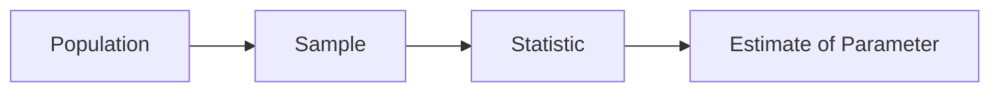

# 표본과 모집단

> Statistics 101 시리즈 (4/10)

<!-- a-grade-intro:begin -->

**핵심 질문**: 우리는 *전체* 를 본 적이 거의 없는데, *왜 자신 있게* 결론을 낼 수 있을까요? *표본* 이 *모집단* 을 *얼마나* 닮을 수 있을까요?

> *추론은 *부분* 으로 *전체* 를 말하는 기술이다.*

<!-- a-grade-intro:end -->

## 이 글에서 배울 것

- *모집단/표본/추정값* 의 관계
- *무작위 추출* 의 *힘*
- *표본 편향* 5가지
- 5단계 표본 설계 실습
- 흔한 함정 5가지

## 왜 중요한가

*모든 통계 결론* 은 *표본* 에서 시작합니다. *나쁜 표본* 으로 *완벽한 분석* 을 해도 *결론은 틀립니다*.

> *Garbage sample → Garbage decision.*

## 개념 한눈에 보기



## 핵심 용어 정리

- **Population (모집단)**: 우리가 알고 싶은 *전체*.
- **Sample (표본)**: 모집단에서 *뽑은 일부*.
- **Parameter**: 모집단의 *진짜 값* (μ, σ).
- **Statistic**: 표본에서 계산한 값 (x̄, s).
- **Sampling Bias**: 표본이 *모집단을 못 대표* 하는 현상.

## Before/After

**Before**: *“웹사이트 방문자 평균 만족도 4.5/5”* — 응답한 사람만 분석.

**After**: *“응답자 200명 / 방문자 10,000명 — 응답률 2%, 만족 사용자 위주 응답 가능성 → 결과 신중히 해석.”*

## 실습: 5단계 표본 설계

### 1단계 — 모집단 정의

```text
Population: "지난 30일간 우리 웹사이트 활성 사용자"
```

### 2단계 — 표본 프레임

```python
import pandas as pd
users = pd.read_csv("active_users.csv")  # 모집단 리스트
print(len(users))
```

### 3단계 — 무작위 추출

```python
sample = users.sample(n=500, random_state=42)
```

### 4단계 — 응답 수집

```python
responses = collect_survey(sample.user_id)
print("response rate:", len(responses) / len(sample))
```

### 5단계 — 편향 확인

```python
print("plan dist (sample):", sample.plan.value_counts(normalize=True))
print("plan dist (pop):",    users.plan.value_counts(normalize=True))
```

## 이 코드에서 주목할 점

- *모집단 정의* 가 *표본의 시작*.
- *random_state* 로 *재현성* 보장.
- *응답률* 과 *세그먼트 분포* 로 *편향* 점검.

## 자주 하는 실수 5가지

1. ***편의 표본* 을 *대표 표본* 처럼 다룬다.**
2. ***응답자만* 분석.** 비응답자가 다르다.
3. ***표본 크기 N=30* 을 무작정 신뢰.**
4. ***모집단 정의* 를 *생략* 한다.**
5. ***무작위* 가 아닌 *시간 순* 으로 자른 표본 사용.**

## 실무에서는 이렇게 쓰입니다

A/B 테스트, 설문조사, 품질검사, 출시 전 베타 테스트 — 모두 *표본 설계* 가 *결과의 질* 을 결정합니다. *층화 추출 (stratified sampling)* 과 *클러스터 추출* 같은 기법이 자주 쓰입니다.

## 시니어 엔지니어는 이렇게 생각합니다

- *모집단* 을 *문장* 으로 적는다.
- *random_state* 를 *고정* 한다.
- *응답률* 과 *세그먼트* 를 *보고* 한다.
- *편향* 을 *부끄러워하지 않고 명시*.
- *표본 크기* 를 *통계적으로* 정한다.

## 체크리스트

- [ ] *모집단* 을 한 줄로 적는다.
- [ ] *무작위 추출* 을 한다.
- [ ] *응답률* 을 보고한다.
- [ ] *세그먼트 분포* 를 비교한다.

## 연습 문제

1. *내 동아리 회원* 의 *모집단/표본/통계량* 을 정의해 보세요.
2. *편의 표본* 과 *무작위 표본* 의 차이를 한 문장으로 설명하세요.
3. *응답률 30%* 인 설문 결과를 *어떻게 해석* 할지 적어 보세요.

## 정리 및 다음 단계

표본 설계는 *통계의 근본* 입니다. 다음 글에서는 표본을 통해 *모집단을 추정* 하는 *추정* 의 세계로 들어갑니다.

<!-- toc:begin -->
- [통계란 무엇인가?](./01-what-is-statistics.md)
- [평균, 중앙값, 분산](./02-mean-median-variance.md)
- [분포](./03-distributions.md)
- **표본과 모집단 (현재 글)**
- 추정 (예정)
- 신뢰구간 (예정)
- 가설검정 (예정)
- 상관과 회귀 (예정)
- p-value 이해하기 (예정)
- 통계적 사고방식 (예정)
<!-- toc:end -->

## 참고 자료

- [Pew Research — Sampling Methodology](https://www.pewresearch.org/our-methods/u-s-surveys/)
- [scikit-learn — Stratified Sampling](https://scikit-learn.org/stable/modules/cross_validation.html)
- [OpenIntro — Sampling Principles](https://www.openintro.org/book/os/)
- [Wikipedia — Selection Bias](https://en.wikipedia.org/wiki/Selection_bias)
