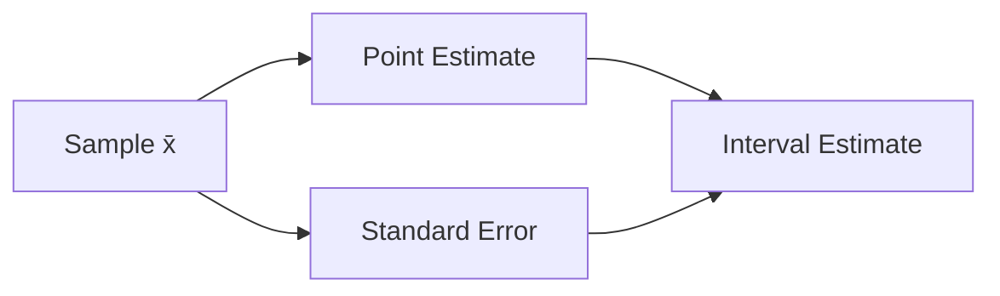

# 추정

> Statistics 101 시리즈 (5/10)


## 이 글에서 다룰 문제

*평균을 보고했다* 가 끝이 아닙니다. *얼마나 가까운지* 를 *함께 적어야* 의사결정자가 *위험* 을 평가할 수 있습니다.

> *추정값에는 *오차* 가 항상 따라온다.*

## 전체 흐름


## Before/After

**Before**: *“표본 평균은 100”* — 얼마나 신뢰할 수 있는지 알 수 없음.

**After**: *“x̄ = 100, SE = 2.5 (n=64). 모평균은 95% 구간 [95.1, 104.9].”*

## 5단계 추정

### 1단계 — 표본 준비

```python
import numpy as np
sample = np.random.normal(loc=100, scale=20, size=64)
```

### 2단계 — 점 추정

```python
mean = sample.mean()
print("x̄:", mean)
```

### 3단계 — 표준오차

```python
se = sample.std(ddof=1) / np.sqrt(len(sample))
print("SE:", se)
```

### 4단계 — 95% 구간

```python
lower, upper = mean - 1.96 * se, mean + 1.96 * se
print(f"95% CI: [{lower:.1f}, {upper:.1f}]")
```

### 5단계 — 보고

```text
x̄ = 99.8 (n=64), SE = 2.4
95% CI: [95.1, 104.5]
```

## 이 코드에서 주목할 점

- *SE = s/√n* — *표본이 클수록* 작아진다.
- *95% CI* 는 *±1.96 × SE*.
- 추정값은 *항상 SE* 와 *함께* 보고.

## 자주 하는 실수 5가지

1. ***표준편차* 를 *SE* 로 *혼동*.**
2. ***N* 을 늘리면 *오차가 0* 이 된다고 *오해*.**
3. ***점 추정* 만 *보고* 한다.**
4. ***작은 표본* 에 *정규* 가정.** *t-distribution* 이 필요.
5. ***편향된 표본* 으로 *불편 추정량* 을 만든다.**

## 실무에서는 이렇게 쓰입니다

A/B 테스트의 *전환율 추정*, 매출 *월간 평균*, 응답 시간 *p95 추정* 등 모든 *대시보드 숫자* 는 *추정* 입니다. *오차 막대* 와 *신뢰구간* 으로 표현됩니다.

## 체크리스트

- [ ] *점 추정* 과 *구간 추정* 의 차이를 안다.
- [ ] *SE* 를 계산할 줄 안다.
- [ ] *95% CI* 를 만들 수 있다.
- [ ] *N* 의 영향을 이해한다.

## 정리 및 다음 단계

추정은 *불확실성을 수치로* 적는 일입니다. 다음 글에서는 *95% CI* 의 *진짜 의미* 를 자세히 봅니다.

<!-- toc:begin -->
- [통계란 무엇인가?](./01-what-is-statistics.md)
- [평균, 중앙값, 분산](./02-mean-median-variance.md)
- [분포](./03-distributions.md)
- [표본과 모집단](./04-sample-and-population.md)
- **추정 (현재 글)**
- 신뢰구간 (예정)
- 가설검정 (예정)
- 상관과 회귀 (예정)
- p-value 이해하기 (예정)
- 통계적 사고방식 (예정)
<!-- toc:end -->

## 참고 자료

- [scipy.stats — Statistical Functions](https://docs.scipy.org/doc/scipy/reference/stats.html)
- [Khan Academy — Estimation](https://www.khanacademy.org/math/statistics-probability/confidence-intervals-one-sample)
- [Wikipedia — Standard Error](https://en.wikipedia.org/wiki/Standard_error)
- [NIST — Estimation Methods](https://www.itl.nist.gov/div898/handbook/eda/section3/eda35.htm)
