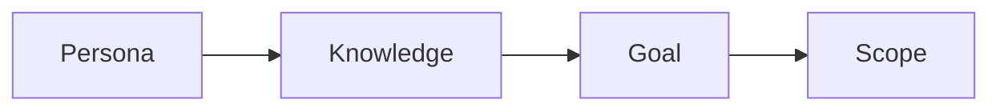

# 독자 정의하기

> 기술 글쓰기 101 시리즈 (2/10)

<!-- a-grade-intro:begin -->

**핵심 질문**: *모두* 를 위한 글이 *왜* *아무도* 못 *읽는* 글이 *될까요*?

> *독자* 가 *명확* 해야 *문장* 이 *명확* 합니다.

<!-- a-grade-intro:end -->

## 이 글에서 배울 것

- *페르소나* 만들기
- *전제 지식* 파악
- *목표* 정렬
- *범위* 좁히기
- *예시* 의 *수준* 맞추기

## 왜 중요한가

*독자* 가 흐릿하면 *문장* 도 흐릿해집니다.

## 개념 한눈에 보기



## 핵심 용어 정리

- **persona**: *독자 모델*.
- **prerequisite**: *전제 지식*.
- **goal**: *읽고 난 뒤 할 일*.
- **scope**: *다룰 범위*.
- **non-goal**: *다루지 않을 범위*.

## Before/After

**Before**: "*개발자* 를 위한 글."

**After**: "*Python 1년차*, *FastAPI* 입문자를 위한 글."

## 실습: 페르소나 카드

### 1단계 — 이름과 직무

```python
persona = {"name": "지민", "role": "Python 1년차 백엔드"}
```

### 2단계 — 전제 지식

```python
knows = ["변수", "함수", "git basics"]
```

### 3단계 — 모르는 것

```python
unknown = ["async", "타입 힌트"]
```

### 4단계 — 목표

```python
goal = "FastAPI 로 첫 엔드포인트 띄우기"
```

### 5단계 — 비목표

```python
non_goal = ["배포", "DB 마이그레이션"]
```

## 이 코드에서 주목할 점

- *이름* 이 있다.
- *모르는 것* 이 있다.
- *비목표* 가 있다.

## 자주 하는 실수 5가지

1. ***모두* 를 *대상* 으로 한다.**
2. ***전제 지식* 을 *적지 않는다*.**
3. ***목표* 가 *추상*.**
4. ***비목표* 가 *없다*.**
5. ***예시* 가 *너무 어렵다*.**

## 실무에서는 이렇게 쓰입니다

API 레퍼런스, 사용자 가이드, 튜토리얼이 모두 *페르소나* 단위로 분리됩니다.

## 시니어 엔지니어는 이렇게 생각합니다

- *독자* 가 *한 명* 으로 보인다.
- *비목표* 가 글의 *부피* 를 줄인다.
- *예시* 는 *전제 지식* 안에서 골라진다.
- *목표* 는 *동사* 로 쓴다.
- *2주 후* 의 *나* 도 *독자* 다.

## 체크리스트

- [ ] *페르소나* 1명.
- [ ] *전제 지식* 3개.
- [ ] *목표* 1줄.
- [ ] *비목표* 1개 이상.

## 연습 문제

1. *persona* 의 정의 한 줄.
2. *non-goal* 의 의미 한 줄.
3. *prerequisite* 의 예 한 줄.

## 정리 및 다음 단계

다음 글은 *제목과 구조 잡기* 입니다.

<!-- toc:begin -->
- [기술 글쓰기란 무엇인가](./01-what-is-technical-writing.md)
- **독자 정의하기 (현재 글)**
- 제목과 구조 잡기 (예정)
- 개념 설명하기 (예정)
- 예제 코드 설명하기 (예정)
- 그림과 표 사용하기 (예정)
- README 작성하기 (예정)
- 튜토리얼 작성하기 (예정)
- 블로그와 문서 차이 (예정)
- 발행 전 체크리스트 (예정)
<!-- toc:end -->

## 참고 자료

- [The Persona Lifecycle - Pruitt & Adlin](https://www.elsevier.com/books/the-persona-lifecycle/pruitt/978-0-12-566251-2)
- [About Face - Cooper et al.](https://www.wiley.com/en-us/About+Face%3A+The+Essentials+of+Interaction+Design%2C+4th+Edition-p-9781118766576)
- [Nielsen Norman Group on Personas](https://www.nngroup.com/articles/persona/)
- [Writing for Developers - Karl Hughes](https://www.writingfordevelopers.com/)
