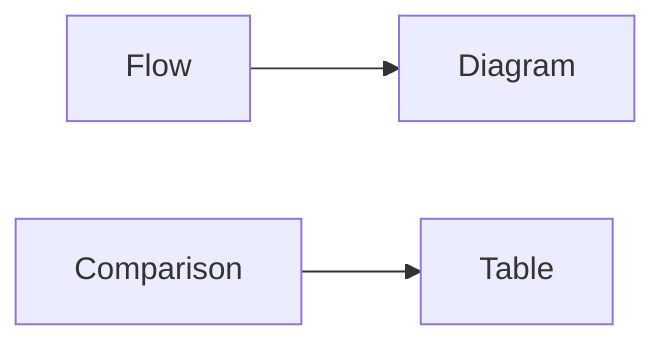
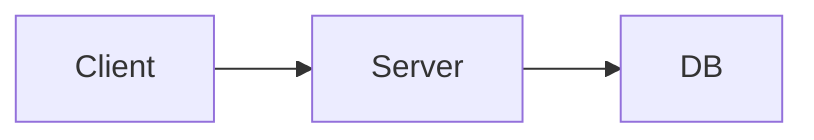
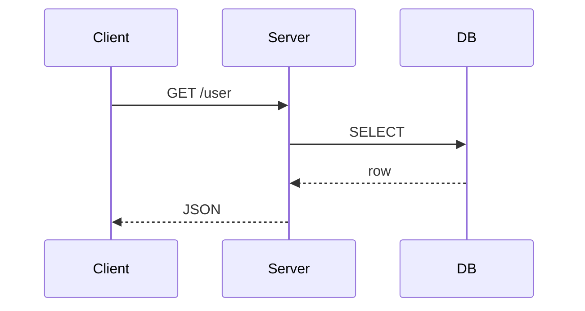

# 그림과 표 사용하기

> 기술 글쓰기 101 시리즈 (6/10)

<!-- a-grade-intro:begin -->

**핵심 질문**: *언제* *그림* 이 *글* 보다 *낫고*, *언제* *표* 가 *낫나요*?

> *흐름* 은 *그림*, *비교* 는 *표* 입니다.

<!-- a-grade-intro:end -->

## 이 글에서 배울 것

- *흐름도* 와 *시퀀스 다이어그램*
- *비교 표* 와 *결정 표*
- *캡션* 작성
- *대체 텍스트*
- *해상도* 와 *접근성*

## 왜 중요한가

*그림 한 장* 이 *문단 다섯 개* 를 줄여줍니다.

## 개념 한눈에 보기



## 핵심 용어 정리

- **flowchart**: *흐름도*.
- **sequence diagram**: *시퀀스 다이어그램*.
- **caption**: *캡션*.
- **alt text**: *대체 텍스트*.
- **a11y**: *접근성*.

## Before/After

**Before**: "*요청* 은 *클라이언트* 에서 *서버* 로 *DB* 로 *간다*..." (5줄)

**After**: 한 장의 *flowchart*.

## 실습: 그림과 표

### 1단계 — Flowchart



### 2단계 — Sequence



### 3단계 — 비교 표

```markdown
| 옵션 | 속도 | 비용 |
| --- | --- | --- |
| A | 빠름 | 높음 |
| B | 보통 | 낮음 |
```

### 4단계 — 캡션

```markdown
*그림 1*. 요청이 클라이언트에서 DB까지 가는 흐름.
```

### 5단계 — 대체 텍스트

```markdown

```

## 이 코드에서 주목할 점

- *그림* 은 *흐름*.
- *표* 는 *비교*.
- *캡션* 은 *문장*.

## 자주 하는 실수 5가지

1. ***그림* 이 *없다*.**
2. ***표* 가 *너무 크다*.**
3. ***캡션* 이 *없다*.**
4. ***대체 텍스트* 가 *없다*.**
5. ***해상도* 가 *낮다*.**

## 실무에서는 이렇게 쓰입니다

기술 사양 문서, 아키텍처 문서, 인시던트 회고 모두 *그림 + 표* 조합을 씁니다.

## 시니어 엔지니어는 이렇게 생각합니다

- *그림* 은 *흐름* 에.
- *표* 는 *비교* 에.
- *캡션* 은 *완성된 문장*.
- *대체 텍스트* 는 *필수*.
- *해상도* 는 *2배수*.

## 체크리스트

- [ ] *그림* 1장 이상.
- [ ] *표* 의 *행* 이 *7개 이하*.
- [ ] 모든 그림에 *캡션*.
- [ ] 모든 그림에 *대체 텍스트*.

## 연습 문제

1. *flowchart* 와 *sequence diagram* 의 차이 한 줄.
2. *caption* 의 정의 한 줄.
3. *alt text* 의 의미 한 줄.

## 정리 및 다음 단계

다음 글은 *README 작성하기* 입니다.

<!-- toc:begin -->
- [기술 글쓰기란 무엇인가](./01-what-is-technical-writing.md)
- [독자 정의하기](./02-defining-the-reader.md)
- [제목과 구조 잡기](./03-title-and-structure.md)
- [개념 설명하기](./04-explaining-concepts.md)
- [예제 코드 설명하기](./05-explaining-example-code.md)
- **그림과 표 사용하기 (현재 글)**
- README 작성하기 (예정)
- 튜토리얼 작성하기 (예정)
- 블로그와 문서 차이 (예정)
- 발행 전 체크리스트 (예정)
<!-- toc:end -->

## 참고 자료

- [The Visual Display of Quantitative Information - Tufte](https://www.edwardtufte.com/tufte/books_vdqi)
- [Mermaid Diagram Syntax](https://mermaid.js.org/intro/)
- [Web Content Accessibility Guidelines](https://www.w3.org/WAI/standards-guidelines/wcag/)
- [Storytelling with Data - Knaflic](https://www.storytellingwithdata.com/)
