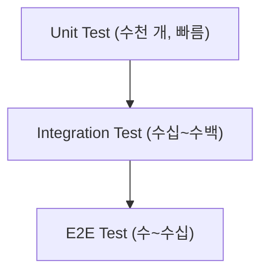

# 단위 테스트

> Testing 101 시리즈 (2/10)


## 이 글에서 다룰 문제

단위 테스트는 *피라미드의 바닥* 입니다. 빠르기 때문에 *수천 개* 가 *수 초* 만에 돕니다. 단위 테스트가 *튼튼하면* 윗 단계의 통합/E2E도 *작아질 수 있습니다*.

> 빠르고 많은 단위 테스트가 *전체 테스트 전략* 의 기초입니다.

## 전체 흐름


## Before/After

**Before (한 덩어리 테스트)**

```python
def test_user_flow():
    u = create_user("a")
    u.activate()
    u.upgrade()
    assert u.plan == "pro"
```

**After (작은 단위로 분리)**

```python
def test_create_user_starts_inactive(): ...
def test_activate_sets_active(): ...
def test_upgrade_sets_pro(): ...
```

## pytest 5단계

### 1단계 — 대상 함수

```python
# src/discount.py
def apply_discount(price: int, percent: int) -> int:
    if not 0 <= percent <= 100:
        raise ValueError("percent must be 0..100")
    return price - price * percent // 100
```

### 2단계 — 기본 테스트 (AAA)

```python
# tests/test_discount.py
from src.discount import apply_discount

def test_apply_10_percent_discount():
    # Arrange
    price, percent = 1000, 10
    # Act
    result = apply_discount(price, percent)
    # Assert
    assert result == 900
```

### 3단계 — parametrize로 묶기

```python
import pytest

@pytest.mark.parametrize("price,percent,expected", [
    (1000, 0, 1000),
    (1000, 50, 500),
    (1000, 100, 0),
])
def test_apply_discount_table(price, percent, expected):
    assert apply_discount(price, percent) == expected
```

### 4단계 — 예외 케이스

```python
def test_apply_discount_invalid_percent_raises():
    with pytest.raises(ValueError):
        apply_discount(1000, 150)
```

### 5단계 — fixture

```python
@pytest.fixture
def base_price() -> int:
    return 10_000

def test_with_fixture(base_price: int):
    assert apply_discount(base_price, 10) == 9_000
```

## 이 코드에서 주목할 점

- 한 테스트는 *한 가지* 만 단언합니다.
- 같은 모양의 테스트는 *parametrize* 로 묶어 *중복을 줄입니다*.
- 예외 케이스를 *별도 테스트* 로 표현합니다.

## 자주 하는 실수 5가지

1. **데이터베이스를 *진짜로* 호출한다.** 그건 *통합 테스트* 입니다.
2. **테스트가 *서로의 상태* 에 의존한다.** 순서가 바뀌면 *깨집니다*.
3. **`time.sleep` 으로 *기다린다*.** 단위 테스트는 *기다리지 않습니다*.
4. **`assert True` 같은 *의미 없는* 단언을 둔다.**
5. **테스트 이름이 *test_1, test_2* 다.** 이름이 *문서* 입니다.

## 실무에서는 이렇게 쓰입니다

핵심 도메인 로직(가격 계산, 권한 판정, 상태 머신 등)은 *항상 단위 테스트* 가 두텁게 깔립니다. 사고가 자주 나는 코드일수록 *단위 테스트의 ROI가 높습니다*.

## 체크리스트

- [ ] 함수 하나에 *3가지 이상* 의 테스트를 썼다.
- [ ] *경계값* 과 *예외 케이스* 를 다뤘다.
- [ ] AAA 구조로 작성했다.
- [ ] parametrize를 *한 번* 써 봤다.

## 정리 및 다음 단계

단위 테스트는 *작고, 빠르고, 외부 의존이 없는* 테스트입니다. 다음 글에서는 여러 모듈을 함께 검증하는 *통합 테스트* 로 한 단계 올라갑니다.

<!-- toc:begin -->
- [테스트란 무엇인가?](./01-what-is-testing.md)
- **단위 테스트 (현재 글)**
- 통합 테스트 (예정)
- E2E 테스트 (예정)
- 테스트 더블 (예정)
- Mock과 Stub (예정)
- 테스트 커버리지 (예정)
- 회귀 테스트 (예정)
- CI에서 테스트 실행하기 (예정)
- 테스트 전략 세우기 (예정)
<!-- toc:end -->

## 참고 자료

- [pytest — parametrize](https://docs.pytest.org/en/stable/how-to/parametrize.html)
- [pytest — fixtures](https://docs.pytest.org/en/stable/explanation/fixtures.html)
- [Martin Fowler — Unit Test](https://martinfowler.com/bliki/UnitTest.html)
- [Google Testing Blog](https://testing.googleblog.com/)
