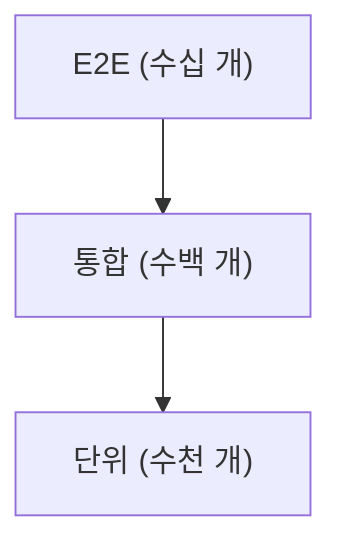

# 테스트 전략 세우기

> Testing 101 시리즈 (10/10)


## 이 글에서 다룰 문제

테스트는 *공짜가 아닙니다*. 짜는 시간, 돌리는 시간, 고치는 시간이 듭니다. 전략 없는 테스트는 *느리고 깨지기 쉬운 그물* 이 됩니다.

> 좋은 전략은 *버그는 잡고, 개발 속도는 살립니다*.

## 전체 흐름


## Before/After

**Before (전략 없음)**

```text
- 모든 함수에 *단위 테스트*
- 모든 시나리오에 *E2E 테스트*
- CI 30분, 팀 PR 속도 정체
```

**After (전략 적용)**

```text
- 핵심 도메인 단위 테스트 *2,000개*
- 통합 테스트 *200개* (DB/외부 API)
- E2E *20개* (결제/로그인 등 critical path)
- CI 5분 이내
```

## 전략 수립 5단계

### 1단계 — 현재 분포 측정

```bash
pytest --collect-only -q | wc -l    # 전체 테스트 수
ls tests/unit | wc -l
ls tests/integration | wc -l
ls tests/e2e | wc -l
```

### 2단계 — Critical path 정의

```text
- 로그인
- 결제
- 회원가입
- 비밀번호 재설정
```

이 흐름은 *반드시 E2E* 로 보호합니다.

### 3단계 — 경계에 계약 테스트

```python
# tests/contracts/test_payment_api.py
def test_payment_response_schema():
    res = payment_client.charge(amount=100)
    assert set(res.keys()) >= {"id", "status", "amount"}
```

### 4단계 — 팀 의식 정착

```text
- PR 템플릿: "회귀 테스트 추가했나요? [ ]"
- 주간 30분: *플레이키 테스트* 리뷰
- 월간: 커버리지 *추세* 확인 (절대값보다 추세)
```

### 5단계 — 분기별 가지치기

```bash
# 6개월간 한 번도 실패한 적 없는 E2E는 검토 대상
# 같은 영역에서 반복 실패하는 테스트는 *리팩터링 신호*
```

## 이 코드에서 주목할 점

- 전략은 *문서가 아니라 의식* 으로 살아남습니다.
- *분포* 는 측정 없이는 알 수 없습니다.
- *Critical path* 가 정의되지 않으면 *모든 게 critical* 이 됩니다.

## 자주 하는 실수 5가지

1. **모든 코드에 *동일한 강도* 의 테스트.** *위험* 에 비례해 투자합니다.
2. **E2E를 *주력 테스트* 로 두기.** 느리고 깨지기 쉬워 *팀 속도* 를 떨어뜨립니다.
3. **커버리지 *목표만* 보기.** 무엇을 *덮었는지* 가 중요합니다.
4. **계약 테스트 없음.** 외부 API 변경이 *프로덕션에서* 처음 발견됩니다.
5. **전략을 *한 번 정하고 잊기*.** 분기별로 *재검토* 합니다.

## 실무에서는 이렇게 쓰입니다

성숙한 팀은 *Engineering Excellence* 문서에 *목표 분포* 와 *flaky budget* 을 적어둡니다. 모든 신규 서비스는 이 기준을 따라 설계되며, *분기 OKR* 에 *CI 시간 / 플레이키 비율* 이 포함됩니다.

## 체크리스트

- [ ] 우리 팀의 *테스트 분포* 를 안다.
- [ ] *Critical path* 가 *문서화* 되어 있다.
- [ ] *PR 템플릿* 에 회귀 테스트 항목이 있다.
- [ ] *플레이키 비율* 을 *측정* 한다.

## 정리 및 다음 단계

테스트 전략은 *기술이 아니라 의사결정* 입니다. Testing 101 시리즈를 마치며, 다음에는 *DevOps 101* 과 *Observability 101* 에서 *배포 후 품질* 까지 확장합니다.

<!-- toc:begin -->
- [테스트란 무엇인가?](./01-what-is-testing.md)
- [단위 테스트](./02-unit-test.md)
- [통합 테스트](./03-integration-test.md)
- [E2E 테스트](./04-e2e-test.md)
- [테스트 더블](./05-test-double.md)
- [Mock과 Stub](./06-mock-and-stub.md)
- [테스트 커버리지](./07-test-coverage.md)
- [회귀 테스트](./08-regression-test.md)
- [CI에서 테스트 실행하기](./09-tests-in-ci.md)
- **테스트 전략 세우기 (현재 글)**
<!-- toc:end -->

## 참고 자료

- [Martin Fowler — The Practical Test Pyramid](https://martinfowler.com/articles/practical-test-pyramid.html)
- [Google Testing Blog](https://testing.googleblog.com/)
- [Accelerate (Forsgren, Humble, Kim)](https://itrevolution.com/product/accelerate/)
- [ThoughtWorks — Test Strategy](https://www.thoughtworks.com/insights/blog/testing-strategy)
