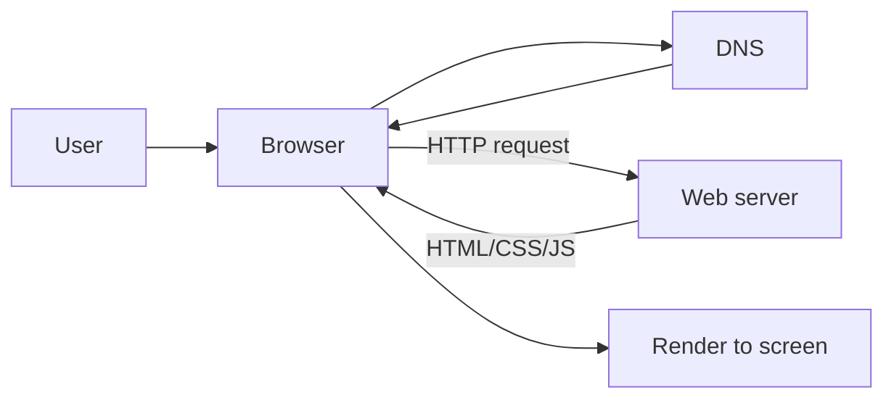

# 웹은 어떻게 동작하는가?

> Web Development 101 시리즈 (1/10)


## 이 글에서 다룰 문제

웹 개발자는 *전체 그림* 을 알아야 합니다. 한 곳만 잘 다뤄도 동작은 하지만, 문제가 생겼을 때 어디를 봐야 하는지 모릅니다. 큰 흐름을 한 번 머릿속에 그려두면 모든 도구의 위치가 보입니다.

> 웹은 *프로토콜의 합의* 위에서 동작합니다.

## 전체 흐름


다섯 박자 — DNS, 연결, 요청, 응답, 렌더링.

## Before/After

**Before (직접 IP 호출)**

```python
# 사람이 외우기 어렵다
import socket
ip = "93.184.216.34"
```

**After (도메인 사용)**

```python
# 사람이 읽고 기억할 수 있다
import socket
ip = socket.gethostbyname("example.com")
print(ip)
```

DNS는 *사람의 언어* 와 *기계의 언어* 사이의 다리입니다.

## 한 번의 요청 따라가기 5단계

### 1단계 — DNS 조회

```python
# 1_dns.py
import socket
print(socket.gethostbyname("example.com"))
```

도메인이 IP로 바뀝니다.

### 2단계 — HTTP 요청

```python
# 2_http.py
import requests
r = requests.get("https://example.com")
print(r.status_code, len(r.text))
```

200과 본문 길이가 출력됩니다.

### 3단계 — 응답 헤더 보기

```python
# 3_headers.py
import requests
r = requests.get("https://example.com")
for k, v in r.headers.items():
    print(k, ":", v)
```

`Content-Type`, `Server`, `Cache-Control` — 응답의 *메타정보* 입니다.

### 4단계 — HTML 파싱

```python
# 4_parse.py
import re, requests
html = requests.get("https://example.com").text
title = re.search(r"<title>(.*?)</title>", html).group(1)
print(title)
```

브라우저는 이 HTML을 트리로 바꾸고 화면을 그립니다.

### 5단계 — DevTools로 관찰

```text
브라우저에서 F12 → Network 탭 → example.com 새로고침
```

요청 하나하나, 응답 시간, 전송 크기까지 직접 볼 수 있습니다.

## 이 코드에서 주목할 점

- DNS는 *한 번* 일어나고 캐싱됩니다.
- HTTPS는 TCP + TLS 위에 얹혀 있습니다.
- 브라우저는 HTML/CSS/JS를 *동시에* 받기 시작합니다.

## 자주 하는 실수 5가지

1. **DNS와 HTTP를 섞어 생각한다.** 둘은 다른 단계입니다.
2. **HTTPS = HTTP의 다른 이름이라 본다.** TLS 암호화 계층이 추가된 것입니다.
3. **렌더링이 *서버* 일이라고 본다.** 기본은 *브라우저* 의 일입니다.
4. **클라이언트와 서버의 경계를 흐린다.** 누가 무엇을 책임지는지 모릅니다.
5. **DevTools 없이 디버깅한다.** Network 탭이 가장 빠른 진단 도구입니다.

## 실무에서는 이렇게 쓰입니다

장애가 났을 때 가장 먼저 *어느 단계* 에서 막혔는지 확인합니다 — DNS? TLS? 서버 응답? 렌더링? 단계의 이름을 알고 있으면 30분 걸릴 디버깅이 3분에 끝납니다. 모든 모니터링 도구(New Relic, Datadog)도 이 다섯 단계로 측정합니다.

## 체크리스트

- [ ] URL 입력부터 화면까지 5단계를 말로 설명할 수 있다.
- [ ] DNS와 HTTP의 차이를 안다.
- [ ] DevTools Network 탭을 열고 요청 하나를 분석할 수 있다.
- [ ] 응답의 status code를 읽을 수 있다.
- [ ] 캐시가 어디서 일어나는지 안다.

## 정리 및 다음 단계

웹은 *프로토콜의 합주* 입니다. 다음 글에서는 브라우저가 받아오는 세 가지 — HTML/CSS/JS — 의 역할을 봅니다.

<!-- toc:begin -->
- **웹은 어떻게 동작하는가? (현재 글)**
- HTML, CSS, JavaScript (예정)
- 브라우저와 DOM (예정)
- HTTP와 API (예정)
- Frontend와 Backend (예정)
- 인증과 세션 (예정)
- 데이터베이스 연결 (예정)
- 배포 (예정)
- 성능과 캐싱 (예정)
- 작은 웹앱 만들기 (예정)
<!-- toc:end -->

## 참고 자료

- [How the Web works (MDN)](https://developer.mozilla.org/en-US/docs/Learn/Getting_started_with_the_web/How_the_Web_works)
- [DNS overview (Cloudflare Learning)](https://www.cloudflare.com/learning/dns/what-is-dns/)
- [HTTP overview (MDN)](https://developer.mozilla.org/en-US/docs/Web/HTTP/Overview)
- [Chrome DevTools Network](https://developer.chrome.com/docs/devtools/network/)
