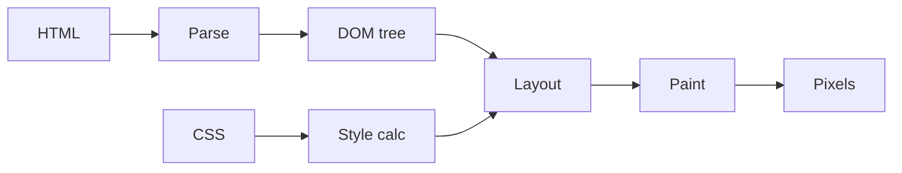

# 브라우저와 DOM

> Web Development 101 시리즈 (3/10)

<!-- a-grade-intro:begin -->

**핵심 질문**: 브라우저는 HTML 텍스트를 받아 어떻게 *움직이는 화면* 으로 바꾸나요?

> HTML을 *트리(DOM)* 로 만들고, 스타일을 계산하고, 레이아웃과 페인트를 하고, 이벤트 루프로 *동작* 을 처리합니다.

<!-- a-grade-intro:end -->

## 이 글에서 배울 것

- DOM이 무엇이고 어떻게 만들어지는지
- 렌더링 파이프라인의 단계
- JavaScript가 DOM을 조작하는 방식
- 이벤트와 이벤트 루프의 기본
- 성능을 망치는 패턴

## 왜 중요한가

DOM을 이해하지 못한 채 JS를 쓰면 *왜 화면이 느린지* 영원히 모릅니다. 브라우저의 렌더링 파이프라인을 한 번만 그려두면 React/Vue 같은 도구도 *왜* 그렇게 만들어졌는지 자명해집니다.

> 브라우저는 *DOM을 그리는 기계* 입니다.

## 개념 한눈에 보기



다섯 단계 — Parse → Style → Layout → Paint → Composite.

## 핵심 용어 정리

- **DOM (Document Object Model)**: HTML을 객체 트리로 표현한 것.
- **Render tree**: DOM + 적용된 스타일.
- **Layout**: 각 요소의 위치와 크기 계산.
- **Paint**: 픽셀로 그리기.
- **Event loop**: 비동기 작업을 처리하는 큐 시스템.

## Before/After

**Before (문자열로 HTML 조작)**

```js
document.body.innerHTML += "<p>새 항목</p>";
```

**After (DOM API로 조작)**

```js
const p = document.createElement("p");
p.textContent = "새 항목";
document.body.appendChild(p);
```

DOM API는 *안전하고 빠릅니다* — XSS도 막아줍니다.

## 실습: DOM 다루기 5단계

### 1단계 — DOM 트리 보기

```html
<!-- index.html -->
<ul id="list">
  <li>사과</li>
  <li>배</li>
</ul>
<script src="app.js"></script>
```

### 2단계 — 요소 선택

```js
// app.js
const list = document.getElementById("list");
const items = list.querySelectorAll("li");
console.log(items.length);  // 2
```

### 3단계 — 새 요소 추가

```js
const li = document.createElement("li");
li.textContent = "포도";
list.appendChild(li);
```

### 4단계 — 이벤트 등록

```js
list.addEventListener("click", (e) => {
  if (e.target.tagName === "LI") {
    console.log("클릭:", e.target.textContent);
  }
});
```

이벤트 *위임* — 부모 하나에만 등록합니다.

### 5단계 — 비동기로 비교

```js
console.log("1");
setTimeout(() => console.log("2"), 0);
console.log("3");
// 출력: 1, 3, 2 — 이벤트 루프가 콜백을 *나중* 에 실행합니다.
```

## 이 코드에서 주목할 점

- DOM 조작은 *비싼* 연산입니다 (layout/paint 트리거).
- 이벤트 위임은 메모리와 성능을 동시에 아낍니다.
- `setTimeout(fn, 0)` 도 *즉시* 실행되지 않습니다.

## 자주 하는 실수 5가지

1. **`innerHTML` 으로 사용자 입력을 넣는다.** XSS 위험.
2. **반복 안에서 DOM에 하나씩 추가한다.** 매번 layout 발생.
3. **모든 `<li>` 에 listener를 단다.** 이벤트 위임을 모른다.
4. **JS가 *언제* 실행되는지 모른다.** `defer`/`async`/inline의 차이.
5. **DOM이 *동기* 라고 가정한다.** 비동기 콜백 순서를 헷갈린다.

## 실무에서는 이렇게 쓰입니다

React/Vue는 *Virtual DOM* 으로 실제 DOM 호출을 묶어 한 번에 처리합니다. 무한 스크롤, 채팅, 게임 — 모두 DOM과 이벤트 루프 위에서 굴러갑니다. 성능 문제가 생기면 Chrome DevTools의 *Performance* 탭으로 layout/paint를 시각화합니다.

## 시니어 엔지니어는 이렇게 생각합니다

- DOM 호출을 *모아서* 한 번에 처리한다.
- 이벤트는 *부모* 에 위임한다.
- *측정* 후에 최적화한다 (DevTools Performance).
- 큰 리스트는 가상화(virtual scroll)를 쓴다.
- 화면을 자주 다시 그리는 코드를 *찾아낸다*.

## 체크리스트

- [ ] 렌더링 파이프라인 5단계를 말할 수 있다.
- [ ] DOM API로 요소를 만들고 추가할 수 있다.
- [ ] 이벤트 위임을 사용한다.
- [ ] 동기 vs 비동기 실행 순서를 안다.
- [ ] `innerHTML` 의 위험을 안다.

## 연습 문제

1. 리스트 100개 항목을 *반복문* 으로 추가하는 코드와 *DocumentFragment* 로 모아 추가하는 코드의 시간을 비교하세요.
2. 부모 `<ul>` 한 곳에만 click listener를 달고 클릭한 `<li>` 의 텍스트를 출력하세요.
3. `console.log("a"); Promise.resolve().then(() => console.log("b")); console.log("c");` 의 출력 순서를 예측하세요.

## 정리 및 다음 단계

브라우저는 *DOM을 그리는 기계* 입니다. 다음 글에서는 클라이언트와 서버를 잇는 *HTTP와 API* 를 봅니다.

<!-- toc:begin -->
- [웹은 어떻게 동작하는가?](./01-how-the-web-works.md)
- [HTML, CSS, JavaScript](./02-html-css-javascript.md)
- **브라우저와 DOM (현재 글)**
- HTTP와 API (예정)
- Frontend와 Backend (예정)
- 인증과 세션 (예정)
- 데이터베이스 연결 (예정)
- 배포 (예정)
- 성능과 캐싱 (예정)
- 작은 웹앱 만들기 (예정)
<!-- toc:end -->

## 참고 자료

- [DOM (MDN)](https://developer.mozilla.org/en-US/docs/Web/API/Document_Object_Model)
- [Critical rendering path (MDN)](https://developer.mozilla.org/en-US/docs/Web/Performance/Critical_rendering_path)
- [Event delegation (MDN)](https://developer.mozilla.org/en-US/docs/Learn/JavaScript/Building_blocks/Events#event_delegation)
- [Event loop (MDN)](https://developer.mozilla.org/en-US/docs/Web/JavaScript/Event_loop)
