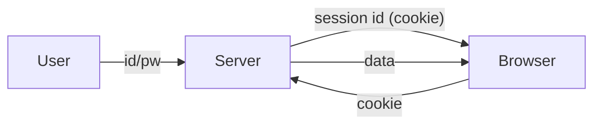

# 인증과 세션

> Web Development 101 시리즈 (6/10)

<!-- a-grade-intro:begin -->

**핵심 질문**: HTTP는 *상태가 없는데*, 서버는 어떻게 사용자를 *기억* 하나요?

> 쿠키/세션/JWT/OAuth — 네 가지 도구가 *상태 없음* 위에 *기억* 을 얹습니다.

<!-- a-grade-intro:end -->

## 이 글에서 배울 것

- 인증(authentication)과 인가(authorization)의 차이
- 쿠키와 세션이 동작하는 방식
- JWT(토큰 기반 인증)의 구조
- OAuth(외부 서비스 로그인) 흐름
- 자주 일어나는 보안 사고와 방어

## 왜 중요한가

로그인은 거의 모든 앱에 들어갑니다. 잘못 설계하면 *계정 탈취* 가 한 줄로 일어납니다. 도구의 이름과 책임을 정확히 알면 큰 사고는 거의 막을 수 있습니다.

> 인증은 *기능* 이 아니라 *기반* 입니다.

## 개념 한눈에 보기



서버가 *세션 ID* 를 발급하고, 브라우저가 매 요청에 동봉합니다.

## 핵심 용어 정리

- **Authentication**: *누구* 인지 확인 (로그인).
- **Authorization**: *무엇* 을 할 수 있는지 (권한).
- **Session**: 서버가 가진 사용자 상태.
- **Cookie**: 브라우저가 도메인별로 저장하는 키-값.
- **JWT**: 서명된 *자기서술적* 토큰 (서버 메모리 불필요).

## Before/After

**Before (매 요청에 비밀번호)**

```python
requests.get("/api/me", auth=("alice", "secret"))  # 매번 보냄 — 위험
```

**After (세션 쿠키)**

```python
s = requests.Session()
s.post("/login", json={"id": "alice", "pw": "secret"})
s.get("/api/me")  # 쿠키 자동 전송
```

비밀번호는 *한 번* 만 흐릅니다.

## 실습: 로그인 만들어 보기 5단계

### 1단계 — Flask 세션 로그인

```python
# app.py
from flask import Flask, session, request, jsonify
app = Flask(__name__)
app.secret_key = "dev-only-change-me"

USERS = {"alice": "secret"}

@app.post("/login")
def login():
    data = request.get_json()
    if USERS.get(data["id"]) == data["pw"]:
        session["user"] = data["id"]
        return jsonify(ok=True)
    return jsonify(ok=False), 401

@app.get("/me")
def me():
    user = session.get("user")
    if not user: return jsonify(error="unauth"), 401
    return jsonify(user=user)
```

### 2단계 — 쿠키 확인

```bash
curl -c c.txt -X POST -H "Content-Type: application/json" -d '{"id":"alice","pw":"secret"}' http://localhost:5000/login
curl -b c.txt http://localhost:5000/me  # → {"user":"alice"}
```

### 3단계 — 로그아웃

```python
@app.post("/logout")
def logout():
    session.clear()
    return jsonify(ok=True)
```

### 4단계 — JWT 발급 (대안)

```python
# jwt_demo.py
import jwt, time
SECRET = "dev"
token = jwt.encode({"sub": "alice", "exp": time.time() + 3600}, SECRET, algorithm="HS256")
print(jwt.decode(token, SECRET, algorithms=["HS256"]))
```

### 5단계 — Authorization 헤더로 호출

```python
import requests
requests.get("/api/me", headers={"Authorization": f"Bearer {token}"})
```

## 이 코드에서 주목할 점

- 세션은 *서버 메모리/DB* 가 필요하다.
- JWT는 *서명* 만 검증하면 되어 분산 시스템에 어울린다.
- 쿠키에는 `HttpOnly`, `Secure`, `SameSite` 를 *반드시* 설정한다.

## 자주 하는 실수 5가지

1. **비밀번호를 평문 저장.** 반드시 *해시* (bcrypt/argon2).
2. **JWT에 비밀 정보를 담는다.** JWT는 *암호화가 아니라 서명* 이다.
3. **쿠키 옵션을 비워둔다.** XSS/CSRF 위험.
4. **만료 없는 토큰.** 한 번 새면 영원히 위험.
5. **권한 검사를 한 번만 한다.** 모든 보호 endpoint에서 검사.

## 실무에서는 이렇게 쓰입니다

웹앱은 *세션 쿠키* + CSRF 토큰, 모바일/SPA + 마이크로서비스는 *JWT* 가 흔합니다. 외부 서비스(Google, GitHub) 로그인은 *OAuth 2.0* 으로 위임합니다 — 비밀번호를 우리가 보지 않아도 됩니다.

## 시니어 엔지니어는 이렇게 생각합니다

- 비밀번호는 *해시* , 토큰은 *짧은 수명* .
- 쿠키는 *HttpOnly + Secure + SameSite=Lax* 기본.
- 권한은 *서버 측 미들웨어* 에서 일괄 검사.
- *Refresh token* 으로 수명을 분리한다.
- 사고 났을 때를 가정해 *모두 회수* 가능하게 둔다.

## 체크리스트

- [ ] 인증과 인가의 차이를 안다.
- [ ] 세션과 JWT의 트레이드오프를 안다.
- [ ] 비밀번호 해시 함수 한 개 이상을 사용한다.
- [ ] 쿠키 보안 옵션 3가지를 안다.
- [ ] OAuth flow를 한 줄로 설명할 수 있다.

## 연습 문제

1. Flask 세션으로 로그인/로그아웃을 만들고 DevTools에서 쿠키를 관찰하세요.
2. JWT 토큰을 발급하고 만료 후 거절되는지 테스트하세요.
3. 한 endpoint에 *권한 미들웨어* 를 적용해 인증 안 된 호출이 401을 받게 하세요.

## 정리 및 다음 단계

인증은 *기반* 입니다. 다음 글에서는 사용자가 만든 데이터를 *영원히 보관* 하는 데이터베이스 연결을 봅니다.

<!-- toc:begin -->
- [웹은 어떻게 동작하는가?](./01-how-the-web-works.md)
- [HTML, CSS, JavaScript](./02-html-css-javascript.md)
- [브라우저와 DOM](./03-browser-and-dom.md)
- [HTTP와 API](./04-http-and-api.md)
- [Frontend과 Backend](./05-frontend-and-backend.md)
- **인증과 세션 (현재 글)**
- 데이터베이스 연결 (예정)
- 배포 (예정)
- 성능과 캐싱 (예정)
- 작은 웹앱 만들기 (예정)
<!-- toc:end -->

## 참고 자료

- [HTTP cookies (MDN)](https://developer.mozilla.org/en-US/docs/Web/HTTP/Cookies)
- [Flask sessions](https://flask.palletsprojects.com/en/latest/quickstart/#sessions)
- [JWT introduction](https://jwt.io/introduction)
- [OAuth 2.0 simplified](https://www.oauth.com/)
