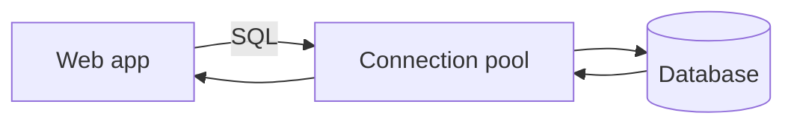

# 데이터베이스 연결

> Web Development 101 시리즈 (7/10)

<!-- a-grade-intro:begin -->

**핵심 질문**: 웹 서버는 어떻게 데이터를 *영원히* 보관하나요?

> SQL 한 줄과 *연결(connection)* — 그리고 그 연결을 *재사용* 하는 풀(pool).

<!-- a-grade-intro:end -->

## 이 글에서 배울 것

- 데이터베이스가 필요한 이유
- SQL 기본 4가지 (SELECT/INSERT/UPDATE/DELETE)
- ORM이 무엇이고 언제 쓰는지
- 연결과 연결 풀(connection pool)
- 트랜잭션의 의미

## 왜 중요한가

웹앱의 사실상 모든 *상태* 는 데이터베이스에 들어 있습니다. 연결을 잘못 다루면 서버는 *수십 명* 만 들어와도 멈춥니다. 한 번만 정확히 익혀 두면 몇 년 통합니다.

> 데이터베이스는 *진실의 보관소* 입니다.

## 개념 한눈에 보기



연결은 *비싼 자원* 이라 풀로 재사용합니다.

## 핵심 용어 정리

- **SQL**: 관계형 DB와 대화하는 언어.
- **Schema**: 테이블의 *모양* (컬럼/타입).
- **ORM**: SQL을 객체로 매핑하는 도구.
- **Connection**: 앱과 DB 사이의 통로.
- **Transaction**: 여러 작업을 *한 단위* 로 묶는 약속.

## Before/After

**Before (파일에 저장)**

```python
open("users.txt", "a").write("alice\n")  # 동시에 쓰면 깨진다
```

**After (DB에 저장)**

```python
import sqlite3
con = sqlite3.connect("app.db")
con.execute("INSERT INTO users(name) VALUES (?)", ("alice",))
con.commit()
```

DB는 *동시성* 과 *영속성* 을 책임집니다.

## 실습: 작은 DB 다루기 5단계

### 1단계 — 테이블 만들기

```python
# 1_init.py
import sqlite3
con = sqlite3.connect("app.db")
con.execute("""
CREATE TABLE IF NOT EXISTS users (
  id INTEGER PRIMARY KEY,
  name TEXT NOT NULL,
  email TEXT UNIQUE
)
""")
con.commit()
```

### 2단계 — 데이터 넣기/읽기

```python
# 2_crud.py
import sqlite3
con = sqlite3.connect("app.db")
con.execute("INSERT INTO users(name, email) VALUES (?, ?)", ("alice", "a@x.com"))
con.commit()
for row in con.execute("SELECT id, name FROM users"):
    print(row)
```

### 3단계 — 파라미터 바인딩 (SQL injection 방지)

```python
name = "alice'; DROP TABLE users; --"  # 공격 입력
con.execute("SELECT * FROM users WHERE name = ?", (name,))  # 안전
```

문자열 포매팅(`f""`)으로 짜면 *치명적* 입니다.

### 4단계 — ORM (SQLAlchemy)

```python
# 4_orm.py
from sqlalchemy import create_engine, Column, Integer, String
from sqlalchemy.orm import declarative_base, sessionmaker

Base = declarative_base()
class User(Base):
    __tablename__ = "users"
    id = Column(Integer, primary_key=True)
    name = Column(String, nullable=False)

engine = create_engine("sqlite:///app.db")
Base.metadata.create_all(engine)
S = sessionmaker(bind=engine)
s = S()
s.add(User(name="bob"))
s.commit()
```

### 5단계 — 트랜잭션

```python
# 5_tx.py
import sqlite3
con = sqlite3.connect("app.db")
try:
    con.execute("BEGIN")
    con.execute("UPDATE users SET name='ALICE' WHERE id=1")
    con.execute("INSERT INTO users(name) VALUES ('charlie')")
    con.commit()
except Exception:
    con.rollback()
    raise
```

전부 성공하거나 *전부 취소* 됩니다.

## 이 코드에서 주목할 점

- 파라미터 바인딩(`?`) 없이 SQL을 짜면 *반드시* 사고난다.
- ORM은 편하지만 *생성된 SQL* 을 가끔 들여다봐야 한다.
- 트랜잭션은 *비즈니스 단위* 로 묶는다.

## 자주 하는 실수 5가지

1. **SQL을 문자열로 합친다.** SQL injection.
2. **연결을 매 요청마다 새로 만든다.** 풀을 안 쓴다.
3. **인덱스 없이 큰 테이블을 SELECT.** 느려진다.
4. **트랜잭션 없이 *2개 쓰기*.** 절반만 반영되는 사고.
5. **에러를 삼킨다.** 데이터 무결성이 깨진다.

## 실무에서는 이렇게 쓰입니다

대부분의 웹 백엔드는 PostgreSQL/MySQL + ORM 조합을 씁니다. 트래픽이 커지면 *읽기 복제(read replica)* 와 *캐시(Redis)* 가 추가됩니다. 모든 도구가 결국 *연결 풀과 트랜잭션* 위에서 굴러갑니다.

## 시니어 엔지니어는 이렇게 생각합니다

- 스키마를 *먼저* 그린다.
- 인덱스를 *쿼리 패턴* 에 맞춰 둔다.
- 트랜잭션 경계를 *명확* 히 한다.
- N+1 쿼리를 *언제나* 의심한다.
- *마이그레이션* 도구로 스키마 변경을 추적한다.

## 체크리스트

- [ ] 4가지 SQL 기본을 안다.
- [ ] 파라미터 바인딩을 쓴다.
- [ ] 연결 풀의 의미를 안다.
- [ ] 트랜잭션을 쓰는 코드를 한 줄 본다.
- [ ] ORM이 만든 SQL을 로그로 볼 수 있다.

## 연습 문제

1. SQLite에 작은 `posts` 테이블을 만들고 CRUD를 모두 구현하세요.
2. 같은 쿼리를 ORM으로 다시 짜고 실제 SQL을 로그에 출력하세요.
3. 일부러 트랜잭션 안에서 예외를 일으켜 *롤백* 이 되는지 확인하세요.

## 정리 및 다음 단계

DB는 *진실의 보관소* 입니다. 다음 글에서는 우리가 만든 앱을 *세상에 내보내는* 배포를 봅니다.

<!-- toc:begin -->
- [웹은 어떻게 동작하는가?](./01-how-the-web-works.md)
- [HTML, CSS, JavaScript](./02-html-css-javascript.md)
- [브라우저와 DOM](./03-browser-and-dom.md)
- [HTTP와 API](./04-http-and-api.md)
- [Frontend과 Backend](./05-frontend-and-backend.md)
- [인증과 세션](./06-auth-and-sessions.md)
- **데이터베이스 연결 (현재 글)**
- 배포 (예정)
- 성능과 캐싱 (예정)
- 작은 웹앱 만들기 (예정)
<!-- toc:end -->

## 참고 자료

- [SQL tutorial (MDN learning)](https://developer.mozilla.org/en-US/docs/Glossary/SQL)
- [sqlite3 (Python docs)](https://docs.python.org/3/library/sqlite3.html)
- [SQLAlchemy ORM tutorial](https://docs.sqlalchemy.org/en/20/orm/quickstart.html)
- [Database connection pool (Wikipedia)](https://en.wikipedia.org/wiki/Connection_pool)
