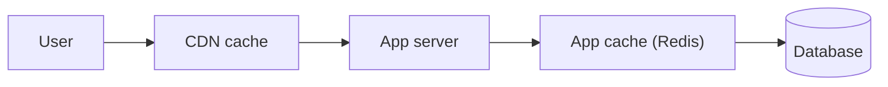

# 성능과 캐싱

> Web Development 101 시리즈 (9/10)


## 이 글에서 다룰 문제

빠른 사이트는 *돈* 입니다 — 전환율, 검색 순위, 사용자 만족이 모두 속도에 비례합니다. 그리고 빠르게 만들기는 *추측이 아니라 측정* 의 일입니다.

> 성능은 *측정* 부터 시작합니다.

## 전체 흐름


가장 가까운 캐시에서 답이 나오면 *가장 빠릅니다*.

## Before/After

**Before (매 요청마다 DB)**

```python
@app.get("/popular")
def popular():
    return db.fetch("SELECT * FROM posts ORDER BY views DESC LIMIT 10")
```

**After (캐시 1분)**

```python
import time
_cache = {"at": 0, "data": None}
@app.get("/popular")
def popular():
    if time.time() - _cache["at"] > 60:
        _cache["data"] = db.fetch("SELECT * FROM posts ORDER BY views DESC LIMIT 10")
        _cache["at"] = time.time()
    return _cache["data"]
```

같은 결과 → DB 호출 *수십 배* 감소.

## 빠르게 만들기 5단계

### 1단계 — 측정

```text
브라우저: F12 → Lighthouse 또는 Performance 탭
서버: time.perf_counter() 또는 APM (Datadog/New Relic)
```

### 2단계 — 정적 파일에 캐시 헤더

```python
# Flask
@app.after_request
def add_cache(resp):
    if resp.mimetype.startswith(("image/", "text/css")):
        resp.headers["Cache-Control"] = "public, max-age=31536000, immutable"
    return resp
```

### 3단계 — CDN 끼우기

```text
Cloudflare/Fastly/CloudFront 앞단에 두면
정적 자산이 *지구 반대편* 에서도 가깝습니다.
```

### 4단계 — 지연 로딩

```html

```

```js
// JS 코드 스플리팅 (동적 import)
button.onclick = async () => {
  const mod = await import("./editor.js");
  mod.open();
};
```

### 5단계 — DB 인덱스와 N+1 잡기

```sql
CREATE INDEX idx_posts_views ON posts(views DESC);
```

```python
# N+1 (나쁨)
for p in posts: print(p.author.name)  # 매번 SELECT

# 한 번에 join (좋음)
posts = db.fetch("SELECT p.*, u.name FROM posts p JOIN users u ON u.id = p.user_id")
```

## 이 코드에서 주목할 점

- 캐시는 *수명* 과 *무효화* 가 같이 와야 한다.
- CDN은 *정적* 자산에 가장 효과가 크다.
- 인덱스는 *쿼리 패턴* 을 따라간다.

## 자주 하는 실수 5가지

1. **추측으로 최적화한다.** 실제로 느린 곳은 다른 곳이다.
2. **모든 응답에 `no-cache`.** 캐시할 수 있는 것을 못 쓴다.
3. **CDN을 *동적* 응답에 그대로 쓴다.** 사용자별 데이터가 섞일 위험.
4. **인덱스를 *모든 컬럼* 에 만든다.** 쓰기 성능이 죽는다.
5. **N+1을 모니터링 없이 둔다.** 서비스가 조용히 느려진다.

## 실무에서는 이렇게 쓰입니다

브라우저 → CDN → 앱 캐시(Redis) → DB — 이 *4단 캐시* 가 거의 모든 큰 사이트의 구조입니다. 새 기능을 만들 때 *캐시 전략* 을 같이 그리는 습관이 시니어와 주니어를 가른다고들 합니다.

## 체크리스트

- [ ] Lighthouse 점수를 한 번 이상 측정했다.
- [ ] 정적 자산에 `Cache-Control` 을 단다.
- [ ] CDN을 정적 자산에 적용했다.
- [ ] N+1 쿼리를 찾는 방법을 안다.
- [ ] DB 인덱스를 한 개 이상 만들어 봤다.

## 정리 및 다음 단계

성능은 *측정* 부터입니다. 마지막 글에서는 지금까지 배운 모든 것을 묶어 *작은 웹앱* 을 만듭니다.

<!-- toc:begin -->
- [웹은 어떻게 동작하는가?](./01-how-the-web-works.md)
- [HTML, CSS, JavaScript](./02-html-css-javascript.md)
- [브라우저와 DOM](./03-browser-and-dom.md)
- [HTTP와 API](./04-http-and-api.md)
- [Frontend과 Backend](./05-frontend-and-backend.md)
- [인증과 세션](./06-auth-and-sessions.md)
- [데이터베이스 연결](./07-connecting-to-database.md)
- [배포](./08-deployment.md)
- **성능과 캐싱 (현재 글)**
- 작은 웹앱 만들기 (예정)
<!-- toc:end -->

## 참고 자료

- [HTTP caching (MDN)](https://developer.mozilla.org/en-US/docs/Web/HTTP/Caching)
- [Lazy loading (MDN)](https://developer.mozilla.org/en-US/docs/Web/Performance/Lazy_loading)
- [Lighthouse overview](https://developer.chrome.com/docs/lighthouse/overview/)
- [Database indexes (Use The Index, Luke!)](https://use-the-index-luke.com/)
