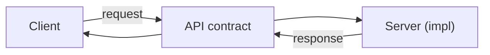

# What Is an API?

> API Design 101 series (1/10)

<!-- a-grade-intro:begin -->

**Core question**: The word *API* is everywhere — what does it actually mean?

> A *call contract* between two systems. A good API makes that contract *easy to read* and *easy to change*.

<!-- a-grade-intro:end -->

## What You Will Learn

- The definition and kinds of APIs
- Five conditions for a "good API"
- Library API vs web API
- The contract between client and server
- A map of the whole series

## Why It Matters

An API is the *face* of a system. The internals can change freely as long as the API stays stable; if the API moves, every internal tweak becomes an external storm.

> An API should look more like a *promise that does not change*.

## Concept at a Glance



The client only needs to know the *contract*.

## Key Terms

- **API (Application Programming Interface)**: a contract between caller and provider.
- **Endpoint**: the call target (URL + method).
- **Request/Response**: the units of call and reply.
- **Contract**: the shape and meaning of input/output.
- **Versioning**: how the contract changes over time.

## Before/After

**Before (no contract)**

```python
# the client has to know the server's internals
data = open("/var/db/users.json").read()
```

**After (using an API)**

```python
# only the contract is required
import requests
data = requests.get("https://api.example.com/users").json()
```

Internals can change without touching the client.

## Hands-on: Five Steps to Understand APIs

### Step 1 — Call a library API

```python
# 1_lib_api.py
import json
data = json.dumps({"a": 1})
print(data)
```

`json.dumps` is also an API — agreed input gives agreed output.

### Step 2 — Call a web API

```python
# 2_web_api.py
import requests
r = requests.get("https://api.github.com/repos/python/cpython")
print(r.status_code, r.json()["full_name"])
```

HTTP is the most common *transport*.

### Step 3 — Look at the contract

```python
# 3_contract.py
# from https://docs.github.com/en/rest, GET /repos/{owner}/{repo}
# - input: owner, repo (path)
# - output: 200 OK + JSON (full_name, stargazers_count, ...)
```

The documentation *is* the contract.

### Step 4 — A minimal server

```python
# 4_min_server.py
from flask import Flask, jsonify
app = Flask(__name__)

@app.get("/health")
def health(): return jsonify(status="ok")

if __name__ == "__main__":
    app.run(port=8000)
```

The smallest contract — `GET /health` → `{"status": "ok"}`.

### Step 5 — Verify with a client

```python
# 5_call.py
import requests
r = requests.get("http://localhost:8000/health")
assert r.status_code == 200
assert r.json() == {"status": "ok"}
```

Tests *verify* the contract.

## What to Notice in This Code

- The client knows nothing about the server's *internals*.
- Implementation can change freely as long as the contract holds.
- Status code and body are the two axes of every response contract.

## Five Common Mistakes

1. **Starting without contract documentation.** Clients have to guess.
2. **Ignoring status codes.** Returning 200 for everything.
3. **Free-form error bodies.** Clients cannot parse them.
4. **Deploying without versioning.** Every change becomes a storm.
5. **Designing without a client in mind.** The user perspective is missing.

## How This Shows Up in Production

GitHub's REST API, Stripe's API, Google Maps API — all *documented contracts*. Internally, OpenAPI (Swagger) plays the same role. The better the company, the more *internal* APIs are treated like external ones.

## How a Senior Engineer Thinks

- Sketch the contract *first* (schema → code).
- Call it from the client's perspective.
- Specify both status codes and bodies.
- Errors deserve a *shape* too.
- Documentation grows with the code (auto-generated OpenAPI).

## Checklist

- [ ] Does this API have *public documentation*?
- [ ] Are input/output shapes explicit?
- [ ] Is the list of status codes explicit?
- [ ] Is the error body shape consistent?
- [ ] Does the client come with example calls?

## Practice Problems

1. Pick five *API functions* from your favorite library and tabulate input/output.
2. Read a public web API doc and call one endpoint.
3. Run your own small Flask server and define a `/health` contract.

## Wrap-up and Next Steps

An API is a *contract*. The next post moves to its most common shape — REST basics.

- **What Is an API? (current)**
- REST Basics (upcoming)
- Resource Design (upcoming)
- HTTP Methods and Status Codes (upcoming)
- Request and Response Schemas (upcoming)
- Pagination and Filtering (upcoming)
- Designing Error Responses (upcoming)
- OpenAPI and Swagger (upcoming)
- API Versioning (upcoming)
- Writing Good API Documentation (upcoming)
## References

- [What is an API? (MDN)](https://developer.mozilla.org/en-US/docs/Glossary/API)
- [GitHub REST API](https://docs.github.com/en/rest)
- [HTTP overview (MDN)](https://developer.mozilla.org/en-US/docs/Web/HTTP/Overview)
- [Flask Quickstart](https://flask.palletsprojects.com/quickstart/)

Tags: Computer Science, APIDesign, REST, HTTP, Backend, WebDevelopment

---

© 2026 YeongseonBooks. All rights reserved.
