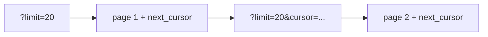

# Pagination and Filtering

> API Design 101 series (6/10)

<!-- a-grade-intro:begin -->

**Core question**: When you must return a large collection in *chunks*, what is the safe and fast way to do it?

> The answer depends on how *fast the data changes* — offset for static data, cursor for fast-changing data.

<!-- a-grade-intro:end -->

## What You Will Learn

- The limits of offset / limit pagination
- Cursor-based pagination
- Sorting, filtering, and searching
- Response metadata and link headers
- Performance traps in large result sets

## Why It Matters

Bad pagination produces slow queries *and* duplicates *and* gaps — at the same time. And once it ships, it is hard to change. Be intentional from day one.

> Large collections must travel in *chunks*.

## Concept at a Glance



A cursor marks the *start of the next page*.

## Key Terms

- **Offset / Limit**: `?offset=40&limit=20` — simple, but *slow as offsets grow*.
- **Cursor**: an opaque token encoding the last item's sort key.
- **Total count**: total number of rows — *expensive* on large tables.
- **Sort**: `?sort=created_at:desc`.
- **Filter**: `?status=active&tier=pro`.

## Before / After

**Before (sort, filter, page mashed together)**

```
GET /orders?p=3&s=date&q=paid
```

**After (named, standard, with metadata)**

```
GET /orders?status=paid&sort=created_at:desc&limit=20&cursor=eyJpZCI6MTIzfQ
```

## Hands-on: Five Pagination Steps

### Step 1 — offset / limit

```python
# 1_offset.py
from flask import Flask, request, jsonify
app = Flask(__name__)
ITEMS = list(range(1000))

@app.get("/items")
def items():
    offset = int(request.args.get("offset", 0))
    limit = min(int(request.args.get("limit", 20)), 100)
    return jsonify(items=ITEMS[offset:offset+limit], total=len(ITEMS))
```

Always cap `limit`.

### Step 2 — cursor

```python
# 2_cursor.py
from flask import Flask, request, jsonify
app = Flask(__name__)
ITEMS = list(range(1000))

@app.get("/items")
def items():
    cursor = int(request.args.get("cursor", 0))
    limit = min(int(request.args.get("limit", 20)), 100)
    page = ITEMS[cursor:cursor+limit]
    nxt = cursor + len(page)
    return jsonify(items=page, next_cursor=(nxt if nxt < len(ITEMS) else None))
```

Cursors are *opaque* — clients do not parse them.

### Step 3 — sorting

```
GET /items?sort=created_at:desc
GET /items?sort=name:asc,id:desc
```

Standardize multi-key sort too.

### Step 4 — filtering

```
GET /orders?status=paid&tier=pro
GET /orders?created_at__gte=2026-01-01
```

Use explicit operator suffixes like `__gte`, `__lt`.

### Step 5 — search

```
GET /articles?q=python+logging
```

Search lives in its own parameter `q` — kept separate from filters.

## What to Notice in This Code

- `limit` has a *cap*.
- The cursor is an *opaque token*.
- Sort, filter, and search each have their own meaning — never share a parameter.

## Five Common Mistakes

1. **No cap on `limit`.** A client asks for a hundred thousand at once.
2. **Deep offset.** `offset=100000` is *slow* even with an index.
3. **Always computing total.** A killer on large tables.
4. **Filter, sort, search jammed into one parameter.** Hard to validate or document.
5. **Exposing cursor *contents*.** Clients forge cursors and exfiltrate data.

## How This Shows Up in Production

GitHub returns next/prev URLs in the `Link` header. Fast-moving data — Twitter, Slack — defaults to cursors. Stripe exposes a simple cursor with `has_more` plus `data[].id`.

## How a Senior Engineer Thinks

- New collections start with *cursors*; only small static ones use offset.
- Document the default and maximum `limit`.
- Make total count *optional* — drop it when expensive.
- Document filter values as enums.
- Consider moving search to a *separate endpoint*.

## Checklist

- [ ] Is `limit` capped?
- [ ] Is the cursor opaque?
- [ ] Do sort, filter, and search use distinct parameters?
- [ ] Does the response include a *next-page* link or cursor?
- [ ] Was total count chosen *with cost in mind*?

## Practice Problems

1. Redesign one of your list endpoints to be cursor-based.
2. Add a hard cap of 100 to Step 1's `limit`.
3. Decide whether to put search on its own endpoint or under `?q=`, and write down the trade-offs.

## Wrap-up and Next Steps

Pagination sits at the intersection of *performance and correctness*. The next episode tackles a topic every API hits — designing error responses.

- [What Is an API?](./01-what-is-an-api.md)
- [REST Basics](./02-rest-basics.md)
- [Resource Design](./03-resource-design.md)
- [HTTP Methods and Status Codes](./04-http-methods-and-status.md)
- [Request and Response Schemas](./05-request-and-response-schema.md)
- **Pagination and Filtering (current)**
- Designing Error Responses (upcoming)
- OpenAPI and Swagger (upcoming)
- API Versioning (upcoming)
- Writing Good API Documentation (upcoming)
## References

- [Stripe API: Pagination](https://stripe.com/docs/api/pagination)
- [GitHub REST API: Using Pagination](https://docs.github.com/en/rest/guides/using-pagination-in-the-rest-api)
- [Slack API: Cursor-based Pagination](https://api.slack.com/docs/pagination)
- [RFC 5988 — Web Linking (Link header)](https://www.rfc-editor.org/rfc/rfc5988)

Tags: Computer Science, APIDesign, Pagination, Filtering, Performance, Backend

---

© 2026 YeongseonBooks. All rights reserved.
